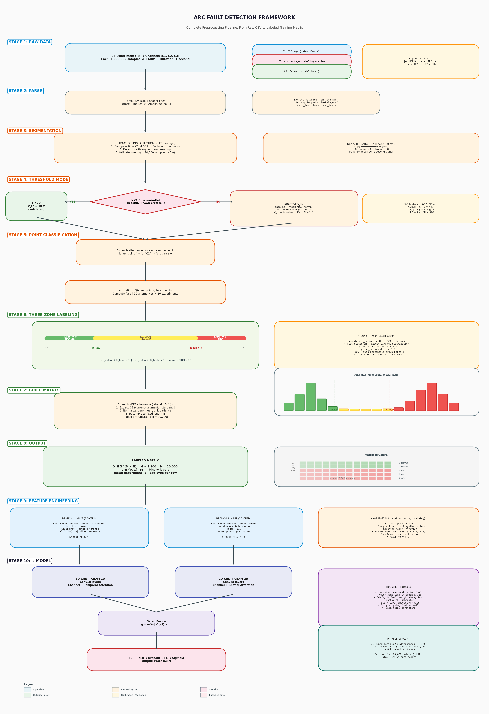

# Arc-FaultNet 🔌⚡

**Dual-Branch CNN with Joint Cross-Attention for Electrical Arc Fault Detection**

> Final Year Project (PFE) — Inspired by MC-VSAttn

---

## Overview

Arc-FaultNet is a deep learning model for detecting **series arc faults** in residential electrical installations from raw current/voltage signals. It uses a dual-branch architecture combining:

- **Branch 1D** — Parametric Gabor filters on raw temporal signals (V_ligne, I)
- **Branch 2D** — Conv2D on STFT spectrograms (2–100 kHz band)
- **Joint Attention** — Cross-branch CAM (channel) + SAM (temporal) attention

The model is validated using **leave-one-charge-out cross-validation** to measure generalization to unseen electrical loads.

---

## Architecture



```
Input: V_ligne (C1) + I (C3)  — 2 × 20,000 samples @ 1 MHz
         │
         ├─► Branch 1D (ParametricConv1d / Gabor)  ──► F_L (128 × D)
         │
         ├─► STFT ──► Branch 2D (Conv2d, 2–100 kHz) ──► F_H (128 × D)
         │
         └─► Joint Attention (CAM + SAM, cross-branch)
                   │
                   └─► Classifier ──► P(arc fault)
```

---

## Project Structure

```
PFE/
├── model.py              # ArcFaultNet architecture + ablation variants
├── dataset.py            # PyTorch Dataset + STFT + Leave-One-Charge-Out splitter
├── train.py              # Training loop + LOCO cross-validation
├── evaluate.py           # Metrics, confusion matrix, ROC, per-charge breakdown
├── ablation.py           # Ablation study across all model variants
├── sanity_check.py       # 5-check pipeline validation before training
│
├── scripts/
│   ├── step1_build_labeled_matrix.py   # CSV → labeled segments (C3 only)
│   └── step2_build_multichannel.py     # CSV → 2-channel dataset (C1 + C3)
│
├── figures/
│   ├── generate_attention_figures.py   # Attention visualization figures
│   ├── pipeline_flowchart.png
│   ├── simple_architecture.png
│   └── CAM.jpg
│
├── data/
│   └── README.md         # Instructions to reconstruct the dataset
│
├── requirements.txt
└── .gitignore
```

---

## Quick Start

### 1. Install dependencies

```bash
python -m venv .venv
source .venv/bin/activate
pip install -r requirements.txt
```

### 2. Prepare the dataset

See [`data/README.md`](data/README.md) for instructions on placing raw CSV files and running preprocessing.

```bash
# Step 1: Build labeled segments + arc_ratio calibration
python scripts/step1_build_labeled_matrix.py

# Step 2: Build 2-channel dataset for Arc-FaultNet
python scripts/step2_build_multichannel.py
```

### 3. Sanity check

```bash
python sanity_check.py
```

Expected output:
```
[ PASS ]  ALL CHECKS PASSED — pipeline is ready for training.
```

### 4. Train the model

```bash
# Quick test (random split)
python train.py --mode single --epochs 50 --batch-size 32 --num-workers 0

# Full leave-one-charge-out cross-validation (thesis results)
python train.py --mode cv --epochs 200 --batch-size 64
```

### 5. Evaluate

```bash
python evaluate.py --model-path runs/<run_dir>/best_fold0_<charge>.pt \
                   --model arcfaultnet \
                   --output-dir results/
```

### 6. Ablation study

```bash
# Fast check (random split, 10 repetitions)
python ablation.py --mode random --repetitions 5 --epochs 50

# Proper LOCO evaluation (for thesis)
python ablation.py --mode loco --epochs 200
```

---

## Model Variants

| Model | Description |
|-------|-------------|
| `arcfaultnet` | **Full model** — dual-branch + Joint Attention + Gabor |
| `standard_conv` | Standard Conv1d instead of ParametricConv1d |
| `no_attention` | Dual-branch, simple concatenation, no attention |
| `1d_only` | Temporal branch only, no STFT |
| `independent_cbam` | CBAM per branch independently (no cross-branch) |
| `baseline_cnn` | Simple Conv1d CNN baseline |

---

## Key Design Choices

| Decision | Rationale |
|----------|-----------|
| **V_arc (C2) excluded** | Oracle signal — not measurable at inference time |
| **Segmentation on C1** | Voltage is stable & load-independent; C3 is phase-shifted by load |
| **2–100 kHz band** | Arc noise band; below 2 kHz = load harmonics; above 100 kHz = noise |
| **LOCO cross-validation** | Tests generalization to *unseen* electrical loads |
| **Gabor filters (learnable)** | f₀ and σ converge to arc-relevant frequencies (2–100 kHz) |

---

## References

- MC-VSAttn: *Multi-Channel Vibration Signal Attention Network* (inspiration)
- IEC 62606: Standard for arc fault detection devices
- Dataset: Teledyne LeCroy oscilloscope recordings @ 1 MHz, 26 charge configurations
