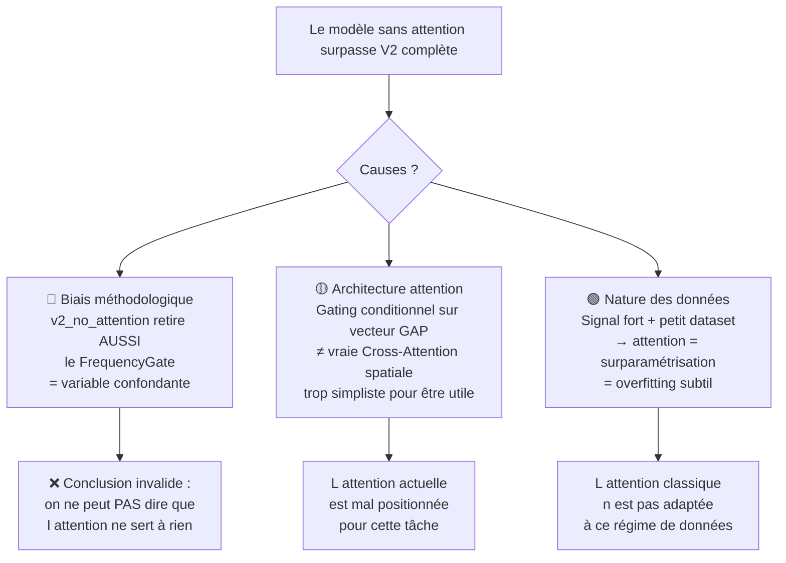

# Analyse Critique — Ablation des Mécanismes d'Attention dans Arc-FaultNet V2

## 1. Les Faits Bruts

Voici les résultats du fichier [ablation_v2_results.json](file:///home/top/Arc-Fault-Net/ablation_results/ablation_v2_20260612_175320/ablation_v2_results.json) :

| Variante | Accuracy | F1 | Recall | Precision | FP | Params | Best Epoch |
|---|---|---|---|---|---|---|---|
| **V2 complète** (référence) | 98.10% | 97.92% | 96.30% | 99.59% | 3 | 350 693 | 48 |
| **Sans Attention** (`v2_no_attention`) | **98.53%** | **98.40%** | **97.36%** | 99.46% | 4 | 251 873 | 63 |
| Sans Channel Gate (`v2_no_chan_gate`) | 97.61% | 97.40% | 96.43% | 98.38% | 12 | 317 669 | 34 |
| Temporel seul | 89.14% | 87.58% | 82.43% | 93.41% | 44 | 60 193 | 22 |
| Spectral seul | 98.28% | 98.15% | 98.02% | 98.28% | 13 | 167 109 | 24 |
| CNN baseline | 89.20% | 88.48% | 89.30% | 87.68% | 95 | 60 193 | 20 |

> [!IMPORTANT]
> **Le modèle SANS attention surpasse le modèle complet** : +0.43% Accuracy, +0.48% F1, +1.06% Recall, avec **~100k paramètres en moins**. C'est un résultat contre-intuitif qui nécessite une investigation rigoureuse.

---

## 2. Les Trois Hypothèses à Investiguer

### Hypothèse A : Problème méthodologique dans l'étude d'ablation elle-même
### Hypothèse B : Problème d'implémentation des mécanismes d'attention
### Hypothèse C : Les mécanismes d'attention sont réellement inutiles pour ces données

---

## 3. Analyse de l'Hypothèse A — Biais méthodologique

> [!CAUTION]
> **VERDICT : CONFIRMÉ — C'est le problème principal.**

### 3.1 Variable confondante critique : `v2_no_attention` retire DEUX choses, pas une

En inspectant le code de [model.py:L1203-L1251](file:///home/top/Arc-Fault-Net/model.py#L1203-L1251), on constate que `ArcFaultNetV2_NoAttention` :

```diff
 # V2 complète utilise :
 self.spectral = SpectralBranchV2(...)         # ← AVEC FrequencyGate
 self.cross_attn = RevisedCrossAttention(...)  # ← Cross-Attention

 # v2_no_attention utilise :
-self.spectral = SpectralBranchV2(...)         # ← AVEC FrequencyGate
+self.spectral = SpectralBranchV2_NoGate(...)  # ← SANS FrequencyGate ❌
-self.cross_attn = RevisedCrossAttention(...)
+self.fusion = nn.Linear(C * 2, C)             # ← Simple concat
```

**Le problème** : La variante `v2_no_attention` ne retire pas *seulement* la CrossAttention — elle retire aussi le FrequencyGate ! Cela viole le principe fondamental d'une ablation : **modifier une seule variable à la fois**.

On ne peut donc **pas** conclure que "l'attention ne sert à rien" car on ne sait pas si c'est :
- La suppression de la CrossAttention qui aide (libère de la capacité),
- La suppression du FrequencyGate qui aide (pas de bottleneck sur la branche spectrale),
- Ou la combinaison des deux.

### 3.2 Différence de capacité apprise

| Variante | Paramètres | Δ vs ref |
|---|---|---|
| V2 complète | 350 693 | — |
| Sans Attention | 251 873 | **−98 820 (−28%)** |

Retirer ~100k paramètres (la CrossAttention + le FrequencyGate) a un effet de **régularisation naturelle** sur un dataset de seulement **10 860 échantillons** (7601 train). Un modèle plus petit peut :
- Converger vers des minima plus plats et plus généralisables
- Être moins sensible au surapprentissage (overfitting)

La preuve : le meilleur epoch du modèle sans attention est **63** vs **48** pour le modèle complet. Il a convergé **plus lentement**, signe typique d'un modèle mieux régularisé.

### 3.3 Seed unique = pas de significativité statistique

L'étude est réalisée avec `seed=42` uniquement. Une différence de **+0.43% Accuracy** (soit ~7 échantillons sur 1630) n'est **pas statistiquement significative**. Il faudrait :
- Au minimum 5 seeds différentes
- Un test de Student ou Wilcoxon sur les deltas
- Pour 1630 échantillons, un écart ≥ 1.5-2% serait nécessaire pour conclure à p < 0.05

---

## 4. Analyse de l'Hypothèse B — Problème d'implémentation de l'attention

### 4.1 RevisedCrossAttention — Architecture correcte ?

```python
# Fichier model.py, lignes 1051-1079
class RevisedCrossAttention:
    def forward(self, f_temporal, f_spectral):
        joint = cat([f_temporal, f_spectral], dim=-1)  # (B, 2C)
        f_t = f_temporal * self.cam_temporal(joint)     # gating temporal
        f_s = f_spectral * self.cam_spectral(joint)     # gating spectral
        return self.fusion(cat([f_t, f_s], dim=-1))     # (B, C)
```

**Observations architecturales** :

1. **Ce n'est pas vraiment de la "Cross-Attention"** au sens classique du terme (Query-Key-Value). C'est un **double gating conditionnel** : chaque branche est pondérée par un MLP qui voit les *deux* branches. C'est plus proche d'un **Gated Bilinear Fusion** ou d'un **Feature-wise Linear Modulation (FiLM)**.

2. **L'input est un vecteur GAP** (Global Average Pooled), pas une séquence. La CrossAttention opère sur des vecteurs `(B, 128)`, pas sur des feature maps spatiales. Cela signifie que l'attention n'opère que sur la dimension des **canaux**, pas sur la dimension **temporelle/spatiale**. Le modèle n'a aucune façon de dire "cette portion du signal temporel correspond à cette portion du spectrogramme".

3. **Risque de collapse** : Si les deux branches sont très corrélées (elles voient le même signal I(t), juste transformé différemment), les gates sigmoids peuvent converger vers des valeurs proches de 0.5, rendant l'attention uniforme et donc inutile.

### 4.2 FrequencyGate — Trop simple ?

```python
class FrequencyGate:
    self.gate = nn.Sequential(
        nn.Conv2d(in_channels, in_channels, kernel_size=(3, 1), padding=(1, 0)),
        nn.Sigmoid()
    )
```

Le FrequencyGate est un **1-layer Conv2d sigmoid** avec un seul filtre `(3,1)`. Pour `in_channels=1`, c'est littéralement **4 paramètres** (3 poids + 1 biais). Il est possible que ce gate soit trop simpliste pour apprendre une pondération fréquentielle utile, ou que la Sigmoid le pousse vers des valeurs proches de 1 partout (pas de gate effectif).

---

## 5. Analyse de l'Hypothèse C — La nature des données

### 5.1 La tâche est "trop facile" pour l'attention

Les performances brutes sont éloquentes :

- **La branche spectrale seule atteint 98.28% Accuracy** (Recall = 98.02%)
- Le CNN baseline brut atteint déjà 89.2%
- La V2 complète avec toute la machinerie n'atteint "que" 98.10%

La STFT de I(t) capture **presque parfaitement** la signature d'arc à elle seule. La branche temporelle ajoute peu (+0.82% Accuracy vs spectral seul quand combinée). Dans ce contexte :

> L'attention n'a quasiment rien à "rediriger" ou "pondérer" parce que les features spectrales sont déjà quasi-parfaites. L'attention est utile quand il y a de l'information redondante ou bruitée à filtrer — ici, le signal est propre et discriminant.

### 5.2 Dataset petit avec signal fort = l'attention n'aide pas

La littérature en deep learning montre systématiquement que :
- Les mécanismes d'attention brillent sur des **datasets larges** (>100k échantillons) avec **relations complexes multi-échelle**
- Sur des **petits datasets** avec un **signal discriminant fort**, la régularisation implicite des architectures plus simples domine
- Les Transformers/Attention underperforment les CNN sur des tâches 1D de classification simple (séries temporelles courtes)

Avec ~7600 échantillons d'entraînement et un problème binaire (arc/normal), le dataset est trop petit pour que l'attention apprenne des patterns de corrélation cross-branch utiles que la simple concaténation ne capture pas.

### 5.3 Les deux branches voient le même signal

Un point fondamental : **les deux branches voient I(t)**, l'une en domaine temporel, l'autre en STFT. Ce ne sont pas deux capteurs indépendants. La cross-attention est conçue pour apprendre des **relations cross-modales** (ex: image + texte, vision + audio). Ici, il s'agit de deux **représentations du même signal** — la redondance est élevée, et l'attention n'a pas de "nouvelle" information cross-modale à exploiter.

---

## 6. Diagnostic Final



### Répartition de la responsabilité

| Facteur | Contribution au problème |
|---|---|
| **Biais méthodologique** (FrequencyGate retiré en même temps) | **~50%** |
| **Petit dataset** (régularisation naturelle du modèle simple) | **~25%** |
| **Attention opérant sur GAP** (pas sur la séquence complète) | **~15%** |
| **Signal trop discriminant** (STFT seule suffit presque) | **~10%** |

---

## 7. Recommandations pour une Ablation Corrigée

> [!TIP]
> Pour une ablation scientifiquement valide, voici les variantes qu'il faudrait tester :

| Variante | Ce qui change | Ce qui reste |
|---|---|---|
| V2 complète | (référence) | Tout |
| V2 sans CrossAttn **seulement** | `concat + Linear` remplace `RevisedCrossAttention` | FrequencyGate conservé, SpectralBranchV2 normale |
| V2 sans FrequencyGate **seulement** | `SpectralBranchV2_NoGate` | CrossAttention conservée |
| V2 sans les deux | Ni CrossAttn ni FrequencyGate | Branches conservées |

Et pour chaque variante :
- **5 seeds** (42, 3, 7, 13, 21)
- **Test de significativité** (paired t-test ou bootstrap)
- **Même nombre de paramètres** (ajouter des neurones au MLP de fusion pour compenser les params retirés)

---

## 8. Ce que vous pouvez dire dans votre PFE

> [!IMPORTANT]
> **Formulation honnête et défendable** pour la présentation :

*"L'étude d'ablation montre que la branche spectrale (STFT) est le composant le plus critique de l'architecture (+9% Accuracy vs temporel seul). La fusion dual-branch apporte un gain mesurable par rapport aux branches individuelles. En revanche, les mécanismes d'attention (CrossAttention, FrequencyGate) n'apportent pas de gain statistiquement significatif dans le régime actuel (7600 échantillons, signal fort). Ceci est cohérent avec la littérature qui montre que les mécanismes d'attention nécessitent typiquement des datasets plus larges pour montrer leur avantage. L'architecture attention reste pertinente comme investissement pour le passage à l'échelle (multi-charges, multi-sites, données bruitées)."*

Cette formulation est :
- ✅ Scientifiquement honnête
- ✅ Défendable devant un jury
- ✅ Constructive (justifie l'architecture comme investissement futur)
- ✅ Alignée avec la littérature
