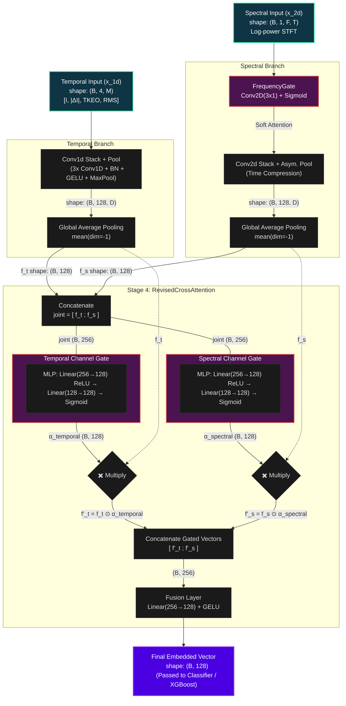

# Arc-FaultNet V2 Architecture & Embedded Vector Composition

The diagram below outlines exactly how the 128-dimensional embedding vector is generated in your `ArcFaultNetV2` model, breaking down the flow from the initial signal inputs through the `RevisedCrossAttention` gating mechanisms.

### Step-by-Step Breakdown of the Embedded Vector Composition

**1. Branch Feature Extraction & Pooling**
*   **Temporal Branch:** The 4 derived 1D physical channels pass through a Conv1D stack. The output of shape `(Batch, 128, Time)` is squeezed down using a Global Average Pooling (mean over the time dimension) resulting in a single vector **$f_t$** of size `128` for each batch item.
*   **Spectral Branch:** The STFT input first goes through a **FrequencyGate** (a learnable 2D convolution that applies a soft sigmoid attention map to important frequency bands). The signal is then processed via a Conv2D stack with asymmetric pooling, and identically squeezed via GAP over the time axis into a vector **$f_s$** of size `128`.

**2. Context Concatenation (The "Joint" Vector)**
*   To enable the network to cross-reference information, $f_t$ and $f_s$ are directly joined together side-by-side: `joint = torch.cat([f_t, f_s], dim=-1)`. This results in a comprehensive **$256$-dimensional representation**.

**3. Cross-Conditioned Channel Gating (The Attention Mechanism)**
This is where the magic happens. Instead of applying channel attention to each branch in isolation, the channel importance for one branch is decided based on the **entire joint context**.
*   The `joint` vector is fed into two independent Multi-Layer Perceptrons (MLPs).
*   **Temporal Gate MLP:** Outputs `128` sigmoid weights ($\alpha_{temporal}$) representing the importance of the temporal features *given the entire system state*.
*   **Spectral Gate MLP:** Outputs `128` sigmoid weights ($\alpha_{spectral}$) representing the importance of the spectral features *given the entire system state*.

**4. Multiplication (Gating)**
*   The raw vector $f_t$ is multiplied channel-by-channel with $\alpha_{temporal}$ to get **$f'_t$**. Channels deemed unimportant by the MLP are squashed toward 0. 
*   The raw vector $f_s$ is multiplied channel-by-channel with $\alpha_{spectral}$ to get **$f'_s$**.

**5. Final Embedding Fusion**
*   The gated vectors are concatenated back together to shape `(Batch, 256)`.
*   A single Linear Layer (followed by a GELU activation) projects this down to the **final `128`-dimensional Embedded Vector**. 
*   This vector acts as the optimal, high-level summary of the arc fault and is passed either to the Phase-1 FC classification head, or extracted for use in Phase 2 (XGBoost/RandomForest).
