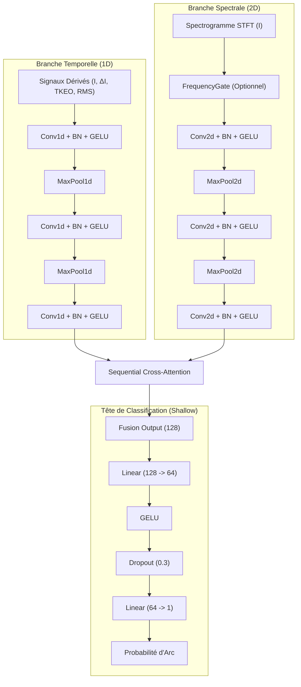
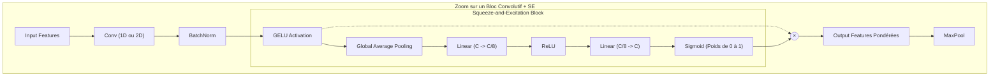
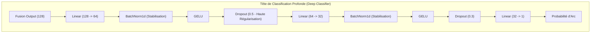

# Analyse Architecturale des Variantes Arc-FaultNet V2

D'après vos expérimentations et les paramètres que vous avez modifiés (`use_se`, `deep_classifier`), vous manipulez trois grandes variantes structurelles du réseau **ArcFaultNet V2**. Bien que la mécanique de fusion (Cross-Attention) reste la même, les branches d'extraction de caractéristiques et la tête de décision changent de manière significative.

Voici une analyse approfondie de ce qui change réellement sous le capot pour chacune des trois configurations, accompagnée de diagrammes architecturaux.

---

## 1. Variante 1 : Le modèle de base (Baseline V2)
**Configuration :** `"use_se": false`, `"deep_classifier": false` (Ex: run `20260710_175224`)

C'est la version la plus légère du modèle (~301k paramètres). Les extracteurs de caractéristiques (les branches Temporelle et Spectrale) utilisent des convolutions standards sans mécanisme de recalibrage des canaux. La tête de classification finale est "peu profonde" (shallow), idéale pour un apprentissage rapide mais potentiellement sujette au surapprentissage (overfitting) sur des données complexes.

---

## 2. Variante 2 : V2 + Squeeze-and-Excitation (SE)
**Configuration :** `"use_se": true`, `"deep_classifier": false` (Ex: run `20260710_173936`)

Cette variante (~313k paramètres) injecte des blocs d'attention de canaux **Squeeze-and-Excitation (SE)** immédiatement après l'activation GELU de *chaque* couche convolutive. 

**Ce que ça change physiquement :** 
Au lieu de traiter toutes les cartes de caractéristiques (filtres) avec la même importance, le bloc SE "écrase" (Squeeze) chaque canal en un scalaire via un Global Average Pooling, puis utilise un petit réseau de neurones (Excitation) pour apprendre un poids entre 0 et 1 pour chaque canal. Le réseau apprend ainsi dynamiquement à **"éteindre" les filtres contenant du bruit** (ex: harmoniques de charge) et à **"amplifier" les filtres contenant la signature d'arc**.

---

## 3. Variante 3 : V2 + SE + Deep Classifier
**Configuration :** `"use_se": true`, `"deep_classifier": true` (Ex: run `20260717_164615` et votre nouvelle commande)

Cette variante (~315k paramètres) combine l'attention de canaux (SE) avec une tête de classification **profonde et robuste**. 

**Ce que ça change physiquement :**
L'embedding de 128 dimensions généré par la Cross-Attention contient des informations très riches. Le classifieur de base (Shallow) n'a qu'une seule couche cachée pour démêler cet espace. Le `deep_classifier` ajoute une profondeur supplémentaire (3 couches Linear au lieu de 2), mais surtout, il intègre du **Batch Normalization (BN)** et un **Dropout agressif (0.5 puis 0.3)**. Cela stabilise énormément les gradients lors de l'entraînement et agit comme un puissant régularisateur, empêchant le réseau d'apprendre par cœur les anomalies spécifiques au dataset.

---

### Résumé de l'Impact Stratégique

| Variante | Avantage Principal | Inconvénient | Cas d'usage idéal |
| :--- | :--- | :--- | :--- |
| **Base V2** (`use_se=F`, `deep_clf=F`) | Plus rapide, moins de paramètres | Moins performant pour rejeter le bruit complexe | Pre-training rapide, validation d'idées |
| **SE V2** (`use_se=T`, `deep_clf=F`) | Rejette activement le bruit spectral/temporel | Risque de léger surapprentissage sur le bruit d'entraînement | Charges électriques avec des harmoniques très spécifiques |
| **Deep V2** (`use_se=T`, `deep_clf=T`) | Généralisation maximale (grâce au fort Dropout/BN) | Légèrement plus long à entraîner, nécessite plus d'époques pour converger | **Déploiement final**, validation croisée stricte (K-Fold) |

Ce découpage vous permet de justifier scientifiquement vos choix dans votre rapport : le SE module ce qui est *extrait*, et le Deep Classifier régularise ce qui est *décidé*.
