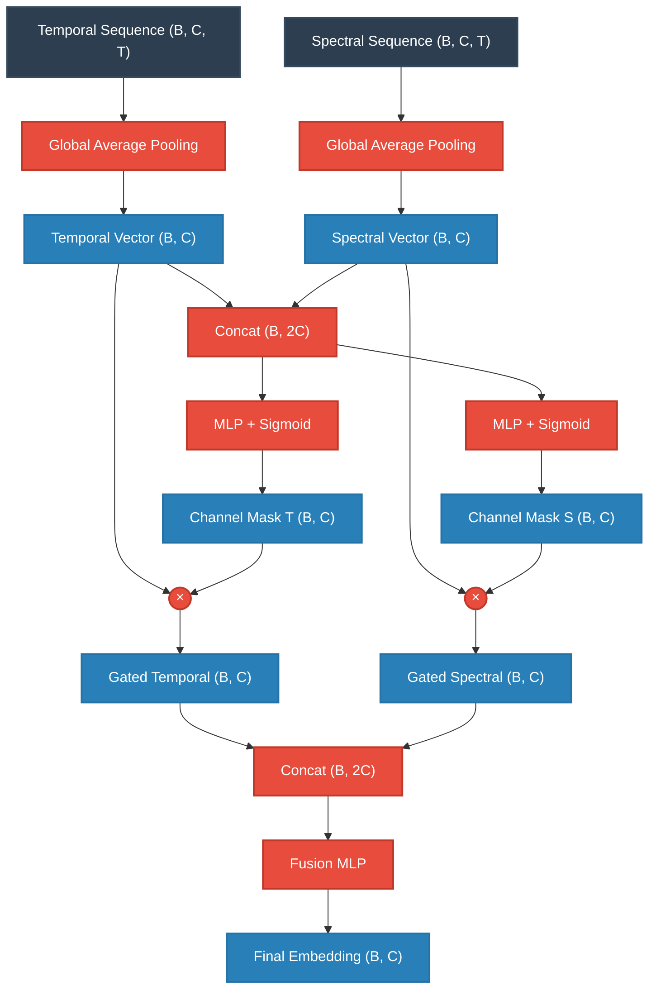
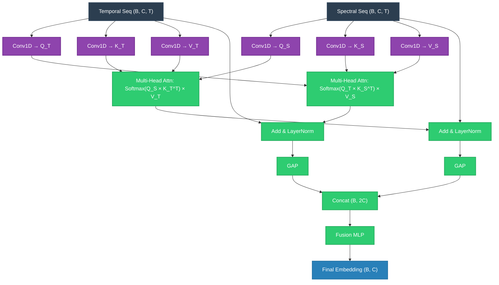

# Comparing Fusion Mechanisms in Arc-FaultNet V2

When defending your architecture choices to an ML engineering jury, the most critical distinction to make between the two fusion implementations is **"When"** the information is combined, and **"What type"** of information is used to compute the attention weights.

Here is a comprehensive breakdown of the two approaches.

---

## 1. The Old Implementation: Revised Cross-Attention (Gated Fusion)

The old approach is technically a **Channel-Wise Gating Mechanism**, not true attention in the sequence-to-sequence sense. 

### How it works:
1. Both the Temporal and Spectral branches compress their entire sequence into a single vector using Global Average Pooling (GAP).
2. All temporal and spatial (frequency/time) resolution is destroyed before fusion begins.
3. The two global vectors $(B, C)$ are concatenated into a joint vector $(B, 2C)$.
4. Two separate Multi-Layer Perceptrons (MLPs) look at this joint vector and output a channel mask (values between 0 and 1) for each branch.
5. The original global vectors are multiplied by these masks.

### Architecture Diagram

### What the Jury Needs to Know (The Critique)
* **The Fatal Flaw:** Because it operates *after* Global Average Pooling, it suffers from the "information bottleneck." If a specific high-frequency spark happens at $t=15$ in the spectral domain, and a sudden current spike happens at $t=15$ in the temporal domain, the fusion layer cannot correlate them. It only sees the global summary of the whole cycle.
* **Parameter Inefficiency:** Because it relies on large Dense/Linear layers mapping $2C \rightarrow C$, it requires more parameters ($\sim350$k total) while capturing less structural information.

---

## 2. The New Implementation: True Q/K/V Cross-Attention

This is the state-of-the-art approach. It leverages the mathematical framework of the Transformer architecture, computing attention **before** spatial/temporal pooling.

### How it works:
1. It intercepts the feature maps *before* pooling, maintaining their temporal dimension $T$. Shape: $(B, C, T)$.
2. It projects these sequences into Queries ($Q$), Keys ($K$), and Values ($V$) using 1D Convolutions.
3. It performs **Bidirectional Cross-Attention**:
   * The **Temporal branch** generates Queries to search through the **Spectral** Keys and Values.
   * The **Spectral branch** generates Queries to search through the **Temporal** Keys and Values.
4. It calculates an Attention Matrix $(B, T, T)$ which represents "how much time step $t_i$ in one modality should attend to time step $t_j$ in the other modality."
5. The attended sequences are added back via residual connections, normalized, and *then* Global Average Pooled.

### Architecture Diagram

### What the Jury Needs to Know (The Defense)
* **Spatio-Temporal Alignment:** This allows the network to say "The high-frequency noise at time $T=2$ in the spectrogram perfectly aligns with the TKEO spike at $T=2$ in the 1D signal." It dynamically aligns modalities across time.
* **Parameter Efficiency:** Because Q, K, and V projections are done via pointwise $1\times1$ Convolutions (which apply across the time dimension dynamically) rather than massive Dense layers, the total model footprint actually **shrinks by $\sim48,000$ parameters** while massively increasing representational capacity.
* **Multi-Head Specialization:** By utilizing multi-head attention (4 heads), the network can look for different types of cross-modality correlations simultaneously (e.g., Head 1 looks for concurrent spikes, Head 2 looks for lag/lead relationships).

## Key Argument Summary for the Jury

If asked: *"Why did you change the fusion mechanism, and how do you justify the complexity?"*

**Your Answer:**
> "The original 'Gated' fusion wasn't true attention—it was a global recalibration. Because it happened *after* pooling, it suffered from a temporal bottleneck. We could not correlate a specific event in the time domain with a specific event in the frequency domain. 
> 
> By moving to a True Q/K/V Cross-Attention mechanism operating directly on the un-pooled sequence $(B, C, T)$, we enabled dynamic temporal alignment between the branches. We did this while simultaneously *reducing* our overall parameter count by $\sim15\%$ ($\sim350$k down to $\sim301$k) because we replaced dense parameter-heavy MLPs with shared $1\times1$ convolutional projections."
