# `--deep-clf` Expliqué Simplement

## L'idée en une phrase

Le modèle Arc-FaultNet est composé de deux parties :
1. **Les yeux** → les branches qui *regardent* le signal et extraient des informations utiles (features)
2. **Le cerveau** → le classifieur qui *prend la décision* : "est-ce un arc ou pas ?"

**`--deep-clf` ne change que le cerveau.** Les yeux restent exactement les mêmes.

---

## Qu'est-ce qui change exactement ?

### Sans `--deep-clf` (Classifieur Simple)

Le cerveau est très basique. Il reçoit 128 informations de la fusion, et prend sa décision en **2 étapes** :

```
128 infos → [réduire à 64] → [décider : arc ou pas]
```

C'est comme un étudiant qui lit un résumé et donne sa réponse immédiatement, sans trop réfléchir.

### Avec `--deep-clf` (Classifieur Profond)

Le cerveau devient plus sophistiqué. Il prend sa décision en **3 étapes** avec des "garde-fous" à chaque étape :

```
128 infos → [réduire à 64] → [vérifier] → [réduire à 32] → [vérifier] → [décider : arc ou pas]
```

C'est comme un étudiant qui relit, vérifie, puis re-vérifie avant de donner sa réponse.

---

## Les 3 Ajouts et Pourquoi Ils Aident

### 1. Une étape de réflexion en plus

```
SIMPLE :  128 → 64 → décision        (2 étapes)
PROFOND : 128 → 64 → 32 → décision   (3 étapes)
```

**Pourquoi ?** Plus d'étapes = le modèle peut faire un raisonnement plus fin. Au lieu de compresser brutalement 128 informations en une seule réponse, il les réduit progressivement : d'abord il garde les 64 plus importantes, puis les 32 plus importantes, puis il décide.

> [!TIP]
> **Analogie :** C'est comme filtrer du café. Un seul filtre laisse passer des résidus. Deux filtres en cascade donnent un café plus pur.

### 2. BatchNorm (Normalisation)

Après chaque étape, on ajoute une couche qui **remet les valeurs à une échelle raisonnable**.

**Pourquoi ?** Imaginons que le modèle reçoit parfois des valeurs entre 0 et 1, et parfois entre 0 et 1000. Sans normalisation, le classifieur est "confus" par ces changements d'échelle. Le BatchNorm dit : "peu importe ce que tu reçois, je ramène tout entre -1 et +1 avant de continuer". Ça rend l'apprentissage **beaucoup plus stable**.

> [!TIP]
> **Analogie :** C'est comme convertir tous les prix en euros avant de comparer. Sans ça, tu compares des dollars avec des yens et tu te trompes.

### 3. Dropout Plus Fort (0.5 au lieu de 0.3)

Le Dropout "éteint" aléatoirement des neurones pendant l'entraînement. 

- **Simple :** éteint 30% des neurones (il garde 70% de ses capacités)
- **Profond :** éteint **50%** des neurones à la première couche (il ne garde que la moitié !)

**Pourquoi c'est bien d'éteindre la moitié ?** Ça semble contre-intuitif, mais c'est le truc le plus important :

Sans Dropout fort, le modèle peut devenir **paresseux**. Il va trouver 2 ou 3 neurones qui marchent bien sur les données d'entraînement et ne compter que sur eux. Problème : ces neurones ont peut-être juste mémorisé les exemples spécifiques du dataset, pas la vraie signature d'un arc.

Avec Dropout 50%, **à chaque fois qu'il s'entraîne, la moitié de ses neurones disparaissent au hasard**. Le modèle est obligé de :
- Apprendre la même info dans PLUSIEURS neurones (redondance)
- Ne pas compter sur un seul chemin de décision
- Apprendre les **vrais patterns** plutôt que mémoriser

> [!TIP]
> **Analogie :** C'est comme étudier pour un examen où on te dit que tu ne pourras utiliser que la moitié de tes notes, choisie au hasard. Tu vas t'assurer de bien comprendre le cours plutôt que de juste copier les réponses dans tes notes.

---

## Le diagramme visuel

```mermaid
graph TD
    subgraph "SIMPLE (sans --deep-clf)"
        A1["128 infos de la fusion"] --> B1["Réduire : 128 → 64"]
        B1 --> C1["Activation GELU"]
        C1 --> D1["Éteindre 30% des neurones"]
        D1 --> E1["Décider : 64 → 1"]
        E1 --> F1["Arc ou Pas ?"]
    end

    subgraph "PROFOND (avec --deep-clf)"
        A2["128 infos de la fusion"] --> B2["Réduire : 128 → 64"]
        B2 --> N1["Normaliser les valeurs"]
        N1 --> C2["Activation GELU"]
        C2 --> D2["Éteindre 50% des neurones"]
        D2 --> B3["Réduire : 64 → 32"]
        B3 --> N2["Normaliser les valeurs"]
        N2 --> C3["Activation GELU"]
        C3 --> D3["Éteindre 30% des neurones"]
        D3 --> E2["Décider : 32 → 1"]
        E2 --> F2["Arc ou Pas ?"]
    end
```



---

## Ce que tes résultats montrent concrètement

| Seed | | Accuracy | Precision | Recall |
|:---:|:---|:---:|:---:|:---:|
| 42 | **avec** `--deep-clf` | **98.77%** | **99.73%** | 97.62% |
| 42 | sans `--deep-clf` | 98.59% | 98.67% | 98.28% |
| 3 | **avec** `--deep-clf` | **98.10%** | **98.82%** | 97.16% |
| 3 | sans `--deep-clf` | 97.12% | 97.03% | 96.90% |
| 4 | **avec** `--deep-clf` | **98.77%** | 99.28% | **97.88%** |
| 4 | sans `--deep-clf` | 97.73% | 99.70% | 95.06% |

**En résumé :**
- ✅ **Precision monte** → quand le modèle dit "c'est un arc", il se trompe moins souvent (moins de fausses alarmes)
- ⚖️ **Recall reste stable** → il détecte toujours la grande majorité des vrais arcs
- ✅ **Accuracy globale monte** → le modèle est meilleur dans l'ensemble

**En une phrase :** Le deep classifier rend le modèle **plus prudent et plus fiable** dans ses décisions, sans perdre sa capacité à détecter les arcs.
