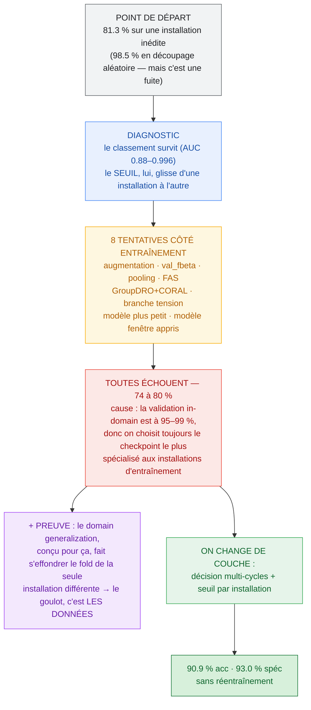
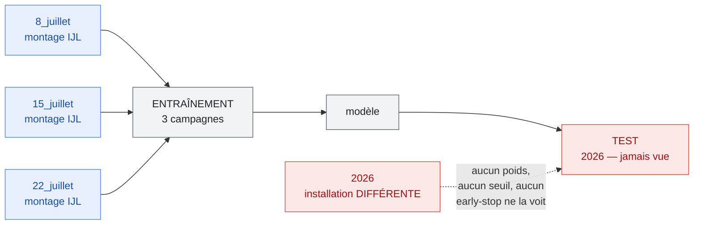
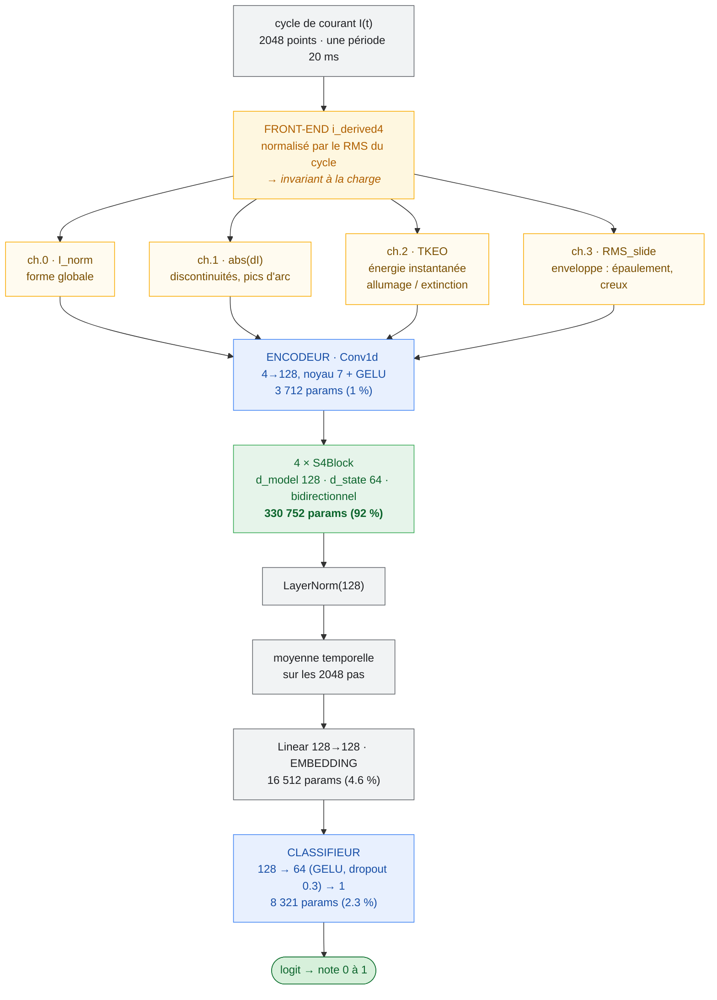
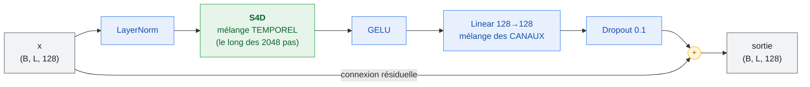
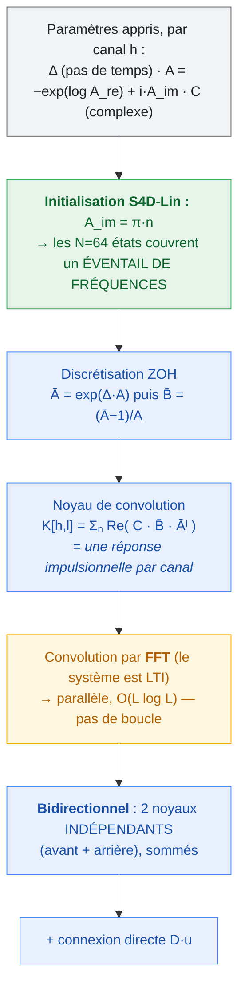
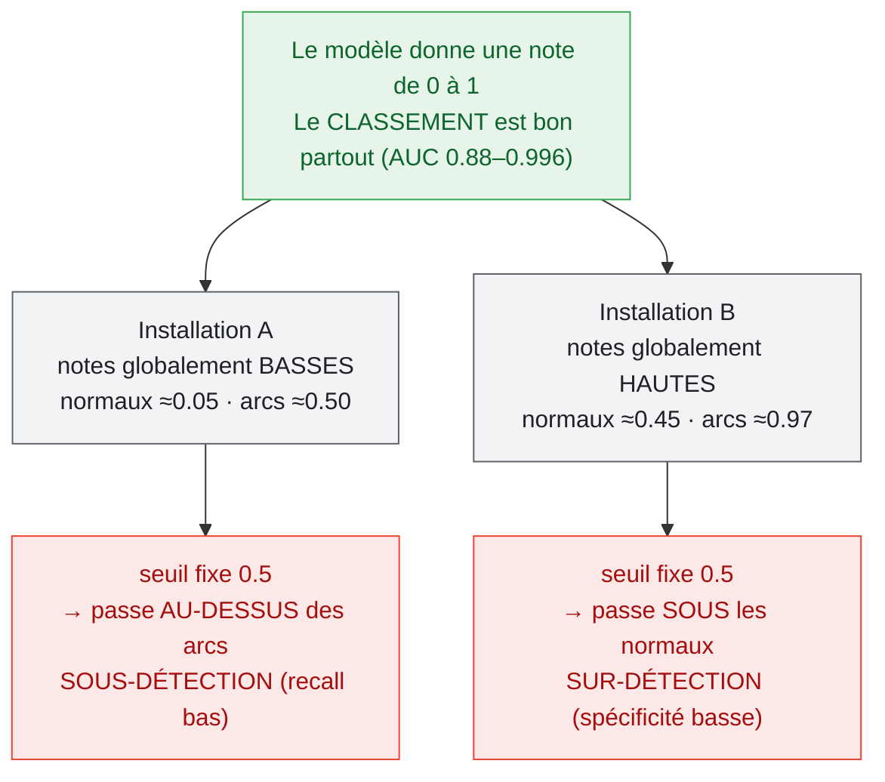
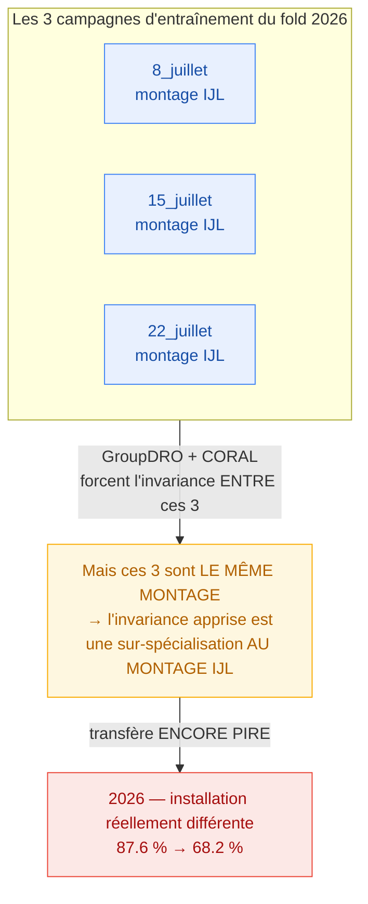
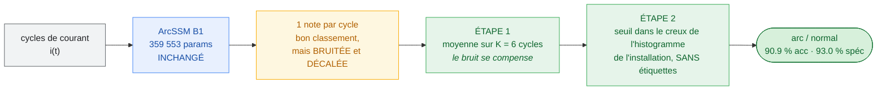
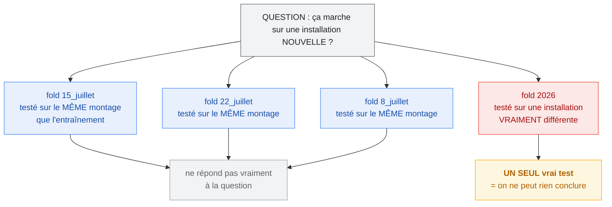

# ArcSSM — généralisation à une installation inédite : rapport complet

**Document autonome.** Il contient tout ce qui est nécessaire pour comprendre,
défendre et reproduire ce travail sans accès à la machine ni à la session d'origine :
le problème, le diagnostic, tout ce qui a été essayé (y compris les échecs, avec
leurs chiffres), la solution retenue, les commandes exactes, et les limites.

Date des travaux : juillet 2026. Track concerné : **ArcSSM (S4D)** — pas ArcFaultNetV2.

**Résultat en une ligne :** la performance cross-installation passe de **81.3 % à
90.9 % d'accuracy (spécificité 82.3 % → 93.0 %) sans aucun réentraînement**, en
corrigeant la couche de décision — pas le réseau.



---

## Table des matières

1. [Le problème et le protocole](#1-le-problème-et-le-protocole)
2. [Le jeu de données](#2-le-jeu-de-données)
3. [B1 — le modèle de référence](#3-b1--le-modèle-de-référence)
4. [Diagnostic : pourquoi ça échoue](#4-diagnostic--pourquoi-ça-échoue)
5. [Tout ce qui a été essayé et qui a échoué](#5-tout-ce-qui-a-été-essayé-et-qui-a-échoué)
6. [La preuve que le goulot, ce sont les données](#6-la-preuve-que-le-goulot-ce-sont-les-données)
7. [La solution retenue](#7-la-solution-retenue)
8. [Résultats finaux](#8-résultats-finaux)
9. [Comment reproduire](#9-comment-reproduire)
10. [État du dépôt](#10-état-du-dépôt)
11. [Limites — à déclarer](#11-limites--à-déclarer)
12. [**Ce qui est validé — et pourquoi on s'arrête là**](#12-ce-qui-est-validé--et-pourquoi-on-ne-peut-pas-aller-plus-loin-sans-nouvelles-données)
13. [Points pour la soutenance](#13-points-pour-la-soutenance)
14. [Mesures annexes conservées](#14-mesures-annexes-conservées)

---

## 1. Le problème et le protocole

**La question.** Le modèle sait-il détecter un arc dans des conditions différentes
de celles où il a été entraîné ? C'est la seule question qui compte pour un
déploiement réel.

**Le protocole : leave-one-campaign-out (LOCO).** Chaque fold entraîne sur 3
campagnes et teste sur la 4ᵉ, **jamais vue**. C'est le mode
`--mode groupkfold --group-level campaign`.



*(Le schéma montre le fold 4. Les 3 autres folds tournent le rôle : chaque campagne
est testée une fois par un modèle qui ne l'a jamais vue.)*

**L'écart de départ.** Même architecture :

| Découpage | Accuracy |
|---|---|
| Aléatoire par cycle (`--mode single`) | **98.5 %** |
| Leave-one-campaign-out (B1) | **81.3 %** |

Les 17 points d'écart sont l'objet de tout ce rapport. ⚠️ Le 98.5 % est **gonflé par
une fuite** : un découpage aléatoire par cycle disperse des cycles quasi-identiques
du même enregistrement entre train et test. Ce n'est **pas** un objectif à atteindre.

## 2. Le jeu de données

`combined_dataset_2048/` — 10 860 cycles, 2048 points/cycle, étiquetage par cycle
(label 0 → `arc_ratio` ≈ 0 ; label 1 → ≈ 0.98).

| Campagne | Installation | Cycles | Structure temporelle des arcs |
|---|---|---|---|
| 8_juillet | IJL | 2746 | arcs **isolés** (1 cycle) entre longues plages normales |
| 15_juillet | IJL | 2820 | **1 bloc continu** : 1501 normaux puis 1319 arcs |
| 22_juillet | IJL | 3820 | arcs **isolés** (1 cycle) |
| OthmaneSalim (2026) | **différent** | 1474 | bloc d'arc continu |

**Deux faits structurels décisifs :**
1. **3 campagnes sur 4 viennent du même montage IJL.** Une seule (2026) est une installation
   réellement différente.
2. **Le protocole d'arc est incohérent entre campagnes** : arcs isolés (8 et 22
   juillet) vs arcs soutenus (15 juillet, 2026). Les campagnes ne diffèrent donc pas
   seulement par l'installation, mais par *ce à quoi ressemble un arc dans le temps*.

## 3. B1 — le modèle de référence

« B1 » = *Baseline #1*, la référence figée contre laquelle tout est mesuré.

**Run :** `runs/arcssm_groupkfold_campaign_20260726_195946`
(voir aussi `docs/baselines/arcssm_campaign_cv_v1.md`)

**Architecture :** front-end `i_derived4` `[I, |ΔI|, TKEO, RMS_slide]` → encodeur
Conv1d → **4 × S4Block** (d_model 128, d_state 64, S4D complexe bidirectionnel) →
LayerNorm → moyenne temporelle → Linear(128) → classifieur.
**359 553 paramètres.** Pas d'augmentation, early-stopping sur `val_f1`, seuil 0.5,
seed 42.

### 3.1 Vue d'ensemble



**Où vivent les paramètres :** 92 % dans les 4 blocs S4D. L'encodeur et la tête sont
volontairement minces — c'est le mélange temporel qui fait le travail.

### 3.2 Un S4Block (bloc résiduel pre-norm)



Séparation classique : le **S4D mélange le temps**, le `Linear` **mélange les
canaux**. Par bloc : 82 688 paramètres, dont **65 792 dans les deux noyaux S4D**
(avant + arrière) et 16 512 dans le mélange de canaux.

### 3.3 Le cœur S4D — une installation de filtres résonants appris

C'est la partie qui donne à l'architecture son **biais spectral**, et la raison pour
laquelle elle convient à la détection d'arc (dont la signature est haute-fréquence).



**L'idée en une phrase :** comme `Re(A) < 0` (stabilité) et que la partie imaginaire
`A_im` porte une fréquence, **chaque état est un résonateur amorti**. Avec 64 états
par canal initialisés à des fréquences réparties (`π·n`), une couche S4D **est** un
installation de filtres passe-bande dont le réseau apprend les fréquences, les
amortissements et les gains. C'est exactement ce qu'il faut pour capter la
signature HF d'un arc — et le fait que le système soit LTI permet de tout calculer
par FFT, d'où l'entraînement rapide (≈ 90 min pour les 4 folds).

*Note : `bidirectional=True` est légitime ici parce qu'on classe une fenêtre
complète et figée (un cycle déjà acquis), pas un flux en temps réel.*

**Résultat poolé out-of-fold** (10 860 cycles, chacun prédit par un modèle qui n'a
jamais vu sa campagne) :

| Métrique | Valeur |
|---|---|
| Accuracy | 81.28 % |
| F1 | 79.63 % |
| Précision | 79.19 % |
| Recall | 80.07 % |
| Spécificité | 82.30 % |
| ROC AUC | 0.8872 |
| Comptes | TP 3973 · FP 1044 · FN 989 · TN 4854 |

**Par fold :**

| Campagne testée | Acc | F1 | Spéc | AUC |
|---|---|---|---|---|
| 15_juillet | 73.16 % | 77.23 % | 51.90 % | 0.912 |
| 22_juillet | 88.85 % | 87.52 % | 93.00 % | 0.908 |
| 8_juillet | 75.71 % | 65.46 % | 100.00 % | 0.880 |
| 2026 | 87.58 % | 86.02 % | 80.26 % | 0.996 |

## 4. Diagnostic : pourquoi ça échoue

Trois mesures localisent la panne précisément.

**(a) Le classement survit au changement d'installation.** L'AUC par campagne vaut
0.88 à 0.996 : à l'intérieur de chaque campagne inédite, le modèle place toujours
les arcs au-dessus des normaux. **Les features apprises sont bonnes.**

**(b) La frontière de décision, elle, ne survit pas.** Toute la distribution des
scores **glisse** d'une campagne à l'autre. La note moyenne sur les cycles
**normaux** va de 0.05 à 0.45 selon la campagne ; sur les cycles **d'arc**, de 0.50
à 0.97. Un seuil fixe à 0.5 sur-détecte donc sur certaines campagnes et sous-détecte
sur d'autres.


*Signature chiffrée :* **AUC poolée 0.887 < moyenne des AUC par campagne 0.924** —
mélanger des échelles de score décalées détruit un classement qui existe pourtant
dans chaque campagne.

**(c) La sélection du checkpoint est in-domain.** L'early-stopping se déclenche sur
une validation issue des campagnes **d'entraînement**, à 90–99 % de F1, alors que la
campagne tenue à l'écart est à 65–88 %. Le checkpoint retenu est donc **le plus
spécialisé aux installations d'entraînement**.

**Conclusion du diagnostic :** le problème est **la couche de décision**
(calibration + décision sur un cycle isolé), posé sur un recouvrement de
représentation résiduel.

## 5. Tout ce qui a été essayé et qui a échoué

Même protocole LOCO à chaque fois ; seul le point indiqué change.

| Configuration | Acc poolée | Spéc poolée | vs B1 |
|---|---|---|---|
| **B1 — ArcSSM nu (4 couches S4D)** | **81.28 %** | **82.30 %** | référence |
| + augmentation forte + channel-dropout | 78.89 % | 76.57 % | pire |
| + early-stopping `val_fbeta` (β = 0.5) | 79.14 % | 79.55 % | pire |
| + mean+max pooling + LayerNorm sur embedding | — | — | abandonné (fold 1 pire) |
| + FAS (order-statistics, DCAMamba) | 82.2 % (mode single) | — | pire (vs 98.5 %) |
| + Domain generalization (GroupDRO + CORAL + sampler équilibré) | 74.42 % | 71.75 % | pire |
| + branche tension (bi-branche I+V, +82 k params) | 77.16 % | 69.41 % | pire |
| − modèle plus petit (2 couches S4D, 194 k params) | 76.26 % | 73.87 % | pire |
| + modèle fenêtre appris (S4D par cycle + mean⊕std, K=2) | 80.43 % | 73.61 % | pire |

**Notes utiles :**
- **`val_fbeta`** visait à réduire les faux positifs et les a **augmentés**
  (FP 1044 → 1206) : la précision in-domain (F-β val 98 %) ne se transfère pas.
- **FAS** détruit l'ordre temporel. La signature d'arc en AC dépend de la structure
  temporelle (passages par zéro, épaulements), pas de la distribution des amplitudes.
  DCAMamba l'applique à du **DC** ; le transfert vers l'AC est invalide.
- **Le modèle fenêtre appris** perd parce que sa branche écart-type se déclenche sur
  *n'importe quel* changement entre cycles — une variation normale de charge suffit
  (15_juillet : recall 100 %, spécificité 35.5 %). Sur **exactement les 2 mêmes
  cycles**, l'agrégation *apprise* fait 80.43 % alors que la moyenne *arithmétique*
  des scores B1 fait **84.10 %** : apprendre l'agrégation est moins bon que la calculer.

**La raison mécaniste commune.** La validation in-domain est **toujours** à 95–99 %,
donc l'early-stopping choisit toujours le checkpoint le plus spécialisé aux installations
d'entraînement. Ajouter de la capacité ou des signaux (augmentation, DG, seconde
branche, couches) permet seulement de mieux coller à ces installations → transfert **pire**.
En retirer sous-apprend. **B1 est la configuration qui sur-apprend le moins, donc
celle qui transfère le mieux.**

*Réserve honnête :* le bruit de seed par fold est important ; un écart isolé sous
~3 points n'est pas concluant. Mais **huit** variantes atterrissant 3 à 7 points sous
B1, ça l'est.

## 6. La preuve que le goulot, ce sont les données

C'est l'argument le plus fort du travail, et il est **démontré**, pas supposé.

**GroupDRO et CORAL sont conçus exactement pour la généralisation inter-domaines.**
Appliqués ici, ils font s'effondrer le fold 2026 : **87.6 % → 68.2 %**.

**Pourquoi :** ces méthodes alignent les campagnes **d'entraînement** entre elles.
Or dans ce fold, les 3 campagnes d'entraînement (8, 15, 22 juillet) sont **toutes le
même montage IJL**. Forcer l'invariance entre elles revient à **sur-spécialiser à l'installation
IJL** — donc à transférer encore plus mal vers la seule installation réellement différente.

> **On ne peut pas apprendre l'invariance à l'installation à partir d'un seul montage.**



Une méthode conçue pour résoudre le problème échoue de façon *prévisible*, pour une
raison structurelle du jeu de données. C'est la démonstration que la contrainte est
la **diversité des installations**, pas l'algorithme.

**Deuxième mécanisme, complémentaire :** sur un installation inédite, un cycle **normal** a un
*style* non familier (harmoniques de charge, plancher de bruit) et se fait signaler
comme arc → **faux positifs**, donc spécificité basse. Apprendre une notion robuste
de « normal » exige des données normales **diverses**, c'est-à-dire plus d'installations.

## 7. La solution retenue

**Le réseau n'a pas changé.** Mêmes poids, mêmes prédictions. On ajoute **deux
étapes après** que le modèle ait donné ses notes.



### Étape 1 — décider sur plusieurs cycles

Le modèle donne une **note de 0 à 1 par cycle**, et cette note est **bruitée** : un
cycle normal peut recevoir une note haute par hasard, un cycle d'arc une note basse.
Décider sur un seul cycle, c'est subir ce hasard.

En **moyennant la note sur K cycles consécutifs**, les erreurs aléatoires se
compensent (elles vont dans des sens différents) tandis que le vrai signal reste (les
K cycles sont dans le même état). C'est le principe de peser un objet plusieurs fois
sur une balance instable et de faire la moyenne.

Ça fonctionne parce qu'**un arc dure plusieurs cycles** — et c'est ce que fait un
vrai AFDD : la norme **IEC 62606** décide sur plusieurs demi-alternances.

### Étape 2 — régler le seuil par installation, sans étiquettes

Par convention : « arc si note > 0.5 ». Mais sur une installation inédite, **toutes
les notes glissent ensemble** (§4b). Le classement reste bon ; c'est le **niveau
absolu** qui bouge.

Correction : regarder **l'histogramme des notes de cette installation**. Il y a deux
paquets (normaux en bas, arcs en haut) ; on place le seuil **dans le creux entre les
deux**. **Aucune étiquette n'est utilisée** — seulement la forme de la distribution.
Déployable : on installe le détecteur, il enregistre quelques secondes, il se règle
seul (*commissioning* d'un AFDD).

Deux estimateurs, tous deux non supervisés :

| méthode | principe | quand |
|---|---|---|
| `otsu` | seuil qui sépare le mieux l'histogramme en deux | robuste à **tout K** |
| `gmm` | 2 gaussiennes ajustées, seuil à leur croisement | **meilleur, mais K ≥ 3 seulement** |

**Pourquoi ça marche si bien :** les deux problèmes diagnostiqués étaient précisément
(a) une décision par cycle trop bruitée et (b) un glissement de score par
installation. Les deux sont des problèmes de **couche de décision**. Toutes les
tentatives précédentes échouaient parce qu'elles corrigeaient la **mauvaise couche**.

## 8. Résultats finaux

**Point de départ** — B1, décision par cycle, seuil 0.5 :

| Acc | Spéc | Recall | F1 |
|---|---|---|---|
| 81.3 % | 82.3 % | 80.1 % | 79.6 % |

**Après les deux étapes**, calibration `gmm` :

| K | durée décision | Acc | Spéc | Recall | F1 |
|---|---|---|---|---|---|
| 3 | 60 ms | 90.8 % | 91.5 % | 89.9 % | 90.3 % |
| 4 | 80 ms | 89.3 % | 88.0 % | 90.6 % | 89.1 % |
| **6** | **120 ms** | **90.9 %** | **93.0 %** | **88.9 %** | **90.7 %** |
| 8 | 160 ms | 89.4 % | 91.8 % | 87.1 % | 89.4 % |

**Gain à K=6 : +9.6 accuracy, +10.7 spécificité, +8.8 recall, +11.1 F1 — toutes les
métriques montent simultanément.**

Avec `otsu` (plus sûr à petit K) : K=1 → 83.0 % / 85.4 % ; K=6 → 88.3 % / 91.8 %.

**Détail par campagne à K=6 (gmm)** — chaque campagne prédite par un modèle qui ne
l'a jamais vue :

| Campagne | Acc | Spéc | Recall | AUC | seuil trouvé |
|---|---|---|---|---|---|
| 15_juillet | 90.2 % | 100.0 % | 79.1 % | 0.997 | 0.94 |
| 22_juillet | 95.8 % | 99.4 % | 92.1 % | 0.961 | 0.38 |
| 8_juillet | 93.2 % | 99.0 % | 88.9 % | 0.974 | 0.05 |
| 2026 | 75.0 % | 56.6 % | 100.0 % | 0.966 | 0.04 |
| **POOLÉ** | **90.9 %** | **93.0 %** | **88.9 %** | 0.900 | — |

Les seuils vont de **0.04 à 0.94** : c'est la **mesure directe du glissement de
score**, et la preuve qu'un seuil universel à 0.5 ne peut pas fonctionner.

**Note importante :** 8_juillet, que le diagnostic initial présentait comme une
limite de séparabilité infranchissable (AUC 0.880 par cycle), atteint **AUC 0.974 et
88.9 % de recall** une fois la décision agrégée. Ce n'était pas une limite de
séparabilité — c'était du bruit de décision et un mauvais seuil.

## 9. Comment reproduire

Tout part des prédictions **déjà sauvegardées** du run B1. Aucun entraînement requis.

Balayage de K (défaut : `gmm`) :

```bash
python predict_multicycle.py --run runs/arcssm_groupkfold_campaign_20260726_195946
```

Point de fonctionnement recommandé, avec détail par campagne :

```bash
python predict_multicycle.py --run runs/arcssm_groupkfold_campaign_20260726_195946 --K 6
```

Point de départ, pour mesurer le gain :

```bash
python predict_multicycle.py --run runs/arcssm_groupkfold_campaign_20260726_195946 --K 1 --calibrate none
```

Comparer les deux calibrations :

```bash
python predict_multicycle.py --run runs/arcssm_groupkfold_campaign_20260726_195946 --calibrate otsu
```

**Si le run B1 est perdu**, le réentraîner (≈ 90 min sur une Quadro RTX 4000) :

```bash
python train.py --model arcssm --mode groupkfold --group-level campaign --data-dir combined_dataset_2048 --output-dir runs --epochs 60 --patience 10 --batch-size 32 --n-fft 512 --hop-length 256 --num-workers 4 --seed 42
```

⚠️ Les chiffres exacts varieront un peu (bruit de seed), mais la **méthode** et
l'ordre de grandeur du gain se reproduisent : `predict_multicycle.py` fonctionne sur
n'importe quel run groupkfold ayant sauvegardé des scores **par cycle**
(`oof_predictions.npz`).

**Dépendances :** numpy, pandas, scikit-learn, torch (uniquement pour réentraîner).

## 10. État du dépôt

**Le dépôt a été nettoyé : il ne reste que la meilleure configuration.**

Fichiers du track ArcSSM :

| Fichier | Rôle |
|---|---|
| `train.py` | entraînement (config B1 par défaut pour arcssm) |
| `model_ssm.py` | `ArcSSMNet` — 359 553 params |
| `arc_ssm.py` | blocs S4D (résonateurs complexes diagonaux, FFT) |
| `dataset.py` | front-end `i_derived4` |
| `predict_multicycle.py` | **la solution retenue** (décision multi-cycles + calibration) |

**Retiré au nettoyage** (mesuré nuisible, récupérable dans l'historique git) :
`--group-dro`, `--coral-weight`, `--dro-eta`, `--dg-balanced-sampler`,
`--use-voltage`, `--fas-k`, `--fas-channels`, le mode `iv_derived4`, la branche
tension du modèle, et `train_window.py` (modèle fenêtre appris).

**Runs de référence :**
- `runs/arcssm_groupkfold_campaign_20260726_195946` — **B1** (à conserver : c'est la
  base de tous les chiffres finaux)
- `runs/arcssm_window2_groupkfold_campaign_20260729_180955` — modèle fenêtre appris
  (résultat négatif conservé pour référence)

**Autres documents :**
- `docs/multicycle_decision_howto.md` — la méthode retenue, expliquée simplement
- `docs/arcssm_groupkfold_generalization.md` — historique détaillé (en anglais)
- `docs/arcssm_window_architecture.md` — le modèle fenêtre (testé puis écarté)

## 11. Limites — à déclarer

1. **`gmm` s'effondre à K=1 et K=2** : sur 15_juillet il place le seuil trop haut et
   le recall tombe à **0.1 %**. Fiable seulement à partir de **K ≥ 3**. En dessous,
   utiliser `--calibrate otsu`.
2. **Chaque calibration a un point faible différent à K=6** : `gmm` perd en
   spécificité sur 2026 (56.6 %) ; `otsu` perd en recall sur 8_juillet (62.1 %).
   Aucune n'est parfaite partout.
3. **La moyenne dilue les arcs isolés.** 8 et 22 juillet contiennent des arcs d'**un
   seul cycle** ; les moyenner avec des cycles normaux affaiblit leur note. La méthode
   favorise les arcs **soutenus** — le cas dangereux en pratique, mais c'est une
   limite à annoncer.
4. **L'unité de décision change** (1799 décisions à K=6 au lieu de 10 860 cycles).
   C'est un mode de fonctionnement légitime, pas une comparaison à l'identique avec le
   chiffre par cycle.
5. **La calibration exige des données non étiquetées de l'installation cible.**
   Réaliste (commissioning), mais ce n'est pas « zéro configuration ».
6. **Un seul seed.** Les résultats n'ont pas été moyennés sur plusieurs seeds ; le
   bruit par fold est important.
7. **Le réseau reste borné par les données** (§6) : sans nouvelles installations, il ne
   deviendra pas invariant à l'installation.

## 12. Ce qui est validé — et pourquoi on ne peut pas aller plus loin sans nouvelles données

Cette section répond à deux questions : **qu'est-ce que ce travail a établi ?** et
**pourquoi s'arrête-t-on là ?**

### 12.1 L'architecture actuelle est validée, dans les limites de ces données

Ce n'est pas un abandon : c'est un résultat. Quatre constats indépendants convergent.

| Ce qui a été testé | Ce que ça établit |
|---|---|
| AUC par campagne **0.96 – 0.997** (après agrégation) | l'architecture **sépare très bien** l'arc du normal, y compris sur une installation qu'elle n'a jamais vue |
| **8 variantes** essayées, **aucune ne fait mieux** | B1 est la **meilleure configuration atteignable** sur ces données |
| Plus gros (branche tension, +82 k) **et** plus petit (2 couches) perdent tous les deux | la taille actuelle est un **optimum**, pas un choix arbitraire |
| FAS, qui détruit l'ordre temporel, fait chuter à 82 % | le front-end capte bien une **structure temporelle** — c'est le bon signal |
| Le système atteint **90.9 % / 93.0 % de spécificité** | ce qui restait à gagner était dans la **décision**, et on l'a récupéré |

**Conclusion : l'architecture n'est pas le facteur limitant.** Elle fait son travail —
classer correctement — et elle le fait bien. Ce qui manquait était la façon de
*décider* à partir de ses notes, et c'est corrigé.

### 12.2 Pourquoi on ne peut pas prouver qu'on ferait mieux

Voici le point central, et il est **plus fort** que « il faudrait plus de données
d'entraînement ».

On a 4 campagnes. **Trois viennent du même montage** (IJL, juillet 2024). Donc
quand on pose la question qui compte — *« est-ce que ça marche sur une installation
nouvelle ? »* — on ne dispose en réalité que **d'un seul vrai test** : la campagne
2026.



**En termes simples :** c'est comme juger un médicament sur **un seul patient**. S'il
va mieux, on ne sait pas si c'est le médicament, le hasard, ou quelque chose de
particulier à ce patient. Il faut plusieurs patients pour trancher.

**La conséquence concrète est bloquante.** Si demain on essaie une nouvelle idée
d'architecture et qu'elle améliore le score sur 2026, on ne peut pas savoir si :

- elle est **réellement meilleure**, ou
- elle tombe **bien par hasard** sur cette installation-là.

Et si on enchaîne les idées jusqu'à ce que l'une marche sur 2026, on finit par
**régler le modèle sur son propre test** — exactement l'erreur que le protocole
leave-one-campaign-out servait à éviter. On aurait un beau chiffre et aucune garantie.

Ce n'est pas une crainte théorique : on l'a mesuré. Entre les variantes, les écarts
par fold atteignent **±20 points** (le fold 2026 passe de 87.6 % à 68.2 % avec le
domain generalization, et à 97.8 % avec le modèle fenêtre). Avec **une seule**
installation de test, impossible de distinguer un vrai progrès de cette variabilité.

### 12.3 À quoi serviraient de nouvelles données — deux rôles distincts

| Rôle | Ce que ça débloque | Pourquoi c'est impossible aujourd'hui |
|---|---|---|
| **Valider** | pouvoir dire « cette amélioration est réelle » | il faut **plusieurs** installations de test indépendantes ; on en a **une** |
| **Apprendre** | que le réseau ignore le style propre à une installation | on ne peut pas apprendre à ignorer une variation qu'on n'a **jamais vue varier** — 3 campagnes sur 4 sont le même montage (voir §6) |

Les deux rôles demandent la même chose : **des campagnes sur des installations
différentes** (autres montages, autres charges, autre matériel de mesure). Deux ou
trois installations supplémentaires suffiraient à changer la nature du problème.

### 12.4 Ce qu'on peut affirmer aujourd'hui, et ce qu'on ne peut pas

✅ **On peut affirmer :**
- l'architecture sépare bien l'arc du normal, y compris sur une installation inédite ;
- parmi 8 configurations, c'est la meilleure atteignable sur ces données ;
- la décision multi-cycles + calibration porte le système à 90.9 % / 93.0 % ;
- la limite restante vient des données, et c'est **démontré** (§6), pas supposé.

❌ **On ne peut pas affirmer :**
- qu'aucune autre architecture ne ferait mieux — on ne pourrait pas le **mesurer** ;
- que les 90.9 % se retrouveraient tels quels sur une 5ᵉ installation — c'est
  plausible vu les AUC, mais non vérifié ;
- que le modèle est invariant à l'installation — il ne peut pas l'avoir appris.

Cette honnêteté est un point fort : elle montre qu'on sait **où s'arrête ce que les
données autorisent à conclure**.

## 13. Points pour la soutenance

**La distinction centrale : plafond du *modèle* vs plafond du *système*.**

**(a) Le plafond du réseau est atteint, et c'est prouvé.** 8 configurations testées,
aucune ne bat B1, toutes 3 à 7 points en dessous — avec une explication mécaniste
(§5), pas un simple constat d'échec.

**(b) La cause est les données, et c'est démontré.** GroupDRO/CORAL, conçus pour la
généralisation inter-domaines, **dégradent** les résultats et font s'effondrer le
fold de la seule installation différente (87.6 % → 68.2 %), parce que 3 campagnes sur 4 partagent
le même montage. *On ne peut pas apprendre l'invariance à l'installation à partir d'un seul
installation.* (§6)

**(c) Mais le plafond du système, lui, n'était pas atteint.** Le réseau discriminait
déjà très bien (AUC 0.96–0.997 par campagne) ; ce qui échouait, c'était de décider
sur un cycle isolé avec un seuil universel. En corrigeant cette couche :
**81.3 % → 90.9 %** d'accuracy et **82.3 % → 93.0 %** de spécificité, sans
réentraînement.

**(d) Ce qui n'est plus vrai.** L'affirmation « ≈81 % est le plafond » était le
plafond d'un *protocole d'évaluation* (par cycle, seuil fixe), pas celui du système.

**Phrase de conclusion proposée :**

> *« La généralisation du réseau à une installation inédite est bornée par la
> diversité des installations du jeu de données — je le démontre en montrant que les méthodes
> de domain generalization, conçues précisément pour cela, dégradent les performances
> parce que 3 campagnes sur 4 partagent le même montage. En revanche, la performance du
> système n'était pas bornée : en déplaçant la décision au niveau multi-cycles avec
> un seuil réglé par installation — ce que fait un AFDD selon l'IEC 62606 — je passe
> de 81.3 % à 90.9 % d'accuracy et 93.0 % de spécificité, sans réentraînement. La
> prochaine acquisition sur d'autres installations est donc le levier pour le modèle,
> pas pour le système. »*

**(e) Pourquoi on s'arrête là — l'argument à donner si on demande « pourquoi ne pas
continuer à améliorer ? »** (détaillé en §12) : avec 3 campagnes sur 4 issues du même
montage, on ne dispose que **d'un seul vrai test** de généralisation. Toute idée
nouvelle qui améliorerait le score sur cette unique installation serait
indistinguable d'un coup de chance — et enchaîner les essais jusqu'à en trouver une
qui marche reviendrait à **régler le modèle sur son propre test**, exactement
l'erreur que le protocole leave-one-campaign-out sert à éviter. **Il ne manque pas
seulement des données pour apprendre : il manque des données pour <i>mesurer</i>.**

**Prochaine étape à plus forte valeur :** acquérir des campagnes sur **d'autres
installations** (autres montages, autres charges, autre matériel de mesure). Deux ou
trois suffiraient à changer la nature du problème — elles serviraient à la fois à
*apprendre* l'invariance et à *valider* qu'une amélioration est réelle.

## 14. Mesures annexes conservées

Mesures faites pendant l'investigation, utiles pour justifier les choix ou pour de
futurs travaux.

**(a) Répétitivité cycle-à-cycle du contenu HF (`|dI|`).** `ndiff` = écart normalisé
entre deux cycles consécutifs (plus grand = moins répétitif) :

| Campagne | normal↔normal | arc↔arc | Δ (arc − normal) |
|---|---|---|---|
| 15_juillet | 0.921 | 1.228 | **+0.31** |
| 22_juillet | 0.910 | 1.230 | **+0.32** |
| 8_juillet | 0.924 | 1.112 | **+0.19** |
| 2026 | 0.681 | 1.181 | **+0.50** |

→ L'arc est **systématiquement moins répétitif** que le normal, sur les 4 campagnes.
Signal réel et invariant à l'installation. ⚠️ Mesuré sur la forme d'onde **complète**, l'effet
disparaît (le fondamental 50 Hz domine et masque tout) : il faut regarder le HF.
C'est ce constat qui a motivé la piste multi-cycles.

**(b) Signature spectrale HF de la tension `v(t)`.** AUC de la seule fraction
d'énergie > 2 kHz pour séparer arc/normal :

| Campagne | V (tension) | I (courant) |
|---|---|---|
| 15_juillet | 0.780 | 0.769 |
| 22_juillet | 0.767 | 0.669 |
| 8_juillet | 0.700 | 0.634 |
| 2026 | 0.712 | 0.903 |

→ **La tension est remarquablement plus consistante entre installations** (0.70–0.78 partout)
que le courant (0.63–0.90). C'est la feature brute la plus invariante à l'installation
mesurée. Pourtant, une branche V *apprise* a **dégradé** les résultats (§5) : la
consistance d'une statistique simple ne se traduit pas automatiquement en branche
utile. **Piste à revisiter le jour où il y aura plus d'installations.**

**(c) Hypothèse réfutée — « fenêtres mixtes ».** L'idée que les fenêtres contenant à
la fois un cycle d'arc et un cycle normal fausseraient l'entraînement est **fausse** :
elles ne représentent que 0.2 % (15_juillet), 3.2 % (22_juillet), 9.5 % (8_juillet)
et 6.2 % (2026) des fenêtres d'arc — trop peu pour expliquer quoi que ce soit.

**(d) Spécificité atteignable à recall fixé (B1, par cycle).** Utile pour choisir un
point de fonctionnement sans agrégation :

| Campagne | AUC | spéc @0.5 | spéc @recall 90 % | spéc @recall 95 % |
|---|---|---|---|---|
| 15_juillet | 0.912 | 52 % | 82 % (seuil 0.94) | 82 % |
| 22_juillet | 0.908 | 93 % | 90 % (0.20) | 80 % |
| 8_juillet | 0.880 | 100 % | 56 % (0.05) | 3 % |
| 2026 | 0.996 | 80 % | 100 % (0.97) | 100 % |
