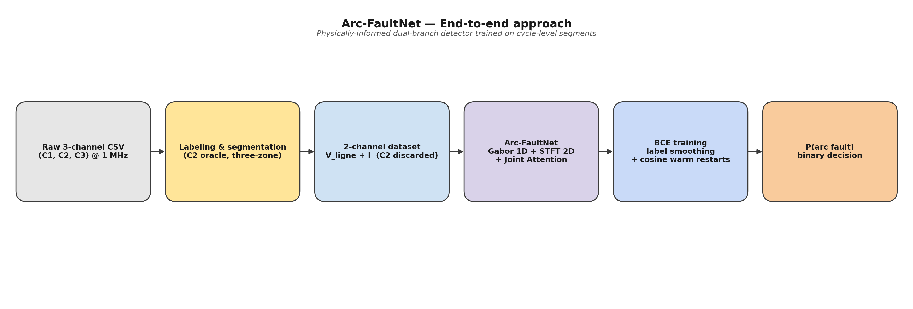

# 00 — Overall approach



## 1. Problem statement

Arc-FaultNet detects **series arc faults** in low-voltage residential
installations from the *raw* mains current and voltage at 1 MHz. A
series arc is a high-frequency, broadband, intermittent disturbance
that:

* leaves the slow 50 Hz envelope almost intact (so simple RMS-based
  protections miss it),
* depends strongly on the connected load (resistive, inductive,
  switching power supply, light dimmer, …),
* and is therefore very hard to characterise by a single hand-crafted
  feature.

The model receives one full 50 Hz cycle (20 000 samples at 1 MHz) and
returns a single probability $P(\text{arc fault})$.

## 2. High-level approach (six stages)

| # | Stage | What happens | Section |
|---|-------|--------------|---------|
| 1 | **Raw 3-channel CSV**          | Oscilloscope export with `C1 = V_ligne`, `C2 = V_arc`, `C3 = I` | [Data pipeline](09_data_pipeline.md) |
| 2 | **Labeling & segmentation**    | C1 used for zero-crossing → segments; C2 used as *oracle* to label arc presence; three-zone thresholding discards ambiguous cycles. | [Data pipeline](09_data_pipeline.md) |
| 3 | **2-channel dataset**          | Only `[V_ligne, I]` are kept as model input. C2 is **discarded** (oracle only). | [Data pipeline](09_data_pipeline.md) |
| 4 | **Arc-FaultNet model**         | Parametric Gabor 1D branch  +  STFT-restricted 2D branch  +  cross-branch Joint Attention. | [Model architecture](01_model_architecture.md) |
| 5 | **Training**                   | BCE with logits, label smoothing $0.05$, AdamW, cosine warm restarts, gradient clipping. | (training script — outside this document) |
| 6 | **Decision**                   | `σ(logit) > 0.5` → arc, else normal. | [Classifier head](08_classifier_head.md) |

## 3. The four pillars of the contribution

Arc-FaultNet is *not* a generic CNN. Its four design choices were made
specifically for the physics of series arc faults and form the
scientific contribution of this work:

1. **Physically-grounded labeling that never leaks at inference time.**
   We use the arc voltage `C2` only at *labeling time* to decide whether
   a cycle is in the arc regime (three-zone rule on
   $\text{ratio} = \overline{\mathbf{1}\{|C_2| > V_{th}\}}$).
   `C2` is **never** given to the model. Two consequences:
   * Training labels are physically meaningful (not human-annotated
     guesses).
   * The model is forced to learn an arc signature in
     $(V_\text{ligne}, I)$ — i.e. quantities that are actually
     measurable in a real installation.

2. **Dual representation of the same cycle.**
   The same input is processed in two complementary domains:
   * **Branch 1D** consumes the raw waveform (time-domain) through
     **parametric Gabor filters** with *learnable* center frequency
     $f_0$ and width $\sigma$. Each filter remains physically
     interpretable.
   * **Branch 2D** consumes the **log-power STFT** restricted to
     2–100 kHz — the band where arc-noise has a measurable signature
     and where load harmonics (≤ 2 kHz) and quantisation/EMI noise
     (≥ 100 kHz) do not dominate.

   See [Branch 1D](02_branch1d.md) and [Branch 2D](04_branch2d.md).

3. **Cross-branch Joint Attention.**
   Instead of fusing the two branches by concatenation (which gives
   them equal, uniform weight) or by applying CBAM independently on
   each branch (which never lets them see each other), we apply CAM
   and SAM **on the joint context** `F_concat = cat(F_L, F_H)`.
   * CAM produces a single channel-attention vector
     $\beta \in (0,1)^{2C}$ — its first $C$ entries gate the temporal
     channels, its last $C$ entries gate the spectral channels.
   * SAM computes a single temporal attention map
     $\alpha \in \mathbb{R}^{D \times D}$, then projects its output
     into two per-branch streams.
   * A residual sum per branch and a final $1{\times}1$ conv produce
     the fused descriptor.

   See [Joint Attention](05_joint_attention.md) for the full
   scientific contribution discussion.

4. **Cycle-level decisions on 50 Hz alternances.**
   The model is asked to make *one* decision per 50 Hz cycle. This
   matches IEC 62606 (which evaluates arc-fault circuit-interrupters
   over multi-cycle windows) and produces a model that can be
   pipelined into a real-time detector with deterministic latency
   (one 20 ms cycle).

## 4. What is **out of scope** in this document

The following pieces of the project exist but are not part of the
present architectural documentation:

* The **Leave-One-Charge-Out** cross-validation splitter
  (`LeaveOneChargeOutSplitter` in `dataset.py`). It is the future
  evaluation protocol; the current focus is the model itself.
* The **ablation framework** (`ablation.py`). It will be activated
  later to quantify how much each pillar (Gabor / STFT / Joint
  Attention) contributes.
* `mini_evaluate.py`, the contents of `runs/`, and `colab_plotter.py`
  are utility tooling and not part of the architectural contribution.

## 5. File map for this documentation

```
docs/architecture/
├── README.md                            ← index, this file links there
├── gen_diagrams.py                      ← matplotlib script producing every PNG
├── diagrams/
│   ├── 00_overall_approach.png
│   ├── 01_model_architecture.png        ← MAIN diagram
│   ├── 02_branch1d.png
│   ├── 03_parametric_gabor.png
│   ├── 04_branch2d.png
│   ├── 05_joint_attention.png
│   ├── 06_channel_attention.png
│   ├── 07_spatial_attention.png
│   ├── 08_classifier_head.png
│   └── 09_data_pipeline.png
└── modules/                             ← one .md per module
    ├── 00_overall_approach.md           ← (this file)
    ├── 01_model_architecture.md
    ├── 02_branch1d.md
    ├── 03_parametric_gabor.md
    ├── 04_branch2d.md
    ├── 05_joint_attention.md
    ├── 06_channel_attention.md
    ├── 07_spatial_attention.md
    ├── 08_classifier_head.md
    └── 09_data_pipeline.md
```
