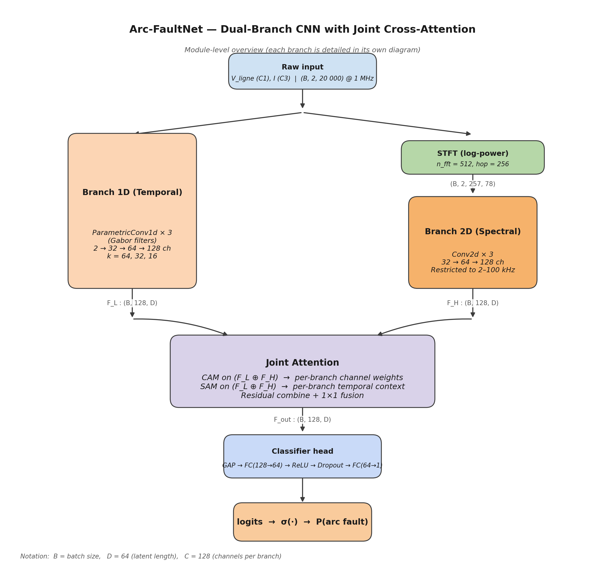
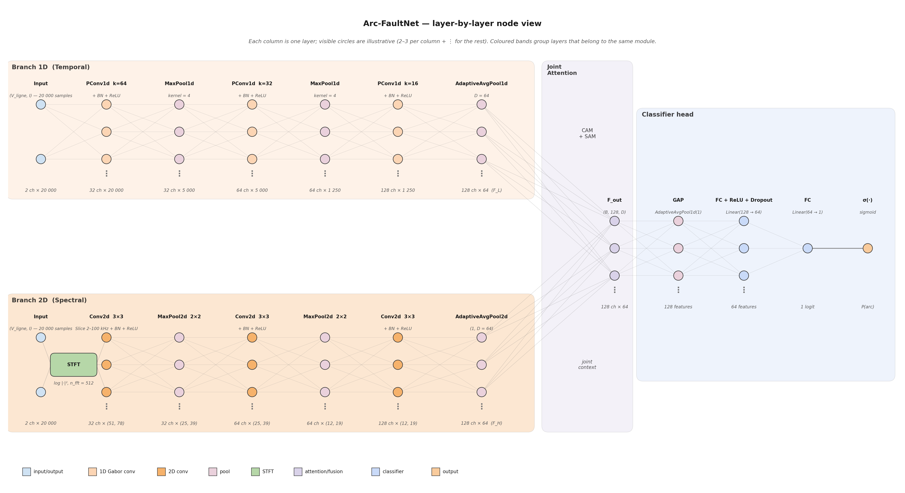

# 01 — Arc-FaultNet : full model architecture



This is the **main diagram** of the project. Every other diagram in
this folder zooms into one of the blocks shown here.

## 1. Inputs and outputs

| Name  | Shape                | Meaning |
|-------|----------------------|---------|
| `x_1d` | `(B, 2, 20 000)`     | raw cycle, channels `[V_ligne, I]`, z-scored per channel per cycle |
| `x_2d` | `(B, 2, 257, 78)`    | log-power STFT of the same cycle, channels `[V_ligne, I]` (full 257 frequency bins; frequency restriction happens inside Branch 2D) |
| `logits` | `(B,)`             | unnormalised arc score; `σ(logits)` is the arc probability |

Constants: `B` is the mini-batch size, `C = 128` channels per branch,
`D = 64` latent length. The numbers `20 000`, `257`, `78` come from
`fs = 1 MHz`, one 50 Hz cycle and `n_fft = 512, hop = 256`.

## 2. Module wiring

The forward pass is implemented in `ArcFaultNet.forward` in `model.py`:

```608:635:/home/top/Arc-Fault-Net/model.py
    def forward(
        self,
        x_1d: torch.Tensor,
        x_2d: torch.Tensor
    ) -> torch.Tensor:
        """
        Args:
            x_1d: (batch, 2, 20000) - raw signals [V_ligne, I]
            x_2d: (batch, 2, n_freq, n_time) - STFT spectrograms [V_ligne, I]
        
        Returns:
            logits: (batch,) - raw logits for BCEWithLogitsLoss
        """
        # Extract features from both branches
        F_L = self.branch_1d(x_1d)  # (batch, 128, D)
        F_H = self.branch_2d(x_2d)  # (batch, 128, D)
        
        # Fuse with attention
        if self.use_joint_attention:
            F_out = self.joint_attn(F_L, F_H)  # (batch, 128, D)
        else:
            F_concat = torch.cat([F_L, F_H], dim=1)
            F_out = self.joint_attn(F_concat)
        
        # Classify
        logits = self.classifier(F_out)  # (batch,)
        
        return logits
```

The four building blocks are:

| Block | Output shape | Detailed module |
|-------|--------------|-----------------|
| `Branch1D`  (temporal, parametric Gabor) | `F_L : (B, 128, 64)` | [`02_branch1d.md`](02_branch1d.md) |
| `Branch2D`  (spectral, frequency-restricted) | `F_H : (B, 128, 64)` | [`04_branch2d.md`](04_branch2d.md) |
| `JointAttention`  (cross-branch CAM + SAM) | `F_out : (B, 128, 64)` | [`05_joint_attention.md`](05_joint_attention.md) |
| `ClassifierHead` | `logits : (B,)` | [`08_classifier_head.md`](08_classifier_head.md) |

## 3. Why this exact topology?

1. **A single global branch is not enough.** Time-domain features
   capture the *shape* of the current pulse at the millisecond scale
   (ignition transients, current restrike); spectral features capture
   the *broadband HF noise* introduced by the arc. Dropping either
   branch hurts performance in our ablation results (`1d_only` and
   the spectral-only experiments).

2. **Separate paths before fusion preserve branch identity.** Sharing
   weights across the two representations would force the kernels to
   work simultaneously in both domains and would lose the
   interpretability of the Gabor filters.

3. **The fusion is done in attention space, not feature space.** The
   two branches arrive at the same latent shape `(B, 128, 64)`. Joint
   Attention then *reweights* them rather than averaging them.

## 4. Where the scientific contribution lives in this diagram

| Pillar | Block in diagram | Section |
|--------|------------------|---------|
| Parametric Gabor filters with learnable $(f_0, \sigma)$ | inside **Branch 1D (Temporal)** | [`03_parametric_gabor.md`](03_parametric_gabor.md) |
| Domain-informed frequency band 2–100 kHz | inside **Branch 2D (Spectral)** | [`04_branch2d.md`](04_branch2d.md) |
| Dual-branch design (1D + 2D STFT) | the splitting of Raw input into the two branches | this file |
| Joint cross-branch CAM + SAM | the **Joint Attention** block | [`05_joint_attention.md`](05_joint_attention.md) |

Pillars 1 and 4 come from MC-VSAttn (acknowledged inspiration); the
dual-branch topology + STFT band + cross-branch joint attention is the
**original contribution** of Arc-FaultNet.

## 5. Layer-by-layer node view



The block-level diagram at the top of this page shows *modules*. The
diagram above shows the same network at the **layer level**, with each
layer rendered as a column of circles (only 2–3 visible per column —
the vertical ellipsis indicates the remaining channels of that layer).

How to read it, left-to-right:

| Region (coloured band) | Columns | What you see |
|------------------------|---------|--------------|
| **Branch 1D (Temporal)** — top band | `Input`  → `PConv1d k=64 + BN + ReLU` → `MaxPool1d` → `PConv1d k=32 + BN + ReLU` → `MaxPool1d` → `PConv1d k=16 + BN + ReLU` → `AdaptiveAvgPool1d (D = 64)` → **F_L** | the channel count grows `2 → 32 → 64 → 128`, the latent length shrinks `20 000 → 5 000 → 1 250 → 64` |
| **Branch 2D (Spectral)** — bottom band | `Input` → small `STFT` badge → `Conv2d 3×3` (with the 2–100 kHz slice) → `MaxPool2d` → `Conv2d 3×3` → `MaxPool2d` → `Conv2d 3×3` → `AdaptiveAvgPool2d ((1, D))` → **F_H** | the channel count grows `2 → 32 → 64 → 128`, the spectrogram shrinks `(51, 78) → (25, 39) → (12, 19) → (1, 64)` |
| **Joint Attention** — purple band in the middle | `F_L` and `F_H` (both `128 ch × 64`) feed a single block in which CAM and SAM act on the joint context; the output is the `F_out` column (`128 ch × 64`) | the two diagonal bundles of edges entering `F_out` are the only place where the two branches actually meet |
| **Classifier head** — right blue band | `F_out` → `GAP` (`128` features) → `FC + ReLU + Dropout` (`64` features) → `FC` (`1` logit) → `σ(·)` → `P(arc)` | the *channel* axis becomes the *feature* axis after GAP |

The thin grey edges between columns are illustrative: they represent
the dense connectivity inside each layer (every output channel
depends on every input channel) but they are intentionally drawn
sparsely so the picture stays readable.

Two further reading notes:

* the **Input** column is shown twice (one for each branch) because
  the two branches read the same `(V_ligne, I)` cycle independently —
  the only difference is the `STFT` transform that prefixes Branch 2D;
* the *latent time axis* `D = 64` is preserved end-to-end from the
  last column of each branch all the way through `F_out`. This is
  what allows Joint Attention to do strict element-wise alignment
  across branches (see [Joint Attention](05_joint_attention.md)).

## 6. Parameter budget (full model)

Counts obtained by instantiating `ArcFaultNet()` from
[`model.py`](../../model.py) and summing `parameter.numel()` per
submodule:

| Submodule          | Parameters | Share |
|--------------------|-----------:|------:|
| `Branch1D`         |     21 280 |  6.6 % |
| `Branch2D`         |     93 408 | 29.1 % |
| `JointAttention`   |    197 600 | 61.6 % |
| `ClassifierHead`   |      8 321 |  2.6 % |
| **Total**          | **320 609** | 100 % |

A dedicated figure — [Parameter budget](15_param_budget.md) — and
its PNG ([`15_param_budget.png`](../diagrams/15_param_budget.png))
visualise this distribution and discuss its consequences for edge
deployment. At ~321 k parameters the full model fits comfortably on
a low-cost microcontroller after int8 quantisation, consistent with
our deployment hypothesis (an in-line arc-fault circuit interrupter,
AFCI).

## 7. Companion figures

* [Tensor-shape flow](11_tensor_flow.md) — cuboid view of every
  tensor shape across the two branches.
* [Receptive-field cascade](12_receptive_field.md) — what an
  output unit of Branch 1D "sees" in time.
* [Input examples](13_input_examples.md) — real cycles in the three
  representations the model uses.
* [Arc-ratio histogram](14_arc_ratio_histogram.md) — labeling-oracle
  distribution and the three decision zones.
* [Parameter budget](15_param_budget.md) — exact counts per
  submodule.
* [Gabor filter atlas](16_gabor_atlas.md) — Branch 1D's first-stage
  filters, plus their $(f_0,\sigma)$ scatter.
