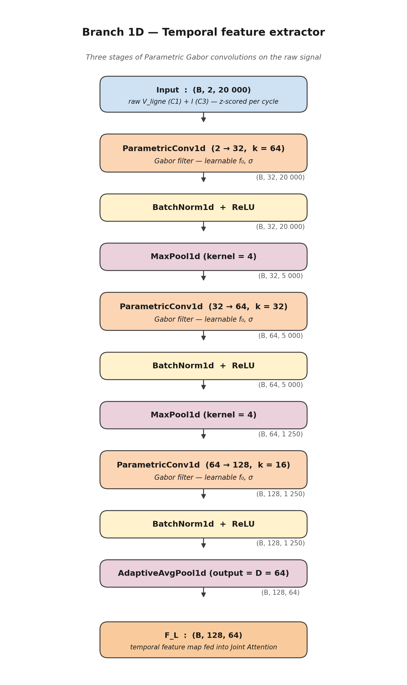

# 02 — Branch 1D : Temporal feature extractor



## 1. Role in the model

`Branch1D` takes the raw 1 MHz cycle `x_1d : (B, 2, 20 000)`
(channels `[V_ligne, I]`) and produces a compact temporal
representation `F_L : (B, 128, 64)` that is fed into the
[Joint Attention](05_joint_attention.md) module.

It mirrors the macro-structure used in CBAM-based 1-D backbones
(three Conv → BN → ReLU stages with decreasing resolution and
increasing depth) but replaces the **first** layer of each Conv block
with a custom [`ParametricConv1d`](03_parametric_gabor.md) — a
learnable Gabor filter bank.

## 2. Layer-by-layer description

Implementation in `model.py` :

```164:214:/home/top/Arc-Fault-Net/model.py
    def __init__(
        self,
        in_channels: int = 2,
        hidden_dims: Tuple[int, int, int] = (32, 64, 128),
        kernel_sizes: Tuple[int, int, int] = (64, 32, 16),
        output_dim: int = 64,  # D in the plan
        use_parametric: bool = True
    ):
        super().__init__()
        
        self.output_dim = output_dim
        self.use_parametric = use_parametric
        
        dims = [in_channels] + list(hidden_dims)
        
        layers = []
        for i in range(3):
            if use_parametric:
                conv = ParametricConv1d(
                    dims[i], dims[i+1],
                    kernel_size=kernel_sizes[i],
                    padding=kernel_sizes[i] // 2
                )
            else:
                conv = nn.Conv1d(
                    dims[i], dims[i+1],
                    kernel_size=kernel_sizes[i],
                    padding=kernel_sizes[i] // 2
                )
            
            layers.append(conv)
            layers.append(nn.BatchNorm1d(dims[i+1]))
            layers.append(nn.ReLU(inplace=True))
            
            if i < 2:
                layers.append(nn.MaxPool1d(4))
        
        self.features = nn.Sequential(*layers)
        self.pool = nn.AdaptiveAvgPool1d(output_dim)
    
    def forward(self, x: torch.Tensor) -> torch.Tensor:
        """
        Args:
            x: (batch, 2, 20000)  — [V_ligne, I]
        
        Returns:
            F_L: (batch, 128, D)
        """
        x = self.features(x)  # (batch, 128, ~1250)
        x = self.pool(x)      # (batch, 128, D)
        return x
```

| Stage | Layer | Channels | Kernel | Output shape |
|-------|-------|----------|--------|--------------|
| 1 | `ParametricConv1d` + BN + ReLU + MaxPool(4) | `2 → 32`   | `k = 64` | `(B, 32, 5 000)` |
| 2 | `ParametricConv1d` + BN + ReLU + MaxPool(4) | `32 → 64`  | `k = 32` | `(B, 64, 1 250)` |
| 3 | `ParametricConv1d` + BN + ReLU              | `64 → 128` | `k = 16` | `(B, 128, 1 250)` |
| out | `AdaptiveAvgPool1d(D = 64)`               | —          | —        | `(B, 128, 64)`   |

The three kernel sizes `64 → 32 → 16` follow the usual rule
**resolution × kernel ≈ constant**: after every MaxPool the receptive
field stays comparable in time while the channel count doubles.

The final `AdaptiveAvgPool1d(D = 64)` enforces the latent length
`D = 64` to match `Branch2D`, so that Joint Attention can fuse the two
streams *without resizing*.

## 3. Why three stages, two pools, and `D = 64`?

* **Three stages** — empirically the smallest depth in which the
  parametric Gabors can specialise to different time scales
  (high-frequency ringing in stage 1, transient envelopes in stages 2
  and 3). Two stages collapsed too many frequencies into the same
  filters; four stages overfit on the small (~5 k samples) dataset.

* **Two MaxPool(4) layers** — they downsample by a factor of 16 in
  total, taking the latent length from 20 000 to 1 250. This keeps
  enough temporal resolution to *localise* an arc inside a cycle
  (~80 µs per latent step) while controlling memory.

* **`D = 64`** — chosen so that the spectral branch's
  `AdaptiveAvgPool2d((1, 64))` and the temporal branch's
  `AdaptiveAvgPool1d(64)` produce **identical shapes**. The Joint
  Attention then performs strict element-wise alignment in the latent
  time axis (the same index $d$ refers to the same fraction of the
  cycle in both branches).

## 4. Scientific contribution of this module

| Item | Origin | Contribution status |
|------|--------|---------------------|
| Macro-architecture (Conv → BN → ReLU → Pool, deepening channels) | Standard CNN practice | Reused |
| Use of *parametric Gabor* convolutions in lieu of free 1D conv | Adapted from MC-VSAttn (vibration signals) | **Re-applied to arc-fault detection** |
| Choice of kernel sizes `64 → 32 → 16` calibrated for the 2–100 kHz arc-noise band at `fs = 1 MHz` | — | **Original** to Arc-FaultNet |
| Output shape `(B, 128, D = 64)` aligned with `Branch2D` to enable strict cross-branch attention | — | **Original** to Arc-FaultNet |

The replacement of the first Conv1d of each stage by a
`ParametricConv1d` is what makes this branch *physically
interpretable*: after training, the learned `(f_0, σ)` distribution
can be read as a frequency–time-width atlas of the arc, see
[`03_parametric_gabor.md`](03_parametric_gabor.md).

## 5. Companion figures

* [Receptive-field cascade](12_receptive_field.md) — how the kernels
  `64 → 32 → 16` together cover the full 20 ms cycle.
* [Gabor filter atlas](16_gabor_atlas.md) — what the parametric
  filters actually look like, and where they sit in the
  $(f_0,\sigma)$ plane.
* [Tensor-shape flow](11_tensor_flow.md) — the cuboid view of every
  shape produced by Branch 1D.
