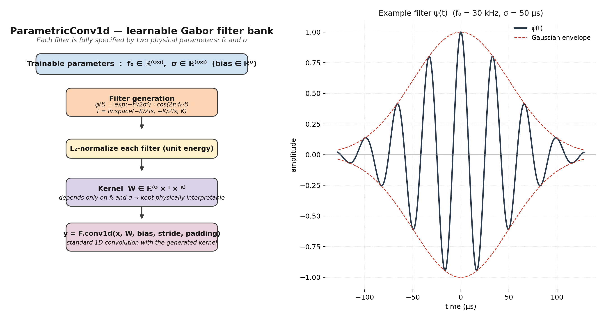

# 03 — Parametric Gabor convolution (`ParametricConv1d`)



## 1. Idea in one sentence

Instead of learning a free set of $O \times I \times K$ scalar
convolution weights, **we learn only two physical parameters per
filter** — a centre frequency $f_0$ and a temporal width $\sigma$ —
and we generate the convolution kernel analytically from them at every
forward pass.

A filter takes the form of a **Gabor function** (a cosine windowed by
a Gaussian):

$$
\psi(t) \;=\; \exp\!\Bigl(-\frac{t^{2}}{2\sigma^{2}}\Bigr)
              \cdot \cos(2\pi f_0 t),
\qquad
t \in \bigl[-\tfrac{K}{2 f_s},\, +\tfrac{K}{2 f_s}\bigr].
$$

After generation each filter is **$L_2$-normalised** so that
amplitudes between filters remain comparable; the layer otherwise
behaves exactly like a regular `F.conv1d` (it even has a learnable
scalar bias per output channel).

## 2. Implementation

```45:146:/home/top/Arc-Fault-Net/model.py
class ParametricConv1d(nn.Module):
    """
    Parametric convolution layer with learnable Gabor-like filters.
    
    Each filter is defined by:
      - f0: center frequency (learned)
      - sigma: temporal width (learned)
    
    Filter formula (simplified from MC-VSAttn, alpha=0):
      psi(t) = exp(-t^2 / (2*sigma^2)) * cos(2*pi*f0*t)
    
    This is a Gabor filter - an oscillation windowed by a Gaussian.
    Physically interpretable: f0 targets a frequency, sigma controls duration.
    """
    
    def __init__(
        self,
        in_channels: int,
        out_channels: int,
        kernel_size: int = 64,
        stride: int = 1,
        padding: int = 0,
        fs: float = 1_000_000,  # Sampling frequency
        f0_init_range: Tuple[float, float] = (100, 50000),  # Hz
        sigma_init_range: Tuple[float, float] = (0.0001, 0.001)  # seconds
    ):
        super().__init__()
        
        self.in_channels = in_channels
        self.out_channels = out_channels
        self.kernel_size = kernel_size
        self.stride = stride
        self.padding = padding
        self.fs = fs
        
        # Learnable parameters: f0 and sigma for each (out, in) filter pair
        # Initialize f0 uniformly in log space
        f0_log_min = math.log(f0_init_range[0])
        f0_log_max = math.log(f0_init_range[1])
        f0_init = torch.exp(
            torch.rand(out_channels, in_channels) * (f0_log_max - f0_log_min) + f0_log_min
        )
        self.f0 = nn.Parameter(f0_init)
        
        # Initialize sigma uniformly in log space
        sigma_log_min = math.log(sigma_init_range[0])
        sigma_log_max = math.log(sigma_init_range[1])
        sigma_init = torch.exp(
            torch.rand(out_channels, in_channels) * (sigma_log_max - sigma_log_min) + sigma_log_min
        )
        self.sigma = nn.Parameter(sigma_init)
        
        # Time axis for filter generation (centered at 0)
        t = torch.linspace(
            -kernel_size / (2 * fs),
            kernel_size / (2 * fs),
            kernel_size
        )
        self.register_buffer('t', t)
        
        # Learnable bias
        self.bias = nn.Parameter(torch.zeros(out_channels))
    
    def _generate_filters(self) -> torch.Tensor:
        # ...
        gaussian = torch.exp(-t ** 2 / (2 * sigma ** 2))
        oscillation = torch.cos(2 * math.pi * f0 * t)
        filters = gaussian * oscillation  # (O, I, K)
        filters = F.normalize(filters, p=2, dim=-1)
        return filters
    
    def forward(self, x: torch.Tensor) -> torch.Tensor:
        filters = self._generate_filters()
        return F.conv1d(x, filters, self.bias, self.stride, self.padding)
```

* `f0_init_range = (100, 50 000) Hz` — initial $f_0$ is sampled
  log-uniformly across this range to cover both load harmonics and
  arc-noise frequencies.
* `sigma_init_range = (0.1, 1) ms` — initial widths are log-uniform.
  Note that $\sigma$ is *bounded below* at zero by `torch.abs(sigma)`
  plus a small $\varepsilon$ inside `_generate_filters`, so gradient
  descent cannot push it to non-physical values.
* The actual gradients flow into $f_0$ and $\sigma$ via the
  reparameterisation: `psi(t)` is differentiable in both.

## 3. Why a Gabor filter and not a free Conv1d?

A free Conv1d kernel of length $K = 64$ on $128 \times 2$ input/output
pairs has $128 \cdot 2 \cdot 64 = 16\,384$ free scalar weights *for
the first layer only*. That is a lot for a dataset of a few thousand
cycles. Three issues follow:

1. **Overfitting risk on a small dataset.** Free Conv1d kernels can
   memorise noise patterns that happen to be correlated with the
   label.
2. **Non-interpretability.** Plotting a single free Conv1d kernel after
   training gives a non-trivial impulse response that needs Fourier
   analysis to be understood.
3. **No physical prior.** Free Conv1d kernels can converge to any
   shape; nothing tells them that arc faults are essentially
   *narrow-band oscillations of bounded duration*.

The Gabor parameterisation solves all three points at once:

* it has **2 parameters per filter** instead of $K$ (8× fewer free
  scalars for $K = 16$, 32× for $K = 64$),
* each filter is **directly readable** as “oscillation at
  $f_0$ Hz, lasting $\approx 3\sigma$ seconds”, and
* the inductive bias matches the physics of high-frequency arc noise.

This is the same Gabor parameterisation used by *SincNet* and the
*MC-VSAttn* paper on which Arc-FaultNet is based; the difference is
that we keep only the cosine factor (we set the chirp factor
$\alpha = 0$, because we are not modelling chirps) and we apply the
filter bank to **electrical** signals at $f_s = 1$ MHz.

## 4. Forward / backward summary

| Step | Code | Notes |
|------|------|-------|
| Generate kernel | `gaussian * cos(2πf₀t)` | analytic, differentiable in $(f_0, \sigma)$ |
| Normalise | `F.normalize(..., p=2, dim=-1)` | keeps filter energy = 1, avoids run-away magnitudes |
| Convolve  | `F.conv1d(x, W, bias)` | uses the standard CUDA kernel |

There is no `nn.Conv1d` layer behind the scenes: the parameters
**are** `f0`, `sigma`, and `bias`. PyTorch's autograd computes
$\partial \mathcal{L} / \partial f_0$ and $\partial \mathcal{L} /
\partial \sigma$ through the analytic kernel.

## 5. Scientific contribution of this module

| Item | Origin | Contribution status |
|------|--------|---------------------|
| Gabor parameterisation of a 1-D conv layer | SincNet (Ravanelli et al., 2018) and MC-VSAttn | Reused, in simplified form (no chirp) |
| Log-uniform initialisation of $f_0$ in [100 Hz, 50 kHz] tailored to *electrical* arc noise | — | **Original** to Arc-FaultNet |
| Log-uniform initialisation of $\sigma$ in [0.1 ms, 1 ms] (i.e. tens to thousands of samples at 1 MHz) | — | **Original** to Arc-FaultNet |
| Use as **a pre-Conv stage in every block of a dual-branch architecture for arc detection** | — | **Original** to Arc-FaultNet |

The figure on the right of the diagram shows a representative learned
filter at $f_0 = 30$ kHz, $\sigma = 50$ µs: the cosine modulation is
clearly localised by a Gaussian envelope. After training, the
distribution of learned $(f_0, \sigma)$ pairs *itself* becomes a
discovery — it tells us which time-frequency atoms the network
considers diagnostic for arc faults.
