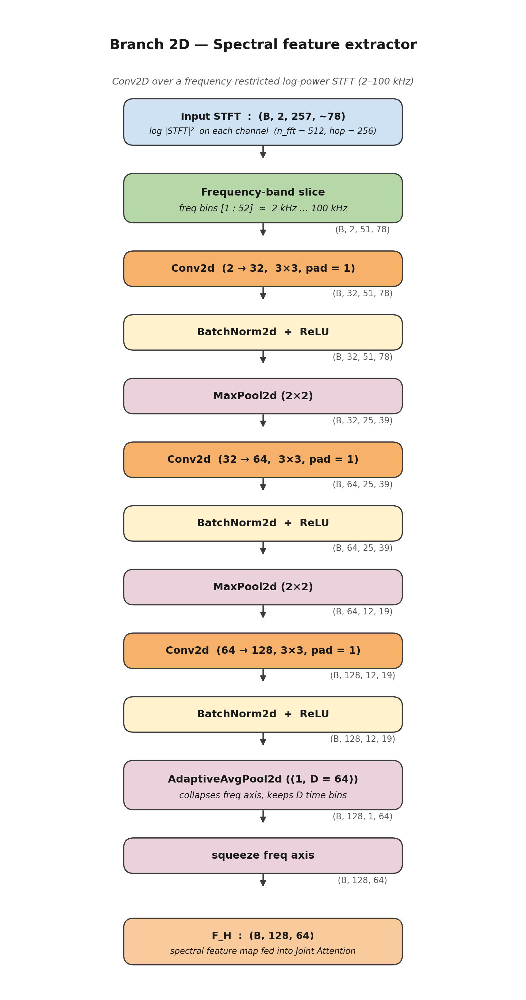

# 04 — Branch 2D : Spectral feature extractor



## 1. Role in the model

`Branch2D` consumes the log-power STFT of the same cycle that
`Branch1D` consumes in the time domain, and produces a spectral
feature map `F_H : (B, 128, 64)` with the *same shape* as `F_L`.

Its output is the second input to the [Joint Attention](05_joint_attention.md)
module.

The decisive scientific ingredient inside this branch is the
**frequency-band restriction to 2–100 kHz** (see §3 below).

## 2. Layer-by-layer description

The branch performs **frequency slicing → 3 × (Conv2d + BN + ReLU,
with two 2×2 MaxPools) → AdaptiveAvgPool2d((1, D)) → squeeze**.

Implementation in `model.py` :

```251:302:/home/top/Arc-Fault-Net/model.py
    def __init__(
        self,
        in_channels: int = 2,
        hidden_dims: Tuple[int, int, int] = (32, 64, 128),
        output_dim: int = 64,
        fs: float = 1_000_000,
        n_fft: int = 512,
        freq_min_hz: float = 2_000,
        freq_max_hz: float = 100_000
    ):
        super().__init__()

        self.output_dim = output_dim

        # Compute frequency bin indices from physical Hz values
        bin_res = fs / n_fft  # Hz per bin
        self.freq_bin_low  = max(1, round(freq_min_hz / bin_res))
        self.freq_bin_high = min(n_fft // 2 + 1, round(freq_max_hz / bin_res) + 1)

        dims = [in_channels] + list(hidden_dims)

        layers = []
        for i in range(3):
            layers.append(nn.Conv2d(dims[i], dims[i+1], kernel_size=3, padding=1))
            layers.append(nn.BatchNorm2d(dims[i+1]))
            layers.append(nn.ReLU(inplace=True))

            if i < 2:
                layers.append(nn.MaxPool2d(2))

        self.features = nn.Sequential(*layers)

        # Adaptive pooling to get fixed size regardless of input shape
        self.pool = nn.AdaptiveAvgPool2d((1, output_dim))

    def forward(self, x: torch.Tensor) -> torch.Tensor:
        # Restrict to 2–100 kHz band: discard low-frequency load harmonics
        # and high-frequency noise above the useful arc signature band
        x = x[:, :, self.freq_bin_low:self.freq_bin_high, :]  # (B, 3, 51, T)

        x = self.features(x)   # (batch, 128, h', w')
        x = self.pool(x)       # (batch, 128, 1, D)
        x = x.squeeze(2)       # (batch, 128, D)
        return x
```

With `n_fft = 512` and `fs = 1 MHz`, the bin resolution is
$f_s / n_\text{fft} = 1\,953$ Hz/bin and the slice indices computed at
init are:

| Bin index | Physical frequency |
|-----------|--------------------|
| `freq_bin_low  = 1`  | ≈ 1.95 kHz |
| `freq_bin_high = 52` | ≈ 101.6 kHz |

51 retained frequency bins out of 257 (≈ 20 % of the raw spectrum).

| Stage | Layer | Channels | Output shape |
|-------|-------|----------|--------------|
| 0 | Frequency slice `[1 : 52]`                       | — | `(B, 2, 51, 78)` |
| 1 | `Conv2d 3×3` + BN + ReLU + MaxPool 2×2           | `2 → 32`   | `(B, 32, 25, 39)`  |
| 2 | `Conv2d 3×3` + BN + ReLU + MaxPool 2×2           | `32 → 64`  | `(B, 64, 12, 19)`  |
| 3 | `Conv2d 3×3` + BN + ReLU                         | `64 → 128` | `(B, 128, 12, 19)` |
| out | `AdaptiveAvgPool2d((1, 64))` + squeeze         | —          | `(B, 128, 64)`     |

## 3. The 2–100 kHz frequency-band restriction

This is the single most important *physically-grounded* design choice
in this branch. The model never sees the parts of the spectrum that
are either dominated by load behaviour or by measurement noise:

| Frequency range | Why we exclude / include it |
|-----------------|-----------------------------|
| **0 – 2 kHz**       | Dominated by the 50 Hz mains fundamental and its first ~40 harmonics. These are **load-specific** (a vacuum cleaner, a dimmer and a switching power supply each shape this region differently). Including them encourages the model to learn “which load is plugged in” instead of “is there an arc fault”. |
| **2 – 100 kHz**     | This is the band where series arcs produce their characteristic **broadband HF noise**. IEC 62606 and most of the arc-detection literature point to this band. The model is therefore forced to look exactly where the arc lives. |
| **> 100 kHz**       | At `fs = 1 MHz` the Nyquist limit is 500 kHz, but in practice this band is dominated by quantisation noise and electromagnetic interference; useful arc information is essentially absent. |

The slice is implemented as a tensor index in the forward pass — so
it has **zero parameters** and **negligible compute cost** but
constitutes a strong inductive prior.

## 4. Why `AdaptiveAvgPool2d((1, D))` and not `(H', W')`?

The output of `Branch2D` must match the shape of `Branch1D`'s output
so that Joint Attention can perform strict element-wise alignment
across the *latent time axis*. We therefore:

* **collapse the frequency axis to size 1** (the network has already
  gathered the relevant frequency information into the channel axis
  via the three Conv2d stages),
* and **keep `D = 64` time bins** to match `Branch1D`.

The `squeeze(2)` then removes the now-singleton frequency dimension,
yielding `(B, 128, 64)` exactly like the temporal branch.

## 5. Scientific contribution of this module

| Item | Origin | Contribution status |
|------|--------|---------------------|
| Generic Conv2d-on-spectrogram backbone | Audio / vibration deep learning | Reused |
| **Restriction of the spectrogram to 2–100 kHz, motivated by arc-fault physics** | — | **Original** to Arc-FaultNet |
| Output shape `(B, 128, D = 64)` *matched* to `Branch1D` to enable cross-branch attention | — | **Original** to Arc-FaultNet |
| Conversion of the band edges to bin indices **from physical Hz values** at init (no hard-coded magic numbers) | — | **Original** — keeps the slice valid if `n_fft` or `fs` change |

This branch acts as the *frequency-side oracle* of the model: while
`Branch1D` describes “what shape does the cycle have”, `Branch2D`
describes “what does its time–frequency content look like in the arc
band”. Joint Attention then decides, per channel and per latent time
position, which branch should dominate.

## 6. Companion figures

* [Input examples](13_input_examples.md) — the full 257-bin STFT and
  the sliced 2–100 kHz STFT shown side by side on real cycles, so
  the band restriction is visually obvious.
* [Tensor-shape flow](11_tensor_flow.md) — Branch 2D's cuboid row,
  showing the spatial down-sampling 78 → 39 → 19 → 1.
