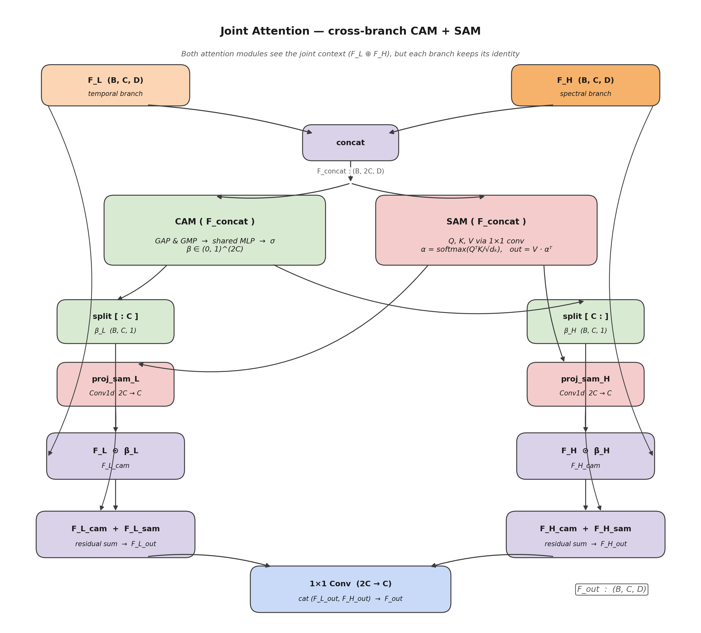

# 05 — Joint Attention : cross-branch CAM + SAM



> **This is, together with the dual-branch design, the central
> scientific contribution of Arc-FaultNet.**

## 1. Problem this module solves

The two branches produce features that live in the **same latent
geometry** `(B, C = 128, D = 64)` but describe complementary aspects
of the cycle:

* `F_L` (temporal branch) — “what does the waveform look like at every
  latent time position $d$?”
* `F_H` (spectral branch) — “what does the time–frequency content
  look like at the same latent time position $d$?”

Three naïve ways of combining them are unsatisfactory:

| Naïve fusion | What goes wrong |
|--------------|-----------------|
| Concatenation `cat([F_L, F_H])` → 1×1 Conv | Both branches contribute equally and uniformly; the network has to learn *gating* from scratch. |
| CBAM on each branch *independently*, then concat | Each branch refines itself with no information from the other; cross-modal interactions never happen. |
| Sum `F_L + F_H` | Forces strict equality of representation magnitude; loses interpretability. |

The Joint Attention module solves this by **computing one CAM and one
SAM on the joint context `F_concat = cat([F_L, F_H])`**, then *routing*
each attention output back to its original branch through clean,
per-branch projections.

## 2. Equations

Let $F_L, F_H \in \mathbb{R}^{B \times C \times D}$ and
$F_\text{concat} = \mathrm{cat}([F_L, F_H], \text{dim} = 1) \in
\mathbb{R}^{B \times 2C \times D}$.

### Channel side (CAM)

$$
\beta \;=\; \mathrm{CAM}(F_\text{concat}) \;\in\; (0, 1)^{B \times 2C \times 1}.
$$

Split the joint weights into per-branch weights:

$$
\beta_L = \beta[\,:\,, \,:C,\,:], \qquad
\beta_H = \beta[\,:\,, \,C:,\,:].
$$

Apply each set to its own branch:

$$
F_L^{\text{cam}} = F_L \odot \beta_L, \qquad
F_H^{\text{cam}} = F_H \odot \beta_H.
$$

### Spatial / temporal side (SAM)

$$
F_\text{concat}^{\text{sam}} \;=\; \mathrm{SAM}(F_\text{concat})
\;\in\; \mathbb{R}^{B \times 2C \times D}.
$$

Two **distinct** $1{\times}1$ conv projections send the joint SAM
output back to per-branch streams:

$$
F_L^{\text{sam}} = \mathrm{proj}_\text{sam}^{L}\bigl(F_\text{concat}^{\text{sam}}\bigr),
\qquad
F_H^{\text{sam}} = \mathrm{proj}_\text{sam}^{H}\bigl(F_\text{concat}^{\text{sam}}\bigr),
\qquad
\text{both } 2C \to C.
$$

### Residual per branch + final fusion

$$
F_L^{\text{out}} = F_L^{\text{cam}} + F_L^{\text{sam}}, \qquad
F_H^{\text{out}} = F_H^{\text{cam}} + F_H^{\text{sam}}.
$$

$$
F_\text{out} \;=\; \mathrm{Conv1d}_{1 \times 1}^{2C \to C}
\bigl(\mathrm{cat}([F_L^{\text{out}}, F_H^{\text{out}}], \text{dim} = 1)\bigr)
\;\in\; \mathbb{R}^{B \times C \times D}.
$$

## 3. Implementation

```461:507:/home/top/Arc-Fault-Net/model.py
    def __init__(self, channels: int = 128, reduction: int = 8):
        super().__init__()

        self.C = channels   # single-branch channel count

        # CAM and SAM operate on the joint (2C) context
        self.cam = ChannelAttention(channels * 2, reduction)
        self.sam = SpatialAttention(channels * 2)

        # SAM output (2C) projected back to per-branch size (C) — one per branch
        self.proj_sam_L = nn.Conv1d(channels * 2, channels, 1)
        self.proj_sam_H = nn.Conv1d(channels * 2, channels, 1)

        # Final fusion of two C-dim branch outputs
        self.fusion = nn.Conv1d(channels * 2, channels, 1)

    def forward(self, F_L: torch.Tensor, F_H: torch.Tensor) -> torch.Tensor:
        F_concat = torch.cat([F_L, F_H], dim=1)    # (batch, 2C, D)

        # ── Channel Attention ─────────────────────────────────────────
        cam_w = self.cam(F_concat)                  # (batch, 2C, 1)
        cam_L = cam_w[:, :self.C, :]                # (batch, C, 1)
        cam_H = cam_w[:, self.C:, :]                # (batch, C, 1)
        F_L_cam = F_L * cam_L                       # (batch, C, D)
        F_H_cam = F_H * cam_H                       # (batch, C, D)

        # ── Spatial / Temporal Attention ──────────────────────────────
        F_sam   = self.sam(F_concat)                # (batch, 2C, D)
        F_L_sam = self.proj_sam_L(F_sam)            # (batch, C, D)
        F_H_sam = self.proj_sam_H(F_sam)            # (batch, C, D)

        # ── Residual combination per branch ───────────────────────────
        F_L_out = F_L_cam + F_L_sam                 # (batch, C, D)
        F_H_out = F_H_cam + F_H_sam                 # (batch, C, D)

        # ── Final fusion ──────────────────────────────────────────────
        return self.fusion(torch.cat([F_L_out, F_H_out], dim=1))  # (batch, C, D)
```

The two atomic attention modules are documented separately:

* [`06_channel_attention.md`](06_channel_attention.md) — CAM (CBAM-style)
* [`07_spatial_attention.md`](07_spatial_attention.md) — SAM (Q/K/V self-attention)

## 4. Why this exact wiring?

| Design choice | Justification |
|---------------|---------------|
| CAM on **joint** context, then split | The split index has a *physical meaning*: the first $C$ entries are channel weights for the temporal branch, the last $C$ for the spectral branch. This guarantees that each branch keeps its own identity (no “mystery mixed channels”). |
| SAM on **joint** context, then **two distinct** linear projections back to $C$ | Conceptually: each latent time position $d$ should be re-weighted using the *full* time–frequency context, but the resulting attention should be *re-projected* into each branch's geometry separately. |
| **Residual sum** `F_L_cam + F_L_sam` (and `F_H_cam + F_H_sam`) | Both attention paths contribute additively, like in the original CBAM. The residual makes optimisation stable and lets the network fall back to a single-attention regime if the other is unhelpful. |
| Final **1×1 Conv** `2C → C` | A *learnable* gate rather than a plain concat or sum — lets the model pick the right mix per channel for downstream classification. |

## 5. Diagnostics — what we can see at inference time

`ArcFaultNet.get_attention_maps` exposes the raw $\beta$ and $\alpha$
tensors so we can visualise *why* the model fired:

```637:675:/home/top/Arc-Fault-Net/model.py
    def get_attention_maps(
        self,
        x_1d: torch.Tensor,
        x_2d: torch.Tensor
    ) -> Tuple[torch.Tensor, torch.Tensor, torch.Tensor, torch.Tensor, torch.Tensor]:
        # ...
        if self.use_joint_attention:
            F_concat = torch.cat([F_L, F_H], dim=1)  # (batch, 256, D)

            # CAM weights — β ∈ (0, 1) per channel
            cam_w = self.joint_attn.cam(F_concat)     # (batch, 256, 1)

            # SAM attention matrix — α[i, j] = weight pos i gives to pos j
            sam_alpha = self.joint_attn.sam.get_attn_weights(F_concat)  # (batch, D, D)
```

* `cam_w[:, :128, :]` directly tells us which *temporal* channels the
  model trusted on that sample.
* `cam_w[:, 128:, :]` does the same for *spectral* channels.
* `sam_alpha` is the $D \times D$ temporal self-attention map — useful
  for showing that the model focuses on the arc-ignition portion of
  the cycle.

This interpretability is enabled *by construction* by the clean per-
branch split — it would not be available with a simple
concat-then-conv fusion.

## 6. Scientific contribution of this module

| Item | Origin | Contribution status |
|------|--------|---------------------|
| CAM and SAM atoms | CBAM (Woo et al., 2018) | Reused |
| Operating CAM/SAM on a *joint* concatenated context with cross-modal interaction | MC-VSAttn (vibration two-domain) | Adapted |
| **Per-branch split of CAM weights with explicit semantic meaning** (`β[:C]` for `F_L`, `β[C:]` for `F_H`) | — | **Original to Arc-FaultNet** — preserves branch identity for diagnostics |
| **Two distinct `Conv1d 2C→C` projections of the SAM output back to per-branch streams** | — | **Original to Arc-FaultNet** — gives each branch its own “temporal lens” without breaking joint context |
| Residual combination *per branch* before the final fusion | — | **Original to Arc-FaultNet** in this dual-branch setting |

In one sentence: **Arc-FaultNet's Joint Attention lets each branch be
guided by the other, while keeping the bookkeeping clean enough that
we can still tell, *after training*, which channel of which branch
was responsible for a given decision.**
