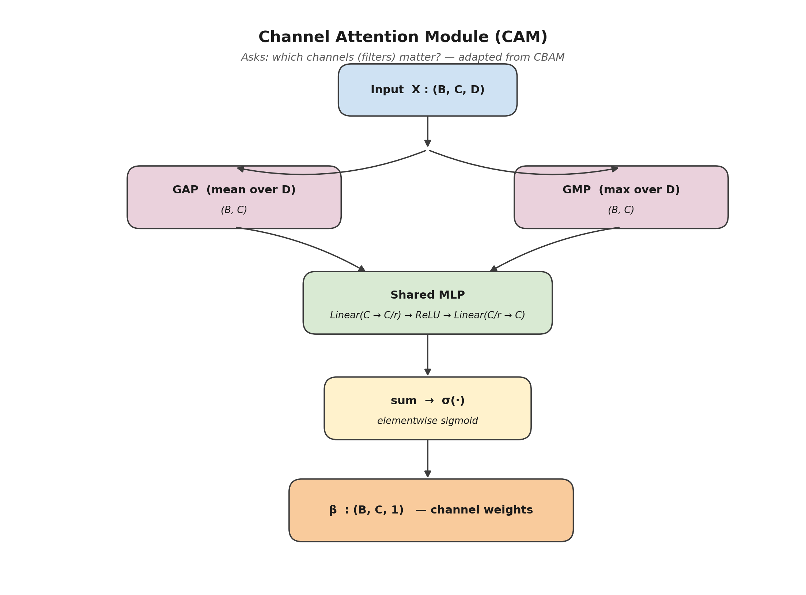

# 06 — Channel Attention Module (CAM)



## 1. Role in the model

`ChannelAttention` is the **CAM atom** used inside
[Joint Attention](05_joint_attention.md). It receives a feature map
$X \in \mathbb{R}^{B \times C \times D}$ and returns a single weight
$\beta \in (0, 1)^{B \times C \times 1}$ per channel. Each channel of
$X$ will later be multiplied by its $\beta$.

It is directly adapted from the **CAM half of CBAM** (Woo et al.,
ECCV 2018), simplified to a 1-D feature map (channel × latent time).

## 2. Equations

For each channel $c$ of the input $X$ we compute:

$$
\text{avg}_c = \frac{1}{D} \sum_{d=1}^{D} X_{:,c,d}, \qquad
\text{max}_c = \max_d X_{:,c,d}.
$$

These two pooled descriptors are passed through a **shared
two-layer MLP** with bottleneck factor $r$:

$$
\text{MLP}(z) = W_2 \, \text{ReLU}\bigl(W_1\, z\bigr),
\qquad W_1 \in \mathbb{R}^{(C/r)\times C},\; W_2 \in \mathbb{R}^{C \times (C/r)}.
$$

Finally:

$$
\beta = \sigma\bigl(\text{MLP}(\text{avg}) + \text{MLP}(\text{max})\bigr)
\;\in\; (0,1)^{C}.
$$

The sigmoid guarantees that $\beta$ behaves like a *gate*: it can
amplify a useful channel ($\beta_c$ close to 1) or suppress a noisy
one ($\beta_c$ close to 0) without ever inverting its sign.

## 3. Implementation

```309:349:/home/top/Arc-Fault-Net/model.py
class ChannelAttention(nn.Module):
    """
    Channel Attention Module (CAM) from CBAM.
    ...
    """
    
    def __init__(self, channels: int, reduction: int = 8):
        super().__init__()
        
        self.mlp = nn.Sequential(
            nn.Linear(channels, channels // reduction),
            nn.ReLU(inplace=True),
            nn.Linear(channels // reduction, channels)
        )
    
    def forward(self, x: torch.Tensor) -> torch.Tensor:
        # Global pooling
        avg_pool = x.mean(dim=-1)   # (batch, channels)
        max_pool = x.max(dim=-1)[0] # (batch, channels)
        
        # Shared MLP
        avg_out = self.mlp(avg_pool)
        max_out = self.mlp(max_pool)
        
        # Combine and sigmoid
        weights = torch.sigmoid(avg_out + max_out)  # (batch, channels)
        
        return weights.unsqueeze(-1)  # (batch, channels, 1)
```

Notes:
* The MLP is **shared** between the average and the max branch, as
  in the original CBAM. Sharing prevents the two branches from
  drifting and halves the parameter count.
* Bottleneck factor `reduction = 8` is the same value used by CBAM and
  yields $C/r = 256/8 = 32$ hidden units when called inside
  `JointAttention(channels=128)` (because Joint Attention runs CAM on
  the **joint** $2C = 256$ channels).

## 4. Why both `avg` and `max`?

* `avg` captures the **mean activation** of each channel along the
  latent time axis — i.e. *how active* the filter is on average over
  the cycle.
* `max` captures the **peak activation** — i.e. *was there ever a
  strong spike?*

For arc-fault detection this matters: an arc is typically a
*localised* event in time, so a channel that has very low average
activity but a strong peak is exactly what we want to keep. Using only
`avg` would suppress such channels.

## 5. Scientific contribution of this module

This module is **reused as-is from CBAM** — it is not part of the
original contribution of Arc-FaultNet. Its role in the project is to
be a clean, well-understood building block of the **truly novel** part
of the model: the way Joint Attention *uses* it on the joint context
and then *splits* its output between the two branches (see
[`05_joint_attention.md`](05_joint_attention.md), §6).
