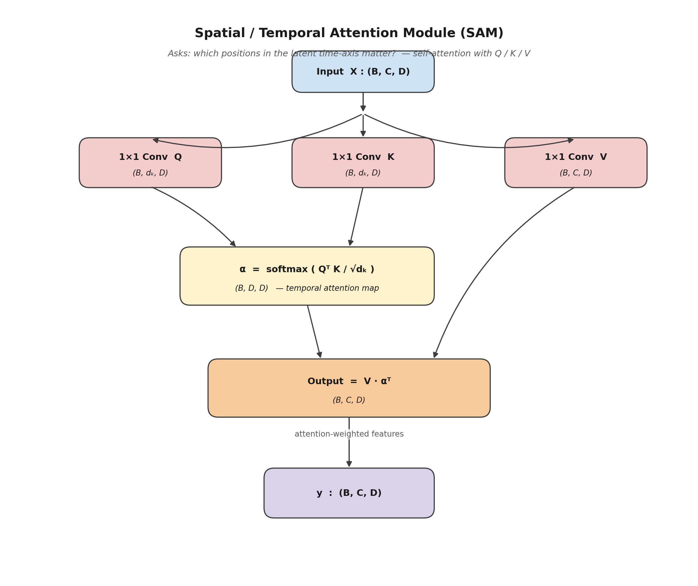

# 07 — Spatial / Temporal Attention Module (SAM)



## 1. Role in the model

`SpatialAttention` is the **SAM atom** used inside
[Joint Attention](05_joint_attention.md). It receives a feature map
$X \in \mathbb{R}^{B \times C \times D}$ and returns a feature map of
the **same shape** in which every latent time position has been
re-mixed with information from every other position.

Even though it is called *spatial* attention in CBAM (where the
features are 2-D spatial maps), in our 1-D context $D$ represents
**positions along the latent time axis**. We therefore use the names
*spatial* and *temporal* interchangeably.

The implementation is a small **self-attention** block in the style of
Transformer's scaled dot-product attention, with $1{\times}1$ Conv
projections playing the role of $Q$, $K$, and $V$.

## 2. Equations

Define three projections, all $1{\times}1$ Conv1d:

$$
Q = W_Q \star X \in \mathbb{R}^{B \times d_k \times D},
\qquad
K = W_K \star X \in \mathbb{R}^{B \times d_k \times D},
\qquad
V = W_V \star X \in \mathbb{R}^{B \times C   \times D}.
$$

The **temporal attention map** is the $D \times D$ matrix of softmax-
normalised inner products between query and key positions:

$$
\alpha \;=\; \mathrm{softmax}\Bigl(\frac{Q^{\!\top} K}{\sqrt{d_k}}\Bigr)
\;\in\; \mathbb{R}^{B \times D \times D}.
$$

The output is then a position-wise re-mixing of the values:

$$
y \;=\; V \cdot \alpha^{\!\top}
\;\in\; \mathbb{R}^{B \times C \times D}.
$$

Row $i$ of $\alpha$ gives the attention distribution that position $i$
places on the $D$ positions, and column $j$ measures how often
position $j$ is *attended to*.

## 3. Implementation

```355:418:/home/top/Arc-Fault-Net/model.py
class SpatialAttention(nn.Module):
    """
    Spatial (Temporal) Attention Module (SAM).
    
    Uses self-attention mechanism with Q, K, V projections
    to weight different temporal positions.
    
    Formula:
      α = softmax(Q @ K^T / sqrt(d))
      output = α @ V
    """
    
    def __init__(self, channels: int, d_k: int = 32):
        super().__init__()
        
        self.d_k = d_k
        
        # Q, K, V projections (1x1 convolution equivalent)
        self.query = nn.Conv1d(channels, d_k, 1)
        self.key = nn.Conv1d(channels, d_k, 1)
        self.value = nn.Conv1d(channels, channels, 1)
        
        self.scale = math.sqrt(d_k)
    
    def forward(self, x: torch.Tensor) -> torch.Tensor:
        batch, channels, D = x.shape
        
        # Compute Q, K, V
        Q = self.query(x)  # (batch, d_k, D)
        K = self.key(x)    # (batch, d_k, D)
        V = self.value(x)  # (batch, channels, D)
        
        # Attention scores
        scores = torch.bmm(Q.transpose(1, 2), K) / self.scale  # (batch, D, D)
        attn = F.softmax(scores, dim=-1)  # (batch, D, D)
        
        # Apply attention to values
        output = torch.bmm(V, attn.transpose(1, 2))  # (batch, channels, D)
        
        return output
    
    def get_attn_weights(self, x: torch.Tensor) -> torch.Tensor:
        Q = self.query(x)
        K = self.key(x)
        scores = torch.bmm(Q.transpose(1, 2), K) / self.scale
        return F.softmax(scores, dim=-1)
```

Notes:

* `d_k = 32` is the dimension of the query/key vectors. With $C = 256$
  channels (inside Joint Attention's joint context), this gives a
  significant compression $256 \to 32$ before computing $Q^\top K$,
  which is critical because $D \times D = 64 \times 64$ is fine but
  $D \times D$ would explode if $D$ were much larger.
* `get_attn_weights` returns the raw $\alpha$ matrix without applying
  it to $V$ — it is used by `ArcFaultNet.get_attention_maps` for
  visualisation.

## 4. Why $1{\times}1$ Conv1d instead of `nn.Linear`?

For a 1-D feature map of shape `(B, C, D)`, a $1{\times}1$ Conv1d *is*
equivalent to a per-position Linear, but it keeps the channel/spatial
ordering explicit. This makes the code easier to read and easier to
extend (e.g. to multi-head attention) without reshape gymnastics.

## 5. Scientific contribution of this module

This module is **a small adaptation of standard self-attention** —
specifically:

* It is **not** reproducing CBAM's spatial attention (which uses a
  small Conv on the channel-pooled feature map). We use Q/K/V
  self-attention instead because $D = 64$ is small enough to afford a
  full $D \times D$ pairwise interaction, and self-attention gives
  *richer* temporal context.
* It is **not** reproducing the full Transformer block (no multi-head,
  no position encoding, no FFN). The choice is deliberate: we keep the
  module light because it is called inside `JointAttention` once per
  forward pass and the project is targeted at low-cost deployment.

The genuinely novel use of this module happens **outside** itself —
the way Joint Attention feeds it the *joint* context and then
distributes its output to each branch through dedicated $1{\times}1$
projections (see [`05_joint_attention.md`](05_joint_attention.md),
§4–6).
