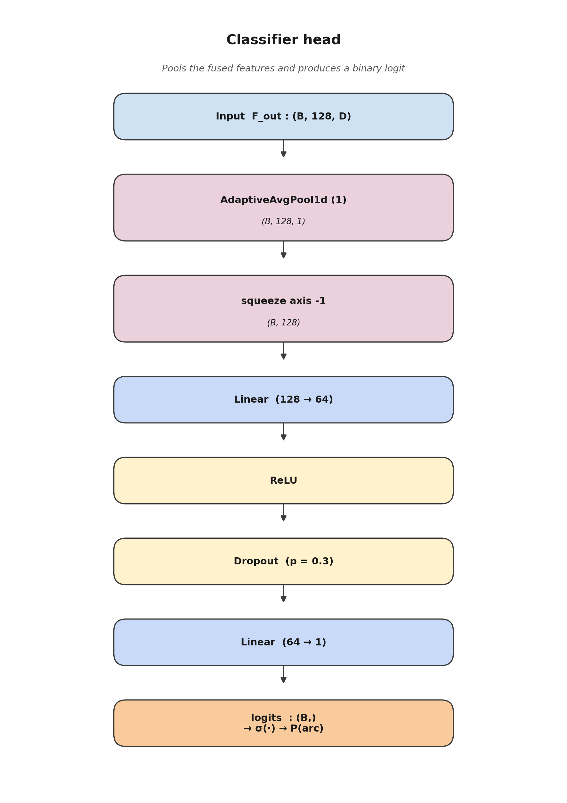

# 08 — Classifier head



## 1. Role in the model

The classifier head turns the fused feature map
$F_\text{out} \in \mathbb{R}^{B \times C \times D}$ (output of
[Joint Attention](05_joint_attention.md)) into a **single scalar
logit** per sample. The sigmoid of that logit is the arc probability:

$$
P(\text{arc} \mid x_{1d}, x_{2d}) \;=\; \sigma\bigl(\text{logit}(x_{1d}, x_{2d})\bigr).
$$

Training uses `BCEWithLogitsLoss`, so the raw logit (not the
probability) is what the head returns.

## 2. Architecture

```514:543:/home/top/Arc-Fault-Net/model.py
class ClassifierHead(nn.Module):
    """
    Classification head: GAP -> FC -> Sigmoid
    
    Binary classification for arc detection.
    """
    
    def __init__(self, in_channels: int = 128, hidden_dim: int = 64):
        super().__init__()
        
        self.gap = nn.AdaptiveAvgPool1d(1)
        self.fc = nn.Sequential(
            nn.Linear(in_channels, hidden_dim),
            nn.ReLU(inplace=True),
            nn.Dropout(0.3),
            nn.Linear(hidden_dim, 1)
        )
    
    def forward(self, x: torch.Tensor) -> torch.Tensor:
        x = self.gap(x)  # (batch, channels, 1)
        x = x.squeeze(-1)  # (batch, channels)
        x = self.fc(x)  # (batch, 1)
        return x.squeeze(-1)  # (batch,)
```

| Step | Output shape |
|------|--------------|
| Input `F_out`                          | `(B, 128, 64)` |
| `AdaptiveAvgPool1d(1)`                 | `(B, 128, 1)`  |
| `squeeze(-1)`                          | `(B, 128)`     |
| `Linear(128 → 64)` + `ReLU`            | `(B, 64)`      |
| `Dropout(0.3)`                         | `(B, 64)`      |
| `Linear(64 → 1)`                       | `(B, 1)`       |
| `squeeze(-1)` → `logits`               | `(B,)`         |

## 3. Why a Global Average Pool over the latent time axis?

After `JointAttention`, **temporal information has already been
re-weighted by SAM** — every channel of $F_\text{out}$ contains a
*time-mixed* summary of the cycle. A GAP collapses the remaining $D$
positions into a single scalar per channel without introducing any
new learned parameter. This:

* drastically reduces the number of dense weights (a `Flatten` would
  give `128 × 64 = 8 192` features instead of `128`),
* is invariant to small shifts of the arc inside the cycle, and
* keeps the classifier head extremely lightweight (~8.3k parameters).

## 4. Why a 64-unit bottleneck + dropout 0.3?

* A two-layer MLP with a 64-unit hidden layer is wide enough to
  separate the two classes after GAP, and narrow enough to avoid
  over-parameterising relative to the rest of the network.
* `Dropout(p = 0.3)` is a deliberate regularisation choice given the
  small dataset (~5 k cycles). It is applied *after* the ReLU and
  *before* the final linear so that the network is forced to keep
  redundant evidence in several hidden units.

## 5. Scientific contribution of this module

The classifier head is **a standard binary head** and is **not part
of the original contribution**. It is included for completeness
because:

* its GAP-based design is a small but important architectural choice
  (it makes the model shift-invariant inside the cycle),
* its small parameter count is consistent with the project's
  deployment hypothesis (on-device inference in an AFCI), and
* its output is the place where label smoothing and `pos_weight`
  hooks are attached during training.

The hyperparameters (`hidden_dim = 64`, `dropout = 0.3`) were fixed
early in development and have not been a focus of tuning.
