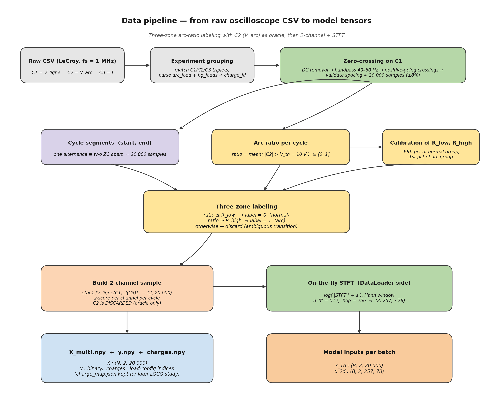

# 09 — Data pipeline : from raw oscilloscope CSV to model tensors



This document describes the data side of the project. Although the
prompt asked to keep architectural focus on the *model*, the data
pipeline is what gives Arc-FaultNet its **physically-grounded
labels** and is therefore part of the scientific contribution.

The pipeline is implemented in three places:

* `scripts/step1_build_labeled_matrix.py` — labels each cycle on the
  single channel C3 (legacy single-channel pipeline; produces the
  histogram used to calibrate $R_\text{low}$ and $R_\text{high}$).
* `scripts/step2_build_multichannel.py` — builds the 2-channel matrix
  actually consumed by Arc-FaultNet (`X_multi.npy`).
* `dataset.py` — the PyTorch `Dataset` that loads `X_multi.npy` and
  computes the STFT on-the-fly on the data-loader side.

## 1. Raw input — Teledyne LeCroy oscilloscope

For every experiment three CSV files are recorded synchronously at
$f_s = 1$ MHz:

| File | Physical quantity | Role |
|------|-------------------|------|
| `C1EE …` | $V_\text{ligne}$ (mains voltage) | model input — also used for cycle segmentation |
| `C2EE …` | $V_\text{arc}$ (voltage across a deliberately-introduced arcing gap) | **oracle for labeling only — never given to the model** |
| `C3EE …` | $I$ (line current) | model input |

Every file goes through the same parser (`parse_csv`), which skips a
5-line LeCroy header and reads the `Time, Ampl` columns as `float32`.

## 2. Experiment grouping and charge identifier

```55:96:/home/top/Arc-Fault-Net/scripts/step2_build_multichannel.py
def group_experiments(data_dir: Path) -> dict:
    """Match C1/C2/C3 files that share the same experiment suffix."""
    files = list(data_dir.glob('*.csv'))
    groups = defaultdict(dict)

    for f in sorted(files):
        name = f.name
        m = re.match(r'^(C[123])EE (.+)$', name)
        if not m:
            continue
        channel = m.group(1)
        suffix  = m.group(2)
        groups[suffix][channel] = f
```

Triplets `(C1, C2, C3)` that share the same suffix are grouped. The
suffix is parsed to extract two pieces of metadata:

* `arc_load`  — the load actually carrying the arc (vacuum cleaner,
  iron, hair dryer, …),
* `bg_loads`  — the background loads connected in parallel.

The pair `(arc_load, bg_loads)` defines a **charge configuration**.
The mapping name → integer is saved in `charge_map.json` for use by
the future Leave-One-Charge-Out splitter.

## 3. Segmentation on C1 (not on C3)

Why segment on C1? Because the **voltage waveform is stable and
load-independent**, whereas the current shape changes with each load
and is shifted by the arc itself. Using C1 yields cycle boundaries
that are well-defined for every experiment.

The algorithm is:

1. Remove DC offset (probe bias).
2. Bandpass-filter 40–60 Hz with a 4th-order Butterworth (forward-
   backward, `sosfiltfilt`) — this isolates the 50 Hz fundamental.
3. Detect **positive-going zero crossings** of the filtered signal.
4. Validate that the spacing between consecutive crossings is
   $20\,000 \pm 8\%$ samples; otherwise the cycle is skipped.

Each pair $(\text{ZC}_i, \text{ZC}_{i+1})$ defines **one full 50 Hz
cycle of length 20 000 samples**, which is the model's input length.

## 4. Three-zone labeling with C2 as oracle

For every cycle delimited above, we compute the **arc-active ratio**
on the arc voltage `C2`:

$$
\text{ratio} \;=\; \frac{1}{N_\text{cycle}}
\sum_{n \in \text{cycle}} \mathbf{1}\!\left\{\bigl|C_2[n]\bigr| > V_\text{th}\right\},
\qquad V_\text{th} = 10\,\text{V}.
$$

Empirically, the histogram of `ratio` is **strongly bimodal**:

* a peak near 0 (cycle is normal, arc is off),
* a peak near 1 (cycle is in the arc regime, arc fires for most of
  the half-cycle), and
* a sparse valley of *transition* cycles in between.

Two thresholds $R_\text{low}, R_\text{high}$ separate the three zones
and they are **calibrated from the histogram itself**:

* $R_\text{low}$ = 99th percentile of the group `ratio < 0.5`,
* $R_\text{high}$ = 1st percentile of the group `ratio ≥ 0.5`.

The labeling rule is then:

| Condition                          | Label |
|------------------------------------|-------|
| `ratio ≤ R_low`                    | 0 (normal) |
| `ratio ≥ R_high`                   | 1 (arc) |
| `R_low < ratio < R_high`           | **discarded** (ambiguous transition) |

This is the **three-zone rule**. It explicitly removes the
uncertain transition cycles from training and evaluation, which is
crucial because they are the ones where the oracle is itself
unreliable (an arc that flickered for half the cycle is neither
clearly arc nor clearly normal).

## 5. Building the 2-channel sample

For every kept cycle, we **only** assemble `[C1, C3]` (i.e. the model
inputs):

```261:300:/home/top/Arc-Fault-Net/scripts/step2_build_multichannel.py
            # Extract segments from model input channels only (C1 and C3).
            # C2 (V_arc) is intentionally excluded: it is the oracle signal
            # used for labeling and is not available at inference time.
            c1_seg = c1[start:end].astype(np.float32)
            c3_seg = c3[start:end].astype(np.float32)

            # Pad or truncate to exact length
            segments = []
            for seg in [c1_seg, c3_seg]:
                seg_len = len(seg)
                if seg_len < SAMPLES_PER_CYCLE:
                    seg = np.pad(seg, (0, SAMPLES_PER_CYCLE - seg_len), mode='edge')
                elif seg_len > SAMPLES_PER_CYCLE:
                    seg = seg[:SAMPLES_PER_CYCLE]
                # Normalize each channel independently
                seg = normalize_segment(seg)
                segments.append(seg)

            # Stack to (2, 20000)
            x_multi = np.stack(segments, axis=0).astype(np.float32)
```

Two design points worth highlighting:

* **Pad-to-edge or truncate.** Cycles are *almost* but not exactly
  20 000 samples long. We pad with edge values or truncate to enforce
  the target length without introducing zero-padding artefacts.
* **Per-channel z-score per cycle.** Each channel is centred and
  divided by its standard deviation within the cycle. This makes the
  model focus on the **shape** of the cycle, not its absolute
  amplitude (which depends on the load drawing 1 A vs 20 A).

The resulting tensors are saved as `X_multi.npy : (N, 2, 20 000)`
together with `y.npy`, `charges.npy`, `charge_map.json` and a
`metadata.csv` keeping the experiment-level trace for every sample.

## 6. On-the-fly STFT inside the `Dataset`

The STFT for the spectral branch is **not** stored on disk — it would
multiply the dataset size by ~6 and would freeze the choice of
`n_fft` and `hop`. It is computed on every `__getitem__`:

```161:193:/home/top/Arc-Fault-Net/dataset.py
    def _compute_stft(self, x: torch.Tensor) -> torch.Tensor:
        """
        Compute log-power STFT spectrogram for all channels.
        """
        n_channels = x.shape[0]
        specs = []
        
        for c in range(n_channels):
            # STFT: returns complex tensor (n_freq, n_time)
            stft = torch.stft(
                x[c],
                n_fft=self.n_fft,
                hop_length=self.hop_length,
                win_length=self.n_fft,
                window=self.window,
                return_complex=True
            )
            
            # Power spectrogram
            power = stft.abs().pow(2)
            
            # Log scale (add small epsilon for numerical stability)
            log_power = torch.log(power + 1e-10)
            
            specs.append(log_power)
        
        return torch.stack(specs, dim=0)  # (n_channels, n_freq, n_time)
```

A Hann window of length `n_fft = 512` and a hop of `256` produce
output shape `(2, 257, 78)` per sample, which is exactly what
[`Branch2D`](04_branch2d.md) expects.

## 7. Light augmentation (training only)

When the dataset is in `training = True` mode (set automatically by
the trainer), each cycle is augmented in two physically-plausible
ways:

* **Amplitude scaling** per channel: $X_c \leftarrow s_c X_c$, with
  $s_c \sim \mathcal{U}(0.95, 1.05)$. Models small probe-calibration
  drifts.
* **Additive Gaussian noise**: $X_c \leftarrow X_c +
  \mathcal{N}(0, 0.005 \cdot \mathrm{std}(X_c))$. Models thermal noise
  on the line.
* **Spectrogram frequency masking**: 1–3 contiguous frequency bins
  are masked to the channel mean. Encourages robustness to a single
  noisy bin.

All augmentations are **deactivated during validation and
evaluation** by `model.eval()` and the explicit
`loader.dataset.dataset.training = False` flag in `train.py`.

## 8. Scientific contribution of this pipeline

| Item | Origin | Contribution status |
|------|--------|---------------------|
| Segmenting on the **mains voltage** rather than the current | Common in power-quality literature | Reused |
| Using a synchronously-recorded arc voltage `C2` as **labeling oracle** | Custom to this PFE | **Original** |
| **Three-zone labeling** with histogram-calibrated $R_\text{low}, R_\text{high}$ that explicitly discards transitions | — | **Original** |
| **Excluding `C2` from model inputs** to enforce a realistic deployment scenario | — | **Original**, and a key methodological point of the project |
| Per-cycle z-score so the model learns shape, not amplitude | Common practice | Reused |
| On-the-fly STFT to keep `(n_fft, hop)` as hyperparameters | Common practice | Reused |

The combination of (a) physical-oracle labeling, (b) three-zone
discard rule and (c) hiding the oracle channel from the model is what
makes Arc-FaultNet's training data and evaluation protocol
**scientifically credible** — the model is never given a feature it
would not have at deployment time.

## 9. Companion figures

* [Arc-ratio histogram](14_arc_ratio_histogram.md) — the empirical
  shape of the labeling oracle, with the three zones drawn in.
* [Input examples](13_input_examples.md) — two real cycles from
  `exp13` rendered exactly as the model receives them
  (time domain, full STFT, sliced 2–100 kHz STFT).
