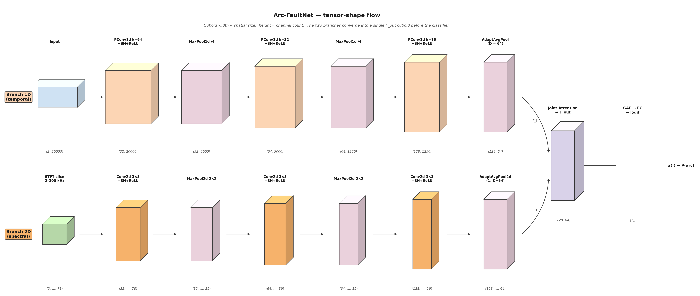

# Supplementary figure 11 — Tensor-shape flow (cuboid view)

## What this figure shows

A single picture that tracks **the shape of every tensor** flowing
through Arc-FaultNet, drawn as pseudo-3D cuboids whose

* **width**  ∝ spatial dimension (samples for 1D, time-frames for 2D)
  on a log scale, and
* **height** ∝ channel count on a log2 scale.

Reading horizontally:

* the **top row** is Branch 1D — the cuboid stays wide (long temporal
  axis) until the final `AdaptiveAvgPool1d` compresses it to $D=64$;
* the **bottom row** is Branch 2D — the cuboids shrink quadratically as
  the two `MaxPool2d(2,2)` stages halve both axes.

The two rows converge into a single fused cuboid (`F_out`, shape
$(128, 64)$) inside the **Joint Attention** block, which is then
collapsed by Global-Average-Pooling and a `Linear` to produce one
scalar logit per cycle.

## Why this figure matters

* It encodes, in one image, every number that appears in any honest
  table of "input / output shapes per layer" in an ML paper.
* It makes the **asymmetric design choice** visually obvious: the 1D
  branch keeps temporal resolution longer than the 2D branch keeps
  spatial resolution, because the 2D branch operates on an already
  band-limited (2–100 kHz) representation.
* It makes the **fusion point** explicit: both branches reach the
  *same* latent shape $(128, 64)$ *before* Joint Attention — this is
  what makes channel-wise concatenation along the channel axis
  meaningful.

## How shapes are computed

Each cuboid was sized from the actual layer specification in
[`model.py`](../../model.py) and not from a fitted forward pass — but
running the model with the documented input shapes reproduces the
labels under each cuboid exactly.

| Branch | Layer | Output shape |
|--------|-------|--------------|
| 1D | input                         | $(2,\,20\,000)$ |
| 1D | `PConv1d` $k{=}64$ + BN + ReLU | $(32,\,20\,000)$ |
| 1D | `MaxPool1d(/4)`               | $(32,\,5000)$ |
| 1D | `PConv1d` $k{=}32$ + BN + ReLU | $(64,\,5000)$ |
| 1D | `MaxPool1d(/4)`               | $(64,\,1250)$ |
| 1D | `PConv1d` $k{=}16$ + BN + ReLU | $(128,\,1250)$ |
| 1D | `AdaptiveAvgPool1d(64)`       | $(128,\,64)$ |
| 2D | STFT slice 2–100 kHz          | $(2,\,51,\,78)$ |
| 2D | `Conv2d` 3×3 + BN + ReLU      | $(32,\,51,\,78)$ |
| 2D | `MaxPool2d(2,2)`              | $(32,\,25,\,39)$ |
| 2D | `Conv2d` 3×3 + BN + ReLU      | $(64,\,25,\,39)$ |
| 2D | `MaxPool2d(2,2)`              | $(64,\,12,\,19)$ |
| 2D | `Conv2d` 3×3 + BN + ReLU      | $(128,\,12,\,19)$ |
| 2D | `AdaptiveAvgPool2d(1, 64)`    | $(128,\,64)$ |
| ∪  | Joint Attention → `F_out`      | $(128,\,64)$ |
| ∪  | GAP → Linear → logit          | $(1,)$ |
