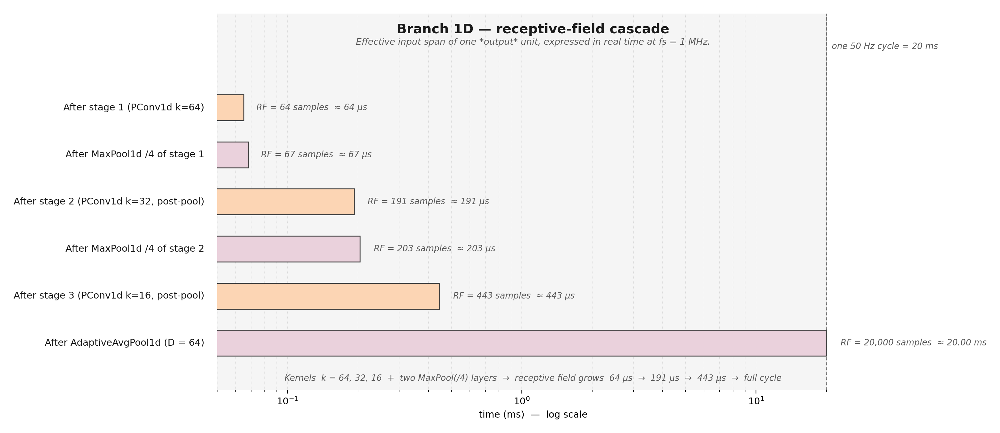

# Supplementary figure 12 — Receptive-field cascade (Branch 1D)

## What this figure shows

For every stage of **Branch 1D**, the figure plots the **effective
receptive field (RF)** of one output unit, expressed in real time at
$f_s = 1\,\text{MHz}$ on a logarithmic axis. The full 50 Hz cycle
(20 ms) is shown as a dashed vertical reference.

| Stage                                | RF (samples) | RF (time)    |
|--------------------------------------|--------------|--------------|
| `PConv1d` $k{=}64$                   |  64          | 64 µs        |
| + `MaxPool1d(/4)`                    |  67          | 67 µs        |
| + `PConv1d` $k{=}32$                 |  191         | 191 µs       |
| + `MaxPool1d(/4)`                    |  203         | 203 µs       |
| + `PConv1d` $k{=}16$                 |  443         | 443 µs       |
| + `AdaptiveAvgPool1d(64)`            |  20 000      | 20 ms (full) |

RFs are computed analytically with the standard formula

$$
\mathrm{RF}_{\ell+1} = \mathrm{RF}_\ell + (k_{\ell+1}-1)\cdot
\prod_{i\le \ell}s_i,
$$

where $k_\ell$ is the kernel size and $s_i$ are the strides of all
previous layers (including the pool strides).

## Why this figure matters

* It links the **kernel choice** $k\in\{64, 32, 16\}$ directly to the
  **physical time scales of arc-fault phenomena**:
  * 64 µs ≈ 16 periods of a 250 kHz wavelet — the upper edge of the
    main arc-noise band;
  * 191 µs ≈ ~5 periods at 25 kHz — the middle of the band;
  * 443 µs ≈ ~22 cycles at 50 kHz — covers ignition–extinction
    bursts in a single half-cycle.
* The final `AdaptiveAvgPool1d(64)` jumps the RF from 443 µs to
  20 ms in one step. This is intentional: after three convolutional
  stages we want the **classifier** to see the whole cycle, not
  another local window.
* Compared to large monolithic kernels (e.g. $k{=}1024$), the
  cascaded $k{=}64\to32\to16$ pattern reaches the same long RF with
  ~10× fewer parameters and is far more amenable to the parametric
  Gabor reparameterisation (which becomes ill-conditioned for very
  wide kernels).

## Relation to the rest of the architecture

The RF cascade explains why **Branch 1D** can afford a 1D-only design
while **Branch 2D** is needed in parallel: 1D cannot reach a
*frequency* representation within ~half a millisecond, only a *time*
one. The 2D branch fills that gap by ingesting STFT features whose
"receptive field" along the frequency axis is provided by the
preceding Fourier transform itself.
