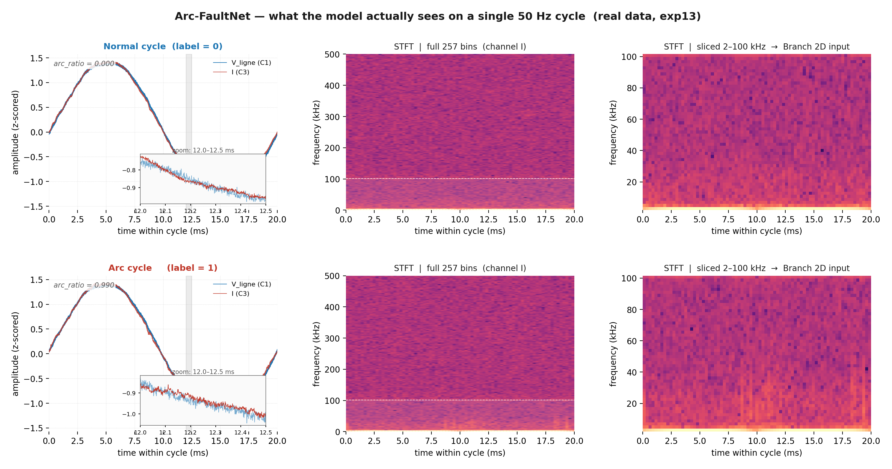

# Supplementary figure 13 — What the model actually sees

## What this figure shows

Two real cycles from experiment **`exp13--IJL--LR`** of the project's
LeCroy acquisition (resistive load, 1 MS/s), selected by the
labeling oracle:

* **top row** — a *normal* cycle with arc_ratio = 0.000 (label = 0);
* **bottom row** — an *arc* cycle with arc_ratio = 0.990 (label = 1).

Each row shows three views, exactly in the order the model receives
them:

1. **time domain (z-scored)** — `V_ligne` (C1, blue) and the load
   current `I` (C3, red) on the same axes, with a translucent gray
   strip marking the 12.0–12.5 ms window expanded in the inset for
   high-frequency detail;
2. **full STFT** — log-power spectrogram of channel `I`, all 257
   frequency bins (0–500 kHz). A dashed white line marks the
   100 kHz cut-off and the shaded band is the 2–100 kHz slice that
   actually reaches the model;
3. **sliced STFT** — only the 51 bins between 2 and 100 kHz; **this
   is Branch 2D's actual input**.

## Why this figure matters

* It demonstrates that the **discriminative information for arc
  faults is overwhelmingly spectral, not temporal**, for resistive
  loads: the time-domain plots (and even the 0.5 ms zoom) look almost
  identical between the two cycles, while the sliced STFT clearly
  shows additional energy in the arc cycle's 20–100 kHz band.
* It justifies the **2–100 kHz frequency restriction** of Branch 2D
  visually: the discarded 0–2 kHz band is dominated by the 50 Hz
  fundamental and its low harmonics (the bright bottom line of the
  full STFT) and contains no usable arc information.
* It motivates why the model still **keeps the time-domain branch**:
  the Gabor filters in Branch 1D can pick up *transients* whose
  exact onset/offset is washed out by the STFT's 256-sample hop
  (≈ 256 µs resolution).

## How the figure was produced

* Files `C1--exp13--IJL--LR--00043.csv`, `C2--exp13`, `C3--exp13`
  were parsed with the same 5-line LeCroy header skip as the rest of
  the data pipeline.
* Zero-crossings on `C1` were detected with a 40–60 Hz Butterworth
  bandpass + sign change, matching `scripts/step2_build_multichannel`.
* For each cycle, `arc_ratio = mean(|C2| > 10 V)` was computed; the
  cycles with the **lowest** and **highest** ratio were chosen.
* Each cycle was z-scored per channel (as the `Dataset` does at
  training time) and STFTs were computed with `n_fft = 512`,
  `hop = 256`, Hann window — identical to
  [`dataset._compute_stft`](../../dataset.py).

When the CSV files are absent the figure falls back to synthetic but
physically motivated signals (HF noise gated to the arc half-cycle);
the synthetic mode is automatically labelled in the title.
