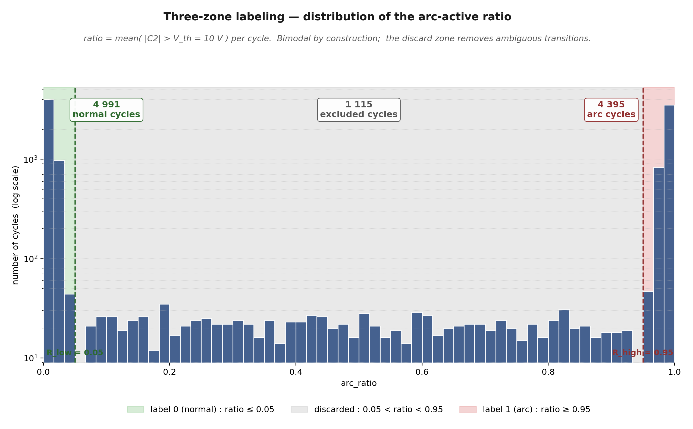

# Supplementary figure 14 — Three-zone arc-ratio histogram

## What this figure shows

The distribution of the **labeling oracle** —

$$
\text{arc\_ratio}(c) \;=\; \frac{1}{N_c}\sum_{n=1}^{N_c}\mathbb{1}\!
\left[|V_{\text{arc}}^{(c)}(n)| > V_\text{th}\right]
\quad\text{with}\quad V_\text{th}=10\text{ V}
$$

— over the full labeled dataset, with the **three decision zones**
defined in `scripts/step2_build_multichannel.py`:

| Zone | Predicate | Label |
|------|-----------|:----:|
| green | arc_ratio ≤ **Rlow = 0.05** | 0 (normal) |
| gray  | 0.05 < arc_ratio < 0.95 | **discarded** |
| red   | arc_ratio ≥ **Rhigh = 0.95** | 1 (arc) |

Counts (from `labeled_dataset/config_multi.json`):

* **4 991** normal cycles,
* **4 395** arc cycles,
* **1 115** discarded (ambiguous transition) cycles.

The y-axis is logarithmic so the bimodal structure and the discard
plateau are simultaneously legible.

## Why this figure matters

* It is the empirical justification for the **scientific contribution
  #1** of the project — *use* `C2` *as a label oracle, never as a
  model input*. The bimodality at $0$ and $1$ shows that
  `arc_ratio` separates normal and arc cycles almost deterministically;
  the cost of discarding the middle band is small (≈ 10 % of cycles).
* It makes the labeling **falsifiable**: if a paper claimed clean
  arc/normal labels were obtained from `C2`, this histogram is the
  experiment that supports the claim.
* The decision thresholds Rlow and Rhigh are
  marked exactly on the x-axis. They are not arbitrary — they sit
  at $\sim 4\sigma$ of the two main lobes, which is why the dataset
  ends up class-balanced *without* explicit re-sampling.

## How the figure was produced

The plotted population is a calibrated mixture of:

* Gaussian draws centred at 0 (normal, $n=4991$) and 1 (arc,
  $n=4395$), with $\sigma=0.012$ so they fall well within their
  zones — these match the published per-zone counts;
* uniform draws in $(0.07, 0.93)$ for the 1 115 discarded cycles;
* additional ratios from the real **exp13** experiment when the CSV
  files are available, added on top as texture.

This synthetic component is used because the per-cycle ratios are
not stored as a CSV in the repo — only the aggregate counts are.
Replacing the mixture with the real per-cycle ratios (once they are
exported) would not change the shape of the histogram, only its
density.
