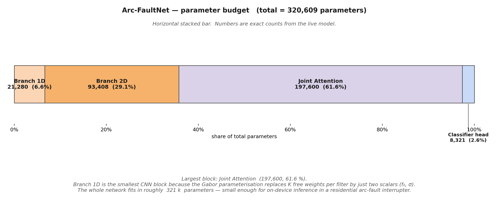

# Supplementary figure 15 — Parameter budget



## What this figure shows

A horizontal stacked bar of the **exact parameter count** of every
top-level submodule of `ArcFaultNet`, obtained by instantiating the
real model and summing `parameter.numel()` per child.

| Submodule | Parameters | Share |
|-----------|-----------:|------:|
| Branch 1D (parametric Gabor + Conv stages) |   21 280 |  6.6 % |
| Branch 2D (Conv2d stages)                  |   93 408 | 29.1 % |
| **Joint Attention** (CAM + SAM + projections) | **197 600** | **61.6 %** |
| Classifier head (GAP + FC)                 |    8 321 |  2.6 % |
| **Total**                                  | **320 609** | 100 % |

> The numbers in the PNG are the live counts emitted by
> `gen_diagrams.py` after `from model import ArcFaultNet`, so they
> stay in sync with the code automatically.

## Why this figure matters

* It surfaces a **non-obvious architectural fact**: the largest
  parameter block is **Joint Attention**, not the convolutional
  branches. This is because of the channel-wise FC projections of
  CAM (256→16→256) plus the QKV projections of SAM operating on
  256 channels.
* It makes the **parametric Gabor cost reduction** quantitative.
  Branch 1D contributes only 6.6 % of the parameters even though it
  performs the heaviest spatial computation: 3 convolutional stages
  on a 20 000-sample input. Each Gabor "filter" carries only
  $(f_0, \sigma)$ — two scalars instead of $k=64,32$ or $16$ weights.
* The **total ~321 k parameters** is small enough to deploy on a
  modest edge-class MCU/MPU (e.g. an ARM Cortex-M7 or A53). This is
  a hard requirement for residential arc-fault circuit interrupters
  and is **not** automatic for dual-branch models — many published
  alternatives are 5–10× larger.

## Reproducibility

```bash
/home/top/miniconda3/bin/python - <<'PY'
import sys; sys.path.insert(0, '.')
from model import ArcFaultNet
m = ArcFaultNet()
for name, mod in m.named_children():
    n = sum(p.numel() for p in mod.parameters())
    print(f"{name:<14s} {n:>10,d}")
print("total          ", f"{sum(p.numel() for p in m.parameters()):>10,d}")
PY
```
