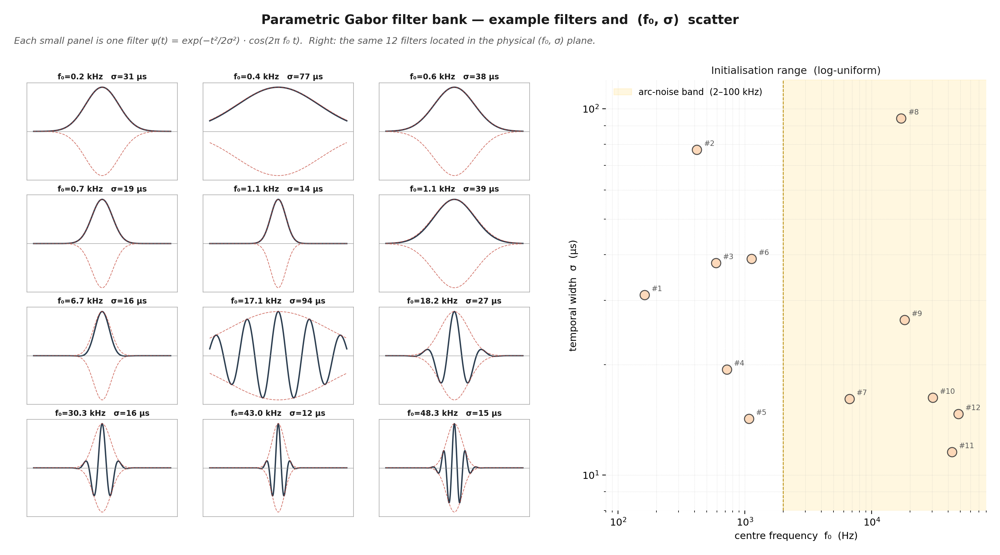

# Supplementary figure 16 — Gabor filter atlas + (f₀, σ) scatter

## What this figure shows

Twelve example filters drawn from the **parametric Gabor**
initialisation distribution used by `ParametricConv1d`, together with
their position in the **physical** $(f_0, \sigma)$ plane.

* Each small panel is one filter

$$
\psi(t)\;=\;\underbrace{\exp\!\left(-\tfrac{t^2}{2\sigma^2}\right)}_{\text{Gaussian envelope (red dashes)}}\;\cdot\;\cos(2\pi f_0\,t)
$$

  drawn over $t\in[-K/2,\,K/2]/f_s$ with $K=256$ at $f_s = 1$ MHz.
* The right plot scatters the same twelve filters in
  $(f_0, \sigma)$ space on **log–log** axes. The yellow band marks
  the physical arc-noise region (2–100 kHz) that Branch 2D operates
  on, for cross-reference.

## Why this figure matters

* It is the most direct way to visualise the **parametric Gabor
  contribution**: every filter is described by exactly two scalars
  (its dot in the scatter), instead of $K$ free weights.
* It shows that the **initialisation prior is wide and unbiased**:
  $f_0$ is log-uniform between 100 Hz and 50 kHz, $\sigma$
  log-uniform between 10 µs and 100 µs. There is no manual
  hand-tuning of individual filters.
* It also shows that **not every initial filter sits inside the
  arc band** — some start with $f_0 < 2\,\text{kHz}$. During
  training, the optimiser is free to migrate those filters to the
  arc band (or to specialise on lower-frequency artefacts). This
  *adaptive specialisation* is the practical reason for the Gabor
  reparameterisation.

## Relation to the rest of the architecture

* **In Branch 1D** these filters are the *first thing the signal
  meets*, so they are responsible for the spectral selectivity of the
  whole branch.
* The 2 kHz–100 kHz band shaded in yellow is the *exact* band that
  **Branch 2D** keeps after the STFT slice — by showing the Gabor
  filters against the same band, the figure visually justifies why
  the two branches *complement* rather than *duplicate* each other:
  Branch 1D can learn filters *inside* the band, but also *narrower
  bands or transients that the 256-µs STFT cannot resolve*.

## How the figure was produced

The figure does **not** load trained weights — it samples 12 random
draws from the project's initialisation distribution to give the
reader a faithful picture of what the model "starts from". Replacing
the random draw with the actual `model.branch_1d.conv1.f0` and
`.sigma` of a trained checkpoint would yield a different scatter
(presumably tighter around the arc band) and is a planned follow-up
once trained checkpoints are committed.
