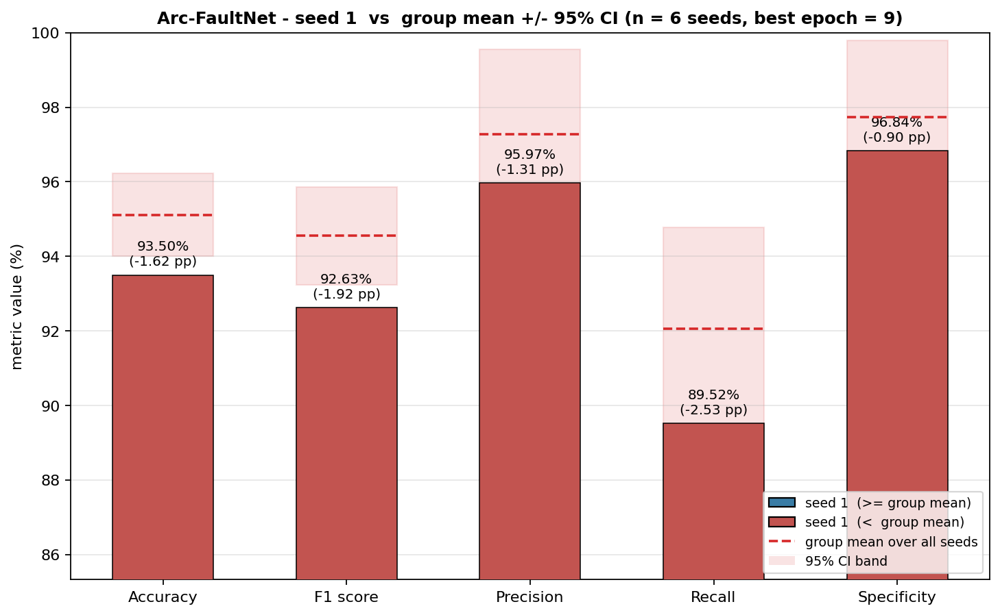
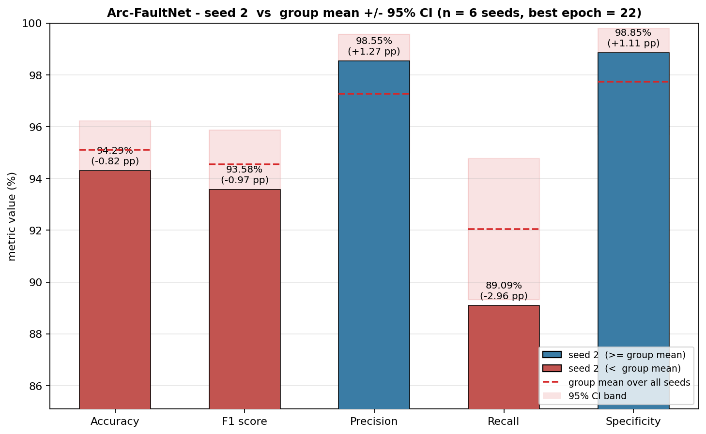
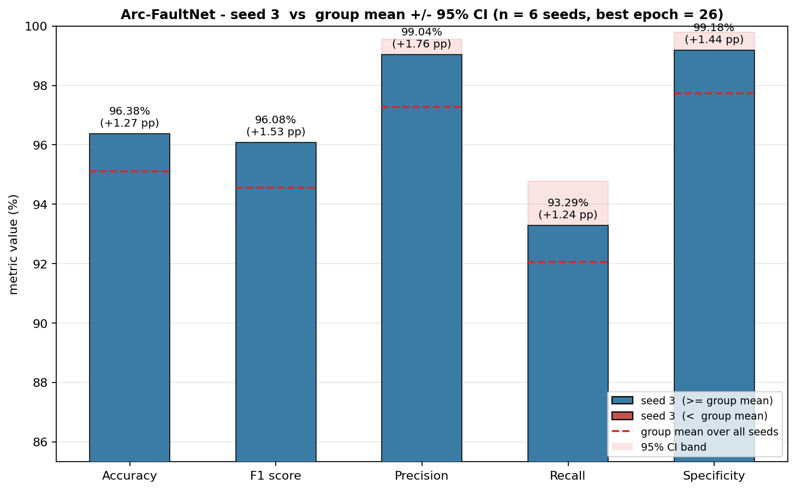
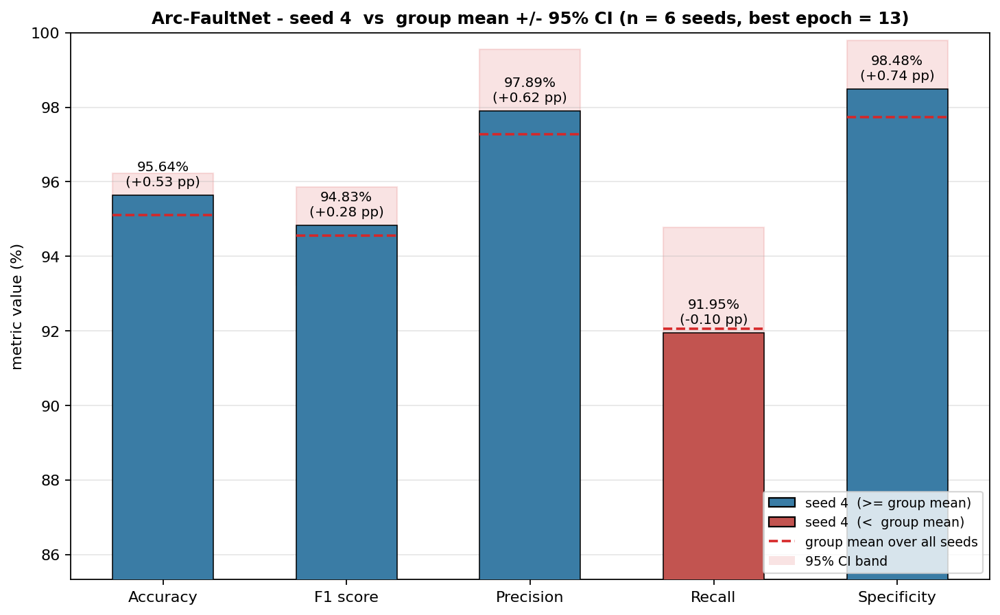
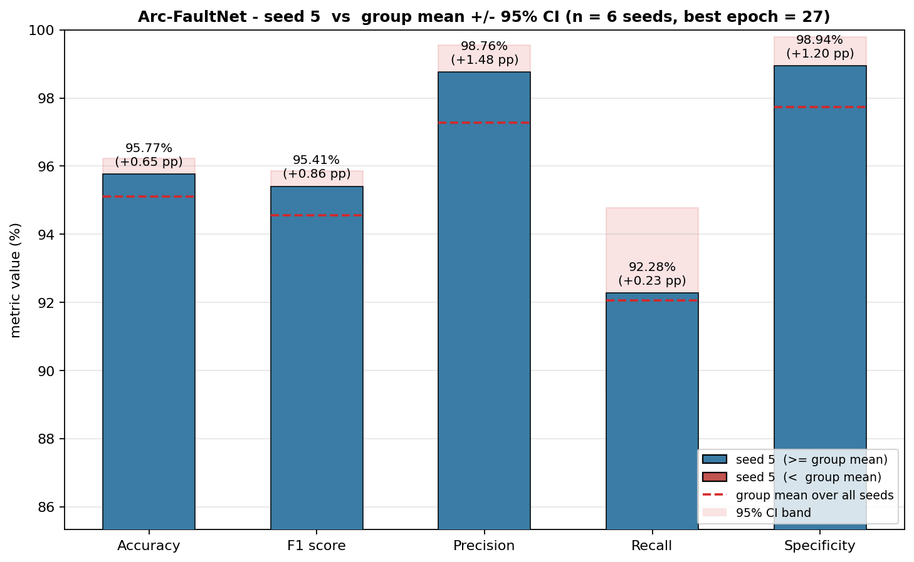
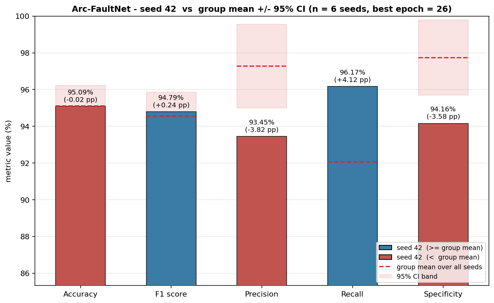
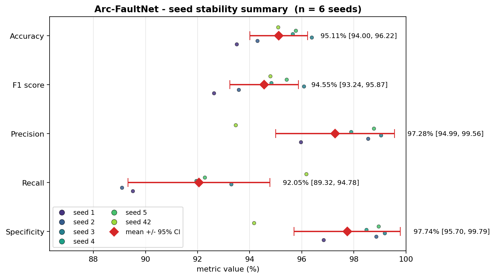
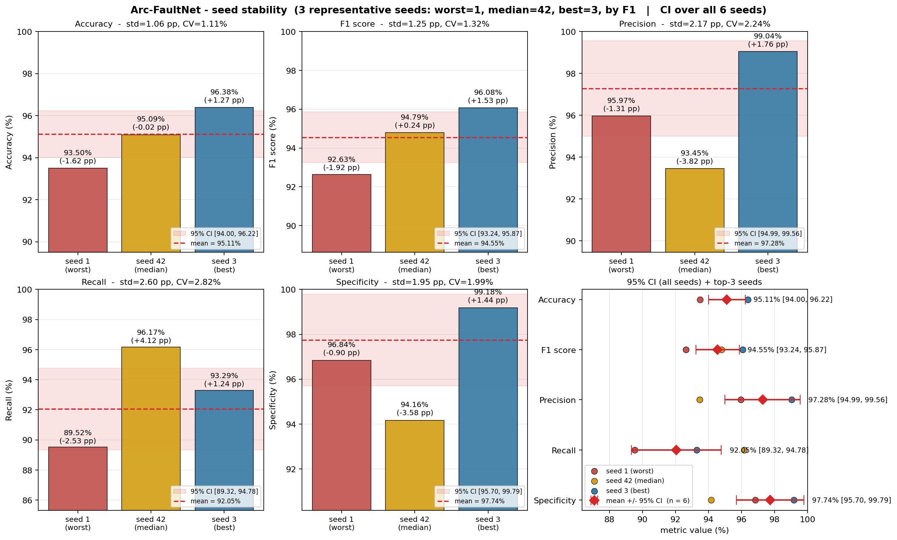
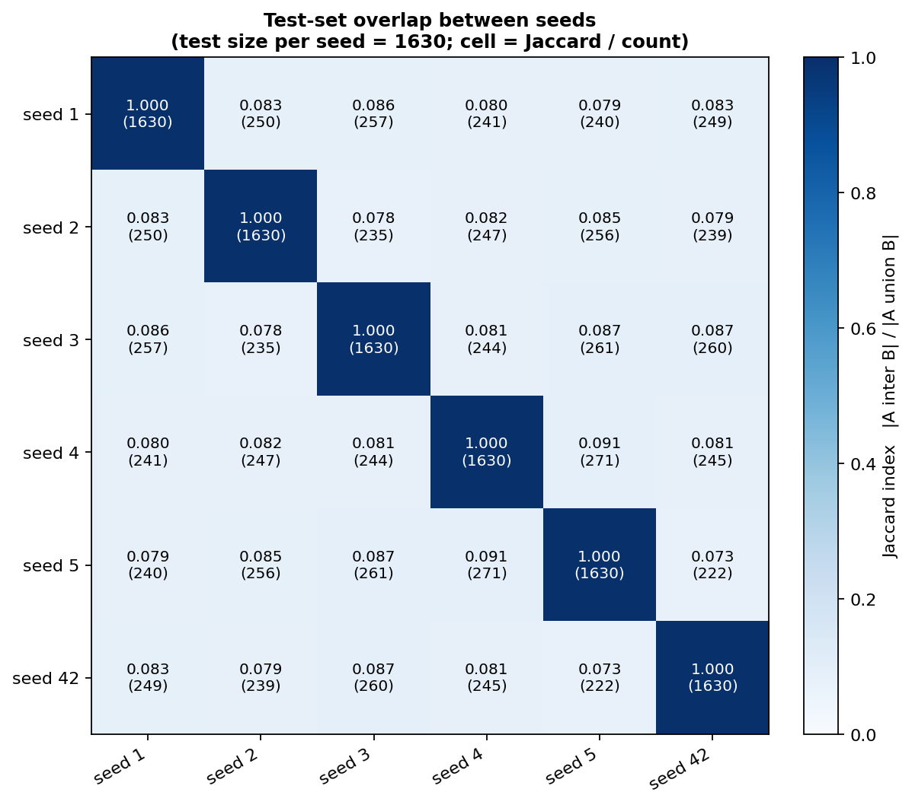

# Seed Stability Study

**Seeds analysed:** 6  -  1, 2, 3, 4, 5, 42
**Overall stability:** **UNSTABLE on at least one metric**
**Dataset:** `combined_dataset` (N = 10860 samples, test split = 1630, ratios 70/15/15)

## 1. Why this study?

Each `--mode single` training run re-rolls *two* sources of randomness through `--seed`:

1. the **random 70/15/15 train-val-test split** (`np.random.permutation` in `train.py`), so the *identity* of the test samples changes across seeds;
2. the **optimisation randomness** - weight init, batch order, augmentation, dropout.

The architecture and hyper-parameters are held **constant**. The spread of test metrics therefore measures the *combined* sensitivity of the model to split + training randomness.

## 2. Reference configuration

| Hyper-parameter | Value |
|---|---|
| model         | `arcfaultnet` |
| parameters    | 344,409 |
| epochs (max)  | 200 |
| learning rate | 0.0003 |
| weight decay  | 0.0005 |
| batch size    | 64 |
| patience      | 10 |
| grad clip     | 0.5 |
| threshold     | 0.5 |

## 3. Per-seed raw results

| seed | best ep. | accuracy | F1 | precision | recall | specificity | run dir |
|---|---:|---:|---:|---:|---:|---:|---|
| 1 | 9 | 93.50 | 92.63 | 95.97 | 89.52 | 96.84 | `arcfaultnet_single_20260526_115725` |
| 2 | 22 | 94.29 | 93.58 | 98.55 | 89.09 | 98.85 | `arcfaultnet_single_20260526_120146` |
| 3 | 26 | 96.38 | 96.08 | 99.04 | 93.29 | 99.18 | `arcfaultnet_single_20260526_120829` |
| 4 | 13 | 95.64 | 94.83 | 97.89 | 91.95 | 98.48 | `arcfaultnet_single_20260527_113220` |
| 5 | 27 | 95.77 | 95.41 | 98.76 | 92.28 | 98.94 | `arcfaultnet_single_20260528_114322` |
| 42 | 26 | 95.09 | 94.79 | 93.45 | 96.17 | 94.16 | `arcfaultnet_single_20260526_112120` |

## 4. Aggregate statistics (Student-t, 95% CI)

| metric | mean | std (pp) | CV | 95% CI | min | max |
|---|---:|---:|---:|---|---:|---:|
| Accuracy | 95.11% | 1.06 | 1.11% | [94.00, 96.22]% | 93.50% | 96.38% |
| F1 score | 94.55% | 1.25 | 1.32% | [93.24, 95.87]% | 92.63% | 96.08% |
| Precision | 97.28% | 2.17 | 2.24% | [94.99, 99.56]% | 93.45% | 99.04% |
| Recall | 92.05% | 2.60 | 2.82% | [89.32, 94.78]% | 89.09% | 96.17% |
| Specificity | 97.74% | 1.95 | 1.99% | [95.70, 99.79]% | 94.16% | 99.18% |

## 5. Stability verdict

- **Accuracy**: mean = 0.9511, std = 0.0106 (1.11%), 95% CI = [0.9400, 0.9622] -> ACCEPTABLE
- **F1 score**: mean = 0.9455, std = 0.0125 (1.32%), 95% CI = [0.9324, 0.9587] -> ACCEPTABLE
- **Precision**: mean = 0.9728, std = 0.0217 (2.24%), 95% CI = [0.9499, 0.9956] -> UNSTABLE
- **Recall**: mean = 0.9205, std = 0.0260 (2.82%), 95% CI = [0.8932, 0.9478] -> UNSTABLE
- **Specificity**: mean = 0.9774, std = 0.0195 (1.99%), 95% CI = [0.9570, 0.9979] -> ACCEPTABLE

**Decision rule**

- `STABLE`     - std <= 1 pp **and** CV <= 2 %
- `ACCEPTABLE` - std <= 2 pp
- `UNSTABLE`   - otherwise

**Overall: UNSTABLE on at least one metric**

## 6. How to read the 95% CI

For each metric we estimate the population mean over all possible seeds with the Student-t 95% confidence interval:

$$\bar{x} \pm t_{n-1,\,0.975}\,\frac{s}{\sqrt{n}}$$

A **narrow CI** means the model behaves consistently across seeds; a **wide CI** means a single training run is not representative and you should report mean +/- CI, not the score of one favourable seed.

## 7. Test-set overlap between seeds

Each seed produces a test set of 1630 samples drawn from N = 10860. With a 70/15/15 split, two independent seeds share on average about 245 samples just by chance (approx. 15.01% of the test set).

Observed mean pairwise overlap (off-diagonal, exact reproduction of `np.random.permutation`):

- **mean intersection count:** 247.8 samples / 1630 (15.20%)
- **mean Jaccard index:**     0.0823

Pairwise Jaccard matrix (also in `seed_stability/overlap_jaccard.csv`):

| | seed 1 | seed 2 | seed 3 | seed 4 | seed 5 | seed 42 |
|---|---|---|---|---|---|---|
| **seed 1** | 1.000 | 0.083 | 0.086 | 0.080 | 0.079 | 0.083 |
| **seed 2** | 0.083 | 1.000 | 0.078 | 0.082 | 0.085 | 0.079 |
| **seed 3** | 0.086 | 0.078 | 1.000 | 0.081 | 0.087 | 0.087 |
| **seed 4** | 0.080 | 0.082 | 0.081 | 1.000 | 0.091 | 0.081 |
| **seed 5** | 0.079 | 0.085 | 0.087 | 0.091 | 1.000 | 0.073 |
| **seed 42** | 0.083 | 0.079 | 0.087 | 0.081 | 0.073 | 1.000 |

Interpretation: a low Jaccard (~ 0.08-0.10) confirms each seed evaluates on a **largely different test set**. So the variance across seeds is not a pure 'training noise' figure - it also absorbs the **split-roulette** effect (some test samples are intrinsically harder than others).

## 8. Figures

Per-seed plots (one PNG each):

- seed 1: 
- seed 2: 
- seed 3: 
- seed 4: 
- seed 5: 
- seed 42: 

Summary across seeds (forest plot with mean +/- 95% CI):

Top-3 representative seeds (worst = 1, median = 42, best = 3, ranked by F1; CI band still computed over all 6 seeds):

Pairwise test-set overlap (Jaccard heatmap):

## 9. Files

- `docs/architecture/seed_stability/per_seed.csv`
- `docs/architecture/seed_stability/summary.csv`
- `docs/architecture/seed_stability/overlap_jaccard.csv`
- `docs/architecture/seed_stability/overlap_count.csv`
- `docs/architecture/diagrams/seed_stability/seed_<S>.png`
- `docs/architecture/diagrams/seed_stability/summary_forest.png`
- `docs/architecture/diagrams/seed_stability/overlap_matrix.png`
