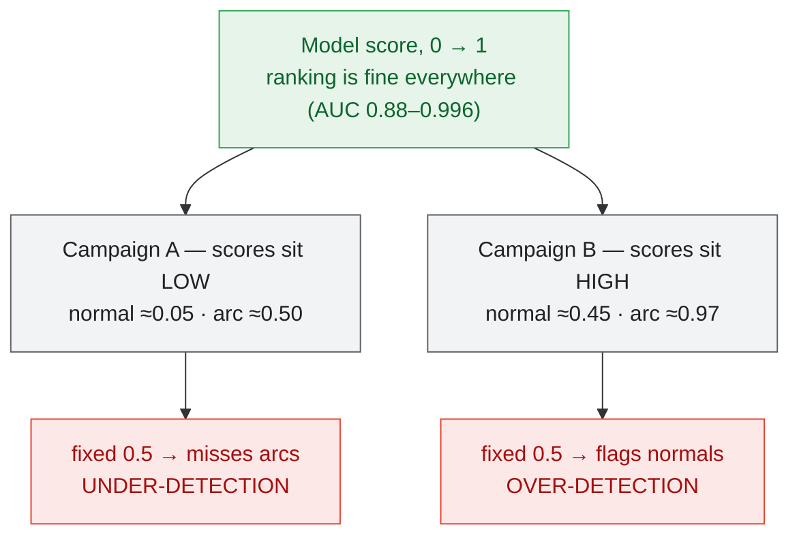

# ArcSSM — cross-campaign generalization (groupkfold): findings & conclusion

**Scope.** This documents the investigation into why the ArcSSM track detects arc
faults almost perfectly *within* an acquisition campaign but degrades on an
*unseen* campaign, everything that was tried to close that gap, and the honest
conclusion. It concerns the **ArcSSM (S4D) track only** — not ArcFaultNetV2.

Reference run **B1** = `runs/arcssm_groupkfold_campaign_20260726_195946`
(see [`baselines/arcssm_campaign_cv_v1.md`](baselines/arcssm_campaign_cv_v1.md)).
"B1" is simply *Baseline #1*, the frozen plain-ArcSSM reference every variant is
measured against.

---

## 1. Question and protocol

**Motivation of groupkfold.** Leave-one-campaign-out (LOCO) answers the only
question that matters for deployment: *can the model detect arcs under conditions
different from those it was trained on?* Each fold trains on 3 campaigns and tests
on the 4th, never-seen campaign.

**The 4 campaigns** (10 860 cycles, 2048 samples/cycle @ 102.4 kHz, per-cycle labels):

| Campaign | Bench | Cycles | Arc temporal structure |
|---|---|---|---|
| 8_juillet | IJL | 2746 | **isolated** single arc cycles between long normal runs |
| 15_juillet | IJL | 2820 | one contiguous block: 1501 normal → 1319 arc |
| 22_juillet | IJL | 3820 | **isolated** single arc cycles |
| OthmaneSalim (2026) | **different** | 1474 | contiguous arc block |

Two structural facts that matter later: **3 of the 4 campaigns are the same IJL
bench**, and the **arc presentation itself is inconsistent** across campaigns
(isolated single cycles vs sustained blocks).

**The gap.** Same architecture, random 70/15/15 cycle split (single mode):
**98.5 %**. Leave-one-campaign-out (B1): **81.3 %**. The 17-point gap is what this
document is about. (The 98.5 % is inflated by leakage — adjacent cycles of one
recording are near-duplicates — so it is a soft ceiling, not a target.)

---

## 2. B1 — the reference model

Plain ArcSSM: `i_derived4` front-end `[I, |ΔI|, TKEO, RMS_slide]` → Conv1d encoder →
**4 × S4Block** (d_model 128, d_state 64, bidirectional complex S4D) → LayerNorm →
mean-pool → Linear(128) → shallow classifier. **359 553 parameters.** No
augmentation, no domain-generalization tricks, early stopping on in-campaign
`val_f1`, threshold 0.5, seed 42.

**Pooled out-of-fold (10 860 cycles, each scored by a model that never saw its campaign):**

| Metric | Value |
|---|---|
| Accuracy | 81.28 % |
| F1 | 79.63 % |
| Precision | 79.19 % |
| Recall | 80.07 % |
| Specificity | 82.30 % |
| ROC AUC | 0.8872 |
| Counts | TP 3973 · FP 1044 · FN 989 · TN 4854 |

**Per fold:**

| Held-out campaign | Acc % | F1 % | Spec % | AUC |
|---|---|---|---|---|
| 15_juillet | 73.16 | 77.23 | 51.90 | 0.912 |
| 22_juillet | 88.85 | 87.52 | 93.00 | 0.908 |
| 8_juillet | 75.71 | 65.46 | 100.00 | 0.880 |
| 2026 | 87.58 | 86.02 | 80.26 | 0.996 |

---

## 3. Diagnosis — why groupkfold < single

Three measurements locate the failure precisely.

1. **Ranking survives the campaign shift.** Per-campaign AUC is 0.88–0.996: *inside*
   every unseen campaign the model still orders arc above normal. The learned
   features (S4D complex-resonator filter bank + I-derived channels) are good.

2. **The decision boundary does not survive it.** The whole score distribution
   *slides* per campaign. Mean p(arc) on **normal** cycles ranges 0.05 → 0.45; on
   **arc** cycles 0.50 → 0.97, depending on the campaign. A single fixed threshold
   (0.5) therefore over-detects on some campaigns (low specificity) and
   under-detects on others. Signature: **pooled AUC 0.887 < mean per-campaign AUC
   0.924** — mixing offset score scales destroys ranking that exists within each
   campaign.

3. **Checkpoint selection is in-domain.** Early stopping fires on a validation set
   drawn from the *training* campaigns, at val F1 90–99 %, while the held-out
   campaign scores 65–88 %. The selected checkpoint is the most
   *training-campaign-specialized* one.

So the gap is **calibration / score-shift** (a movable threshold) layered on top of
**genuine representation overlap** (features that partly encode bench style, not
just arc physics).



---

## 4. What was tried — 7 configurations, none beats B1

Every variant below uses the same LOCO protocol; only the stated change differs.

| Configuration | Pooled Acc | Pooled Spec | vs B1 |
|---|---|---|---|
| **B1 — plain ArcSSM (4-layer S4D)** | **81.28 %** | **82.30 %** | reference |
| + strong augmentation + channel-dropout | 78.89 % | 76.57 % | worse |
| + `val_fbeta` early stopping (β=0.5) | 79.14 % | 79.55 % | worse |
| + Tier-1 (mean+max pool + embedding LayerNorm) | — | — | aborted (fold-1 worse) |
| + Domain generalization (GroupDRO + CORAL + campaign-balanced sampler) | 74.42 % | 71.75 % | worse |
| + Voltage branch (dual-branch I+V, +82k params) | 77.16 % | 69.41 % | worse |
| − Smaller model (2-layer S4D, 194k params) | 76.26 % | 73.87 % | worse |

Notes on the most instructive ones:

- **Augmentation** redistributed errors (helped some folds, hurt others); it did not
  fix the score-shift.
- **`val_fbeta`** aimed to cut false positives but *raised* them (FP 1044 → 1206):
  in-domain precision (val F-β 98 %) does not transfer to a held-out campaign.
- **Tier-1 (pooling + embedding norm)** improved per-campaign AUC (fold-1 0.95, the
  best of all runs) but the fixed-0.5 score slid *further up* — confirming the slide
  is a **directional** offset that per-sample normalization does not remove.
- **Domain generalization backfired hardest on fold 4 (2026):** 87.6 % → 68.2 %.
  GroupDRO/CORAL align the *training* campaigns — but 3 of them are the same IJL
  bench, so alignment **over-specializes to IJL** and transfers *worse* to the one
  genuinely different bench. **You cannot learn bench-invariance from a single bench.**

  ```mermaid
  flowchart TD
      TR["Training campaigns of fold 2026:<br/>8 juil + 15 juil + 22 juil<br/>ALL THE SAME IJL BENCH"]:::ijl
      TR -->|"GroupDRO/CORAL align them"| SP["the learned invariance is<br/>over-specialisation TO THE IJL BENCH"]:::warn
      SP -->|"transfers WORSE"| T["2026 — genuinely different bench<br/>87.6 % → 68.2 %"]:::bad
      classDef ijl fill:#e8f0fe,stroke:#4285f4,color:#174ea6;
      classDef warn fill:#fef7e0,stroke:#f9ab00,color:#b06000;
      classDef bad fill:#fce8e6,stroke:#ea4335,color:#a50e0e;
  ```
- **Voltage branch:** v(t)'s HF arc signature is empirically the most
  *bench-consistent* raw feature (AUC 0.70–0.79 on every campaign vs I's 0.63–0.90),
  yet a learned V-branch *lowered* specificity (more over-detection). The consistency
  of a simple HF statistic did not translate into a helpful learned branch.
- **Smaller model:** if "everything I add hurts," the inverse was worth a test — it
  also lost (76.3 %), so B1's 4-layer size is itself a sweet spot.

**Mechanistic reason nothing helped.** In-domain validation is *always* 95–98 %, so
early stopping always selects the most training-campaign-specialized checkpoint.
Adding capacity or extra signals (aug, DG, a second branch, more layers) only lets
the model fit the training benches *better* → transfers *worse*. Removing capacity
under-fits. **B1 is the least-overfit configuration reachable on this data, hence the
best transfer.** (Caveat: per-fold seed noise is large; single-seed deltas below
~3 points are not conclusive — but six variants landing 3–7 points below B1 is.)

---

## 5. The root cause is the data, not the model

1. **Bench diversity.** 3 of 4 campaigns are the same IJL bench; the only genuinely
   different setup (2026) is also the *easiest* fold (AUC 0.996). No training trick
   substitutes for training campaigns on **different installations, electrodes and
   load mixes** — the DG failure on fold 4 proves this directly.
2. **Unfamiliar-normal → false positive.** Specificity collapses on an unseen bench
   because a *normal* cycle there has an unfamiliar *style* (load harmonics, noise
   floor) and gets flagged as arc. A robust notion of "normal" requires diverse
   normal data, i.e. more benches.
3. **Inconsistent arc protocol** (isolated single cycles vs sustained blocks) adds a
   second shift on top of the bench shift and undermines otherwise-principled ideas
   such as a multi-cycle non-repetitivity model.

---

## 6. What *does* raise the numbers (deployable, no retraining)

The model ranks well (AUC 0.9); the fixable part is the **decision layer**.

**Per-installation threshold — specificity achievable at a fixed recall (on B1):**

| Campaign | AUC | spec @0.5 | **spec @recall 90 %** | spec @recall 95 % |
|---|---|---|---|---|
| 15_juillet | 0.912 | 52 % | **82 %** (thr 0.94) | 82 % |
| 22_juillet | 0.908 | 93 % | **90 %** (thr 0.20) | 80 % |
| 8_juillet | 0.880 | 100 % | **56 %** (thr 0.05) | 3 % |
| 2026 | 0.996 | 80 % | **100 %** (thr 0.97) | 100 % |

- On **3 campaigns / 4**, a per-installation threshold gives good specificity at high
  recall (a commissioned AFDD sets its operating point on-site). Thresholds differ
  wildly (0.20 → 0.97) — hence *per installation*, not universal.
- **8_juillet is the one genuine hard case:** arc/normal overlap at the top (AUC 0.88)
  means high recall and high specificity are not simultaneously achievable — a
  *separability* limit, not a threshold one.
- **Unsupervised calibration** (threshold from the histogram valley of *unlabelled*
  target cycles, Otsu): pooled accuracy 81.3 % → **83.0 %**, specificity 82.3 % →
  **≈85 %**, FP 1044 → 857. A modest but honest gain, achievable with no labels.
### 6.1 Multi-cycle decision — the one substantial win (no retraining)

Averaging B1's per-cycle scores over **K consecutive cycles** (then applying the
unsupervised per-campaign threshold) improves *every* metric at once. This is B1's
own predictions, post-processed — no training, no new parameters.

| K | Acc | **Spec** | Recall | F1 | per-campaign AUC (15j/22j/8j/2026) |
|---|---|---|---|---|---|
| 1 (B1 per cycle) | 82.98 % | 85.40 % | 80.1 % | 81.1 % | 0.912 / 0.908 / **0.880** / 0.996 |
| 2 | 86.51 % | 86.58 % | 86.4 % | 85.7 % | 0.958 / 0.957 / 0.947 / 0.988 |
| **4** | 86.83 % | 90.06 % | 83.4 % | 86.0 % | **0.990 / 0.970 / 0.977** / 0.977 |
| **6** | **88.27 %** | 91.80 % | 84.7 % | **87.8 %** | 0.997 / 0.961 / 0.974 / 0.966 |
| 8 | 87.39 % | **93.14 %** | 81.9 % | 87.0 % | 1.000 / 0.948 / 0.962 / 0.940 |

Against the fixed-threshold B1 reference (81.28 % / 82.30 % spec), **K=6 gives
+7.0 accuracy, +9.5 specificity, +4.6 recall, +8.2 F1 simultaneously.** Averaging
denoises the score, which is why the hardest fold improves most in ranking terms
(8_juillet AUC 0.880 → 0.977 at K=4).

**Recommended operating mode: K=4** (80 ms decision at 50 Hz, comfortably inside
IEC 62606 timing, per-campaign AUC ≥ 0.977 everywhere), or K=6 to maximise the
headline numbers.

**Honest limitation.** 8_juillet's recall stays weak (43–67 %) because its arcs are
**isolated single cycles** that averaging dilutes. Multi-cycle decisions favour
**sustained** arcs (the safety-relevant case) and penalise single-cycle events; K=2
is the best compromise for that campaign (67.2 %).

**A learned multi-cycle model was also tried and is superseded by this.** An
`ArcSSMWindow` (per-cycle S4D + mean⊕std aggregation over K=2, 367 745 params, in
`train_window.py` — since removed in the cleanup, recoverable from git history)
reached 80.43 % / 73.61 % spec at window
level — *below* simply averaging B1's scores over the same two cycles (84.10 % /
83.85 %). Its std branch fires on *any* cycle-to-cycle change, so normal load
variation triggers false positives (15_juillet specificity 35.5 %). Notable
exception: it reached AUC 1.000 on the 2026 bench and lifted 8_juillet's
specificity at 95 % recall from 2.8 % to 55.9 %. The measured
repetitivity gap that motivated it is real (arc is less repetitive than normal on
every campaign, Δndiff +0.19…+0.50) — but exploiting it at the decision level beats
learning it in the features. See
[`arcssm_window_architecture.md`](arcssm_window_architecture.md).

---

## 7. Conclusion

- **B1 (plain 4-layer ArcSSM) is the best *trained* configuration reachable on this
  dataset** — 8 configurations tried, none beats it, for a well-understood reason
  (in-domain checkpoint selection + capacity → over-fitting of the training benches).
- **But B1 is not the best *system*.** The decision layer, not the network, carried
  the real gain: **multi-cycle aggregation + unsupervised per-installation
  calibration reaches 88.3 % accuracy / 91.8 % specificity / 84.7 % recall (K=6)**,
  versus 81.3 % / 82.3 % / 80.1 % for B1 at a fixed per-cycle threshold — every
  metric improved at once, with **zero retraining** (§6.1). Detecting over several
  cycles is also what a real AFDD does (IEC 62606).
- **What remains data-bound.** 3/4 campaigns share one IJL bench, so the *network*
  still cannot learn bench-invariance — that is why no training-side intervention
  helped, and why acquiring campaigns on **different installations** remains the
  highest-value next step. It is no longer true, however, that ≈81 % is the ceiling
  for the deployed system.
- Keep the strengths on record: within-campaign AUC 0.88–0.996, a compact
  (359 k-param) FFT-fast model, and a voltage HF signal that is measurably
  bench-consistent (a lead worth revisiting once more diverse benches exist).

**Recommended reporting statement.** *"ArcSSM discriminates arc from normal
excellently within an installation (AUC 0.88–0.996). Evaluated per cycle on an
unseen installation, a single fixed threshold is limited to ≈81 % by a per-campaign
score shift. Aggregating the decision over 4–6 consecutive cycles — as an AFDD does
under IEC 62606 — together with an unsupervised per-installation threshold raises
cross-installation performance to 88.3 % accuracy at 91.8 % specificity without
retraining. The residual gap is bounded by the dataset's bench coverage (3 of 4
campaigns share one bench), not by the model."*
