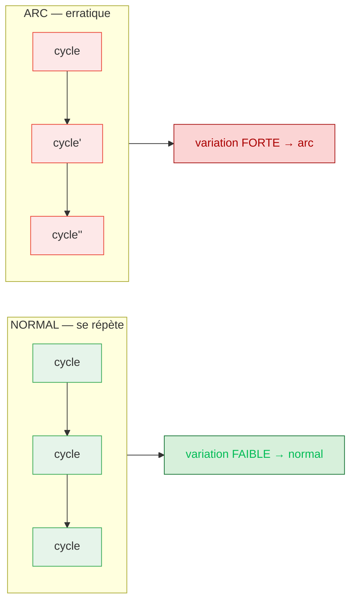
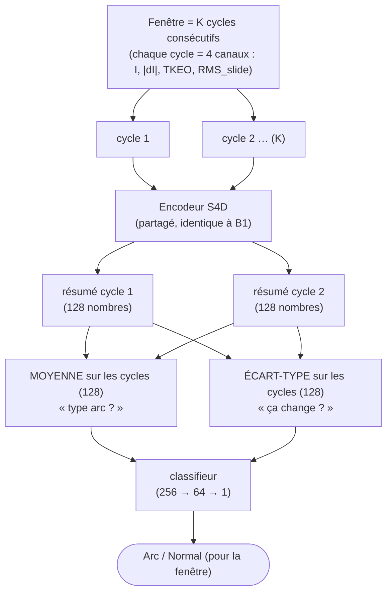
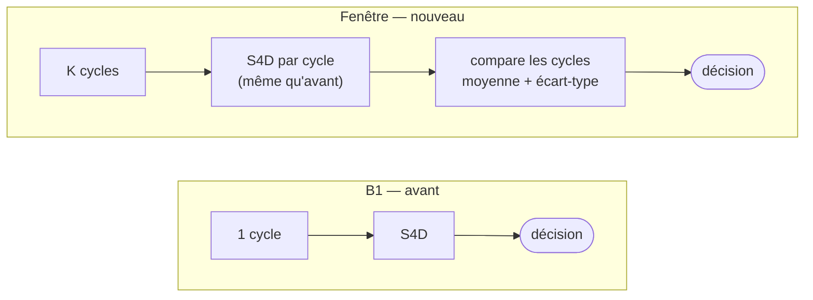

# ArcSSM « fenêtre » (multi-cycles) — architecture & logique, en simple

> But de ce document : expliquer **simplement** la nouvelle architecture qui décide
> sur **plusieurs cycles consécutifs** au lieu d'un seul, pourquoi elle devrait mieux
> généraliser à un banc inédit, et comment elle est construite. Code :
> [`train_window.py`](../train_window.py) (classe `ArcSSMWindow`).

---

## 1. Le problème de départ (en une phrase)

Le modèle B1 regarde **un seul cycle** et le juge par sa **forme**. Or la forme d'un
cycle *normal* dépend du banc (type de charge, bruit, harmoniques). Sur un banc
**jamais vu**, un cycle normal a une forme *inhabituelle* → le modèle crie « arc »
à tort → **faux positifs**, donc **spécificité basse**.

## 2. L'idée nouvelle (en une phrase)

Au lieu de « à quoi ressemble ce cycle ? » (dépend du banc), on pose une question
qui marche sur **tous les bancs** :

> **« Est-ce que ça se répète d'un cycle à l'autre ? »**

- Un appareil **normal** répète ses cycles **presque à l'identique** (courant périodique).
- Un **arc** est **erratique** : il change d'un cycle à l'autre (ré-allumages aléatoires,
  bruit haute-fréquence qui n'est jamais deux fois pareil).

« Se répète ou pas » est **la même question quel que soit le banc** → c'est un signal
**invariant au banc**, exactement ce qui manquait.

## 3. Comment le modèle le fait (étapes simples)

1. On prend une **fenêtre de K cycles consécutifs** (on commence à **K = 2**).
2. Chaque cycle passe dans **le même extracteur S4D que B1** — **inchangé**, on garde
   ce qui marche. Il transforme un cycle en un **« résumé »** de 128 nombres (un
   *embedding*).
3. On combine les K résumés de **deux** façons :
   - **la MOYENNE** des résumés → *« de quel type de signal s'agit-il ? »* (la partie
     « est-ce un contenu type-arc », comme B1) ;
   - **l'ÉCART-TYPE** des résumés → *« à quel point ça change d'un cycle à l'autre ? »*
     (**la répétitivité** — le nouveau signal invariant au banc).
4. Un petit **classifieur** décide **arc / normal** à partir de ces deux informations.

## 4. Pourquoi garder les DEUX (moyenne **et** écart-type)

L'écart-type détecte **le changement**. Mais **tout changement n'est pas un arc** :
allumer un moteur ou une bouilloire change aussi le courant d'un cycle à l'autre.
Donc :

- l'**écart-type** dit *« ça change »*,
- la **moyenne** dit *« est-ce un changement de type arc »*.

**Ensemble**, ils séparent « arc » de « simple changement de charge ». Un détecteur de
changement *tout seul* déclencherait à tort sur les enclenchements de charge.

## 5. Ce que ça NE change PAS (important)

- L'**extracteur S4D** — le cœur qui marche déjà (AUC 0.9 intra-campagne) — est
  **identique à B1**. On ne casse rien.
- On ajoute seulement une **petite tête** (moyenne+écart-type puis classifieur) :
  **+8 000 paramètres** (367 745 au total vs 359 553 pour B1). Vitesse ~identique.
- La **mémoire du SSM** n'est pas un souci : il traite **un cycle** (ce qu'il fait déjà
  parfaitement) ; la comparaison entre cycles est calculée **explicitement** (l'écart-type),
  pas confiée à la mémoire du SSM.

## 6. Pourquoi on pense que ça peut marcher (c'est mesuré)

On a mesuré, sur le contenu haute-fréquence (`|dI|`), à quel point deux cycles
**consécutifs** se ressemblent, pour le normal vs l'arc, sur chaque campagne
(`ndiff` = à quel point ça change ; plus grand = moins répétitif) :

| Campagne | normal→normal | arc→arc | **Δ (arc − normal)** |
|---|---|---|---|
| 15_juillet | 0.921 | 1.228 | **+0.31** |
| 22_juillet | 0.910 | 1.230 | **+0.32** |
| 8_juillet | 0.924 | 1.112 | **+0.19** |
| 2026 | 0.681 | 1.181 | **+0.50** |

→ **Sur les 4 campagnes**, l'arc est **moins répétitif** que le normal (Δ toujours
positif, y compris sur les folds difficiles). C'est **exactement** le signal que
l'écart-type de l'architecture va capter, et il est **présent partout** (invariant au banc).

## 7. B1 (avant) vs Fenêtre (nouveau)

| | B1 (par cycle) | Fenêtre (K cycles) |
|---|---|---|
| Entrée | 1 cycle | K cycles consécutifs |
| Question posée | « quelle forme ? » (dépend du banc) | « ça se répète ? » (invariant banc) + « type arc ? » |
| Unité de décision | 1 cycle | 1 fenêtre (≈ IEC 62606, plusieurs demi-cycles) |
| Extracteur S4D | — | **identique** |
| Paramètres | 359 553 | 367 745 (+8 k) |

## 8. Honnêteté (attentes)

- Le signal de non-répétitivité est **modéré** (Δ ≈ 0.2–0.3) → viser une **amélioration
  réelle de la spécificité** sur banc inédit, **pas** un bond à 98 %.
- L'**unité de décision devient la fenêtre** (pas le cycle) — plus proche d'un vrai
  AFDD, mais les chiffres ne se comparent pas *au cycle près* avec B1.
- Le **plafond reste borné par les données** (3 campagnes/4 = même banc IJL). Cette
  architecture attaque la *bonne* cause (le style spécifique au banc), mais elle ne
  fabrique pas de la diversité de bancs.

## 9. Protocole d'évaluation

Leave-one-campaign-out **sur les fenêtres** (une fenêtre ne traverse jamais deux
enregistrements ; train/test séparés par campagne → pas de fuite). On lance **K=2**
d'abord (l'événement d'arc est instantané → 2 cycles suffisent), puis **K=4** pour
voir si une estimation de répétitivité plus lissée aide. Comparaison à B1 sur
accuracy / **spécificité** par campagne.
