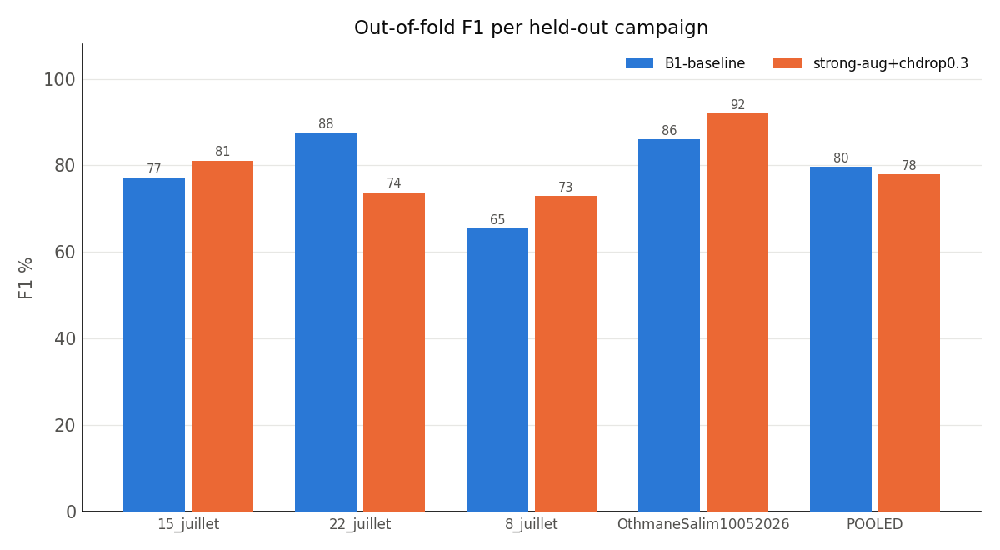

# Group-CV comparison

- Baseline: `runs/arcssm_groupkfold_campaign_20260726_195946` (B1-baseline)
- Threshold: 0.5
- Cycles compared: 10860

## Pooled out-of-fold

| Run | Acc % | F1 % | Recall % | Spec % | AUC |
|---|---|---|---|---|---|
| B1-baseline | 81.28 | 79.63 | 80.07 | 82.30 | 0.8872 |
| strong-aug+chdrop0.3 | 78.89 (-2.39) | 77.94 (-1.69) | 81.64 (+1.57) | 76.57 (-5.73) | 0.8747 (-0.0126) |

## Paired test vs baseline (McNemar, same cycles)

| Run | baseline✓ variant✗ | baseline✗ variant✓ | χ² | p | verdict |
|---|---|---|---|---|---|
| strong-aug+chdrop0.3 | 877 | 617 | 44.90 | 2.07e-11 | baseline better |

Both runs classify the same cycles, so only the discordant pairs carry information; a change that moves the accuracy but has p > 0.05 is inside run-to-run noise.

## Per held-out campaign

### 15_juillet_clean

| Run | n | Acc % | F1 % | Recall % | Spec % | AUC |
|---|---|---|---|---|---|---|
| B1-baseline | 2820 | 73.16 | 77.23 | 97.35 | 51.90 | 0.9119 |
| strong-aug+chdrop0.3 | 2820 | 79.11 (+5.96) | 81.13 (+3.89) | 95.98 (-1.36) | 64.29 (+12.39) | 0.9536 (+0.0417) |

### 22_juillet_clean

| Run | n | Acc % | F1 % | Recall % | Spec % | AUC |
|---|---|---|---|---|---|---|
| B1-baseline | 3820 | 88.85 | 87.52 | 84.07 | 93.00 | 0.9076 |
| strong-aug+chdrop0.3 | 3820 | 73.46 (-15.39) | 73.78 (-13.74) | 80.30 (-3.77) | 67.50 (-25.50) | 0.8734 (-0.0341) |

### 8_juillet_clean

| Run | n | Acc % | F1 % | Recall % | Spec % | AUC |
|---|---|---|---|---|---|---|
| B1-baseline | 2746 | 75.71 | 65.46 | 48.65 | 100.00 | 0.8804 |
| strong-aug+chdrop0.3 | 2746 | 78.44 (+2.73) | 72.87 (+7.41) | 61.20 (+12.55) | 93.92 (-6.08) | 0.9046 (+0.0242) |

### OthmaneSalim10052026

| Run | n | Acc % | F1 % | Recall % | Spec % | AUC |
|---|---|---|---|---|---|---|
| B1-baseline | 1474 | 87.58 | 86.02 | 99.29 | 80.26 | 0.9963 |
| strong-aug+chdrop0.3 | 1474 | 93.35 (+5.77) | 91.99 (+5.97) | 99.29 (+0.00) | 89.64 (+9.37) | 0.9944 (-0.0019) |

## Worst-campaign summary

| Run | worst F1 % | mean F1 % | std F1 % | worst AUC | mean AUC |
|---|---|---|---|---|---|
| B1-baseline | 65.46 | 79.06 | 8.78 | 0.8804 | 0.9240 |
| strong-aug+chdrop0.3 | 72.87 | 79.94 | 7.66 | 0.8734 | 0.9315 |

A change that lifts the mean but not the worst campaign has not improved generalization — it has improved the campaigns that already worked.

