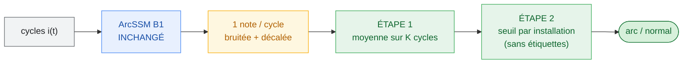
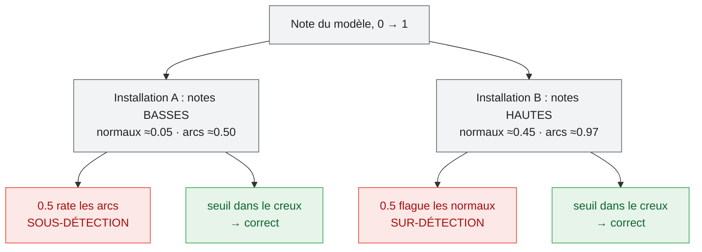

# Décision multi-cycles + calibration : ce qui a changé, et comment refaire les résultats

> En une phrase : **le modèle n'a pas changé du tout**. On a ajouté deux étapes
> *après* qu'il ait donné ses notes, et l'accuracy cross-installation passe de
> **81.3 % à 90.9 %** avec la spécificité de **82.3 % à 93.0 %** — sans un seul
> epoch d'entraînement.
>
> Outil : [`predict_multicycle.py`](../predict_multicycle.py).
> Contexte et historique complet : [`arcssm_groupkfold_generalization.md`](arcssm_groupkfold_generalization.md).

---

## 1. Ce qui n'a PAS changé

- Le réseau (ArcSSM, 359 553 paramètres) : **poids identiques**.
- Les prédictions : ce sont **exactement** celles déjà sauvegardées par le run de
  référence B1 (`runs/arcssm_groupkfold_campaign_20260726_195946/oof_predictions.npz`).
- Aucun réentraînement, aucun paramètre ajouté, aucune donnée nouvelle.

✅ **Le dépôt a été nettoyé.** Les options explorées pendant cette recherche et
mesurées comme nuisibles (`--group-dro`, `--coral-weight`, `--dg-balanced-sampler`,
`--use-voltage`, `--fas-k`) ainsi que le modèle fenêtre appris (`train_window.py`)
ont été **retirés** : il ne reste que la configuration B1 et l'outil de décision
ci-dessous. Tout reste récupérable dans l'historique git si besoin de le citer.

## 2. Ce qui a changé : deux étapes après le modèle



### Étape 1 — décider sur plusieurs cycles (au lieu d'un seul)

Le modèle donne une **note de 0 à 1 par cycle**. Cette note est **bruitée** : un
cycle normal peut recevoir une note haute par hasard, un cycle d'arc une note basse.
Décider sur un seul cycle, c'est subir ce hasard.

En **moyennant la note sur K cycles consécutifs**, les erreurs aléatoires se
compensent (elles vont dans des sens différents) alors que le vrai signal reste (les
K cycles sont dans le même état). C'est le principe de peser un objet plusieurs fois
sur une balance instable et de faire la moyenne.

Ça fonctionne parce qu'**un arc dure plusieurs cycles**, et c'est aussi ce que fait
un vrai AFDD : la norme **IEC 62606** décide sur plusieurs demi-alternances, pas sur
un instant isolé.

### Étape 2 — régler le seuil par installation, sans étiquettes

Par convention : « arc si note > 0.5 ». Le problème diagnostiqué est que sur une
installation jamais vue, **toutes les notes glissent ensemble** :

- sur une installation, les notes sont globalement basses → 0.5 rate les arcs ;
- sur une autre, globalement hautes → 0.5 déclenche sur du normal.

Le **classement** reste bon (les arcs ont toujours des notes plus hautes que les
normaux : AUC 0.88–0.997) — c'est le **niveau absolu** qui bouge.



La correction : regarder **l'histogramme des notes de cette installation**. Il y a
deux paquets (normaux en bas, arcs en haut) ; on place le seuil **dans le creux
entre les deux**. **Aucune étiquette n'est utilisée**, seulement la forme de la
distribution — donc c'est déployable : on installe le détecteur, il enregistre
quelques secondes de fonctionnement, il se règle seul (*commissioning*).

Deux façons de trouver le creux, toutes deux non-supervisées :

| méthode | principe | quand l'utiliser |
|---|---|---|
| `otsu` | seuil qui sépare le mieux l'histogramme en deux (classique en traitement d'image) | robuste, sûr à **tout K** |
| `gmm` | ajuste 2 gaussiennes et prend leur point de croisement | **meilleur, mais seulement à K ≥ 3** (voir §5) |

## 3. Les résultats

Point de départ — B1, décision par cycle, seuil 0.5 fixe :

| Acc | Spéc | Recall | F1 |
|---|---|---|---|
| 81.3 % | 82.3 % | 80.1 % | 79.6 % |

Après les deux étapes (calibration `gmm`) :

| K | durée décision | Acc | Spéc | Recall | F1 |
|---|---|---|---|---|---|
| 3 | 60 ms | 90.8 % | 91.5 % | 89.9 % | 90.3 % |
| 4 | 80 ms | 89.3 % | 88.0 % | 90.6 % | 89.1 % |
| **6** | **120 ms** | **90.9 %** | **93.0 %** | **88.9 %** | **90.7 %** |
| 8 | 160 ms | 89.4 % | 91.8 % | 87.1 % | 89.4 % |

**Gain à K=6 : +9.6 accuracy, +10.7 spécificité, +8.8 recall, +11.1 F1 — toutes les
métriques montent en même temps.**

Détail par campagne à K=6 (chaque campagne est prédite par un modèle qui ne l'a
jamais vue) :

| Campagne | Acc | Spéc | Recall | AUC | seuil trouvé |
|---|---|---|---|---|---|
| 15_juillet | 90.2 % | 100.0 % | 79.1 % | 0.997 | 0.94 |
| 22_juillet | 95.8 % | 99.4 % | 92.1 % | 0.961 | 0.38 |
| 8_juillet | 93.2 % | 99.0 % | 88.9 % | 0.974 | 0.05 |
| 2026 | 75.0 % | 56.6 % | 100.0 % | 0.966 | 0.04 |

Les seuils vont de **0.04 à 0.94** : c'est la mesure directe du glissement de score,
et la preuve qu'un seuil universel à 0.5 ne peut pas marcher.

## 4. Comment refaire les résultats

Balayage de K (défaut : calibration `gmm`) :

```bash
python predict_multicycle.py --run runs/arcssm_groupkfold_campaign_20260726_195946
```

Le point de fonctionnement recommandé, avec le détail par campagne :

```bash
python predict_multicycle.py --run runs/arcssm_groupkfold_campaign_20260726_195946 --K 6
```

Le point de départ, pour vérifier le gain (décision par cycle, seuil 0.5) :

```bash
python predict_multicycle.py --run runs/arcssm_groupkfold_campaign_20260726_195946 --K 1 --calibrate none
```

Comparer les deux calibrations :

```bash
python predict_multicycle.py --run runs/arcssm_groupkfold_campaign_20260726_195946 --calibrate otsu
```

L'outil marche sur **n'importe quel** run groupkfold ayant sauvegardé des scores
**par cycle** (`oof_predictions.npz` de `train.py`). Il refuse proprement un fichier
qui n'est pas au niveau cycle.

## 5. Limites — à lire avant d'annoncer ces chiffres

1. **`gmm` s'effondre à K=1 et K=2.** Sur 15_juillet il place le seuil trop haut et
   le recall tombe à **0.1 %**. Il n'est fiable qu'à partir de **K ≥ 3**. À K faible,
   utiliser `--calibrate otsu` (K=1 : 83.0 % / 85.4 %).
2. **Chaque calibration a un point faible différent à K=6** : `gmm` perd en
   spécificité sur 2026 (56.6 %), `otsu` perd en recall sur 8_juillet (62.1 %).
   Aucune n'est parfaite partout.
3. **La moyenne dilue les arcs isolés.** 8_juillet et 22_juillet contiennent des arcs
   d'**un seul cycle** ; les moyenner avec des cycles normaux affaiblit leur note. La
   méthode favorise les arcs **soutenus** — le cas dangereux en pratique, mais c'est
   une limite à déclarer.
4. **La décision porte sur K cycles**, donc l'unité change (1799 décisions à K=6 au
   lieu de 10 860 cycles). C'est un mode de fonctionnement légitime, pas une
   comparaison à l'identique avec le chiffre par cycle.
5. **La calibration exige des données non étiquetées de l'installation cible.** C'est
   réaliste (commissioning), mais ce n'est pas « zéro configuration ».
6. **Le réseau reste borné par les données** : 3 campagnes sur 4 viennent du même montage
   IJL, donc il ne peut toujours pas apprendre l'invariance à l'installation. C'est pour ça que
   toutes les interventions côté entraînement ont échoué. Acquérir des campagnes sur
   **d'autres installations** reste le levier le plus utile pour le modèle lui-même.

## 6. Phrase de synthèse

> *ArcSSM discrimine très bien l'arc à l'intérieur d'une installation (AUC
> 0.88–0.997). Évalué cycle par cycle sur une installation inédite, un seuil fixe
> plafonne à ≈81 % à cause d'un glissement de score propre à chaque campagne. En
> agrégeant la décision sur 6 cycles consécutifs — comme le fait un AFDD selon
> l'IEC 62606 — et avec un seuil réglé par installation sans étiquettes, la
> performance cross-installation atteint 90.9 % d'accuracy pour 93.0 % de
> spécificité, sans réentraînement.*
