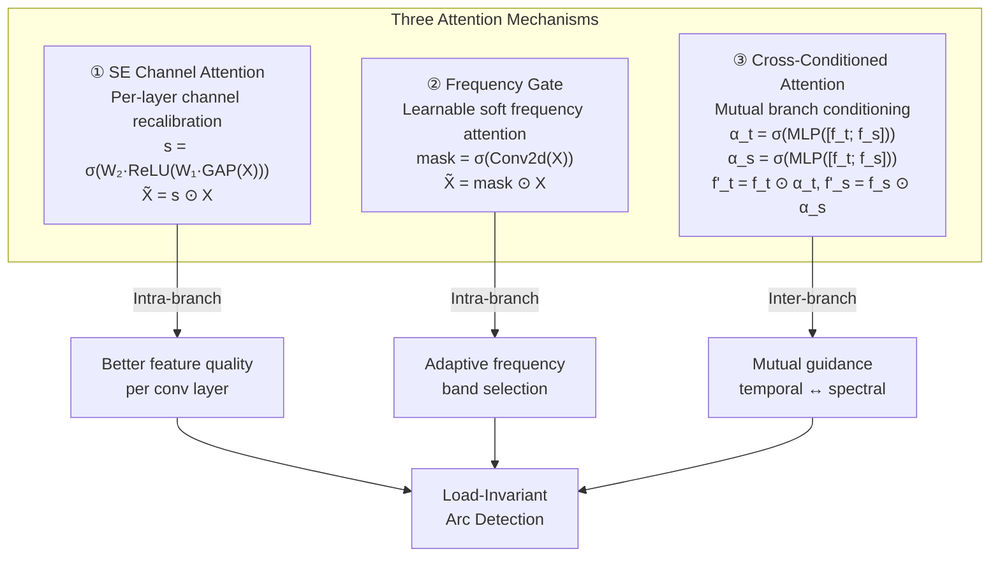

# MDPI Electronics — Phase 1 Submission Draft

> [!IMPORTANT]
> This document contains the **Phase 1 metadata** required for submission to MDPI *Electronics*.
> Items marked with `⚠️ TO FILL` require your input before submission.

---

## 1. Title of the Paper

**Arc-FaultNet: A Lightweight Dual-Branch CNN with Channel Attention and Cross-Attention for Generalizable Series Arc Fault Detection**

### Alternative title options:

| # | Title |
|---|-------|
| A | Arc-FaultNet: Attention-Enhanced Dual-Branch Convolutional Network for Load-Invariant Series Arc Fault Detection |
| B | Dual-Branch CNN with Cross-Conditioned Channel Attention for Robust Series Arc Fault Detection in Low-Voltage Installations |
| C | Leveraging Channel and Cross-Attention Mechanisms in a Dual-Branch Architecture for Generalizable Arc Fault Detection |

> [!TIP]
> MDPI Electronics titles should be informative, concise, and include the main keywords. The recommended title (bold above) hits all key points: **architecture name**, **attention mechanisms**, **dual-branch**, **lightweight**, and **generalization**.

---

## 2. Abstract of the Paper

> Series arc faults in low-voltage electrical installations pose severe fire hazards due to their intermittent, load-dependent nature, making reliable detection across diverse operating conditions a persistent challenge. Existing deep learning approaches typically process a single signal representation and struggle to generalize to unseen load configurations. This paper presents **Arc-FaultNet**, a lightweight dual-branch convolutional neural network that jointly exploits temporal and spectral representations of the line current signal through complementary attention mechanisms. The temporal branch extracts four physically derived channels—raw current, discrete derivative, Teager–Kaiser energy operator, and sliding RMS—via a 1D convolutional stack enhanced with **Squeeze-and-Excitation (SE) channel attention** blocks that adaptively recalibrate feature importance per sample. The spectral branch processes the log-power Short-Time Fourier Transform (STFT) spectrogram through a 2D convolutional stack preceded by a **learnable frequency gate** that replaces fixed band-pass filtering with data-driven soft frequency attention. The two branch embeddings are fused through a **cross-conditioned channel attention** mechanism, where the channel importance of each branch is determined by the joint context of both branches, enabling mutual guidance between temporal and spectral representations. Extensive ablation studies demonstrate that each attention component contributes measurably to performance: cross-attention fusion yields +5.62 percentage points (pp) in F1-score over naive concatenation under rigorous GroupKFold cross-validation by recording session, with the full model achieving 90.16% accuracy, 87.82% F1-score, and 94.57% precision. An enhanced variant incorporating SE blocks and a deep classifier head further reduces performance variance by 28–51% across all metrics, with only a 3.8% parameter overhead. The proposed architecture achieves competitive detection performance with fewer than 365K parameters, offering a practical path toward deployment on embedded arc fault detection devices compliant with IEC 62606.

**(248 words)**

> [!NOTE]
> MDPI Electronics abstracts should be **150–300 words**. This draft is within the limit. It covers: problem statement, methodology (3 attention mechanisms), key results, and practical impact.

---

## 3. Keywords

`series arc fault detection` · `channel attention` · `cross-attention` · `squeeze-and-excitation` · `dual-branch CNN` · `STFT spectrogram` · `load-invariant detection` · `IEC 62606` · `lightweight deep learning` · `electrical safety`

---

## 4. All Author(s) Names

⚠️ **TO FILL** — List all authors in order of contribution:

| # | Full Name | Role |
|---|-----------|------|
| 1 | **Salim Gouaied** | First author (PFE student, architecture design & implementation) |
| 2 | ⚠️ TO FILL | Supervisor / co-advisor |
| 3 | ⚠️ TO FILL | Additional co-author (if applicable) |

> [!TIP]
> MDPI requires ORCID iDs for all authors. If you don't have one, register at [orcid.org](https://orcid.org).

---

## 5. Affiliation(s) of All Authors

⚠️ **TO FILL** — Provide the full institutional affiliation for each author:

| # | Author | Affiliation |
|---|--------|-------------|
| 1 | Salim Gouaied | ⚠️ Laboratory/Department, University Name, City, Country |
| 2 | ⚠️ Supervisor | ⚠️ Laboratory/Department, University Name, City, Country |

**Example format (MDPI style):**
> Department of Electrical Engineering, Faculty of Sciences and Technology, University of XYZ, City 12345, Country

---

## 6. Email Address(es) of All Authors

⚠️ **TO FILL**:

| # | Author | Email |
|---|--------|-------|
| 1 | Salim Gouaied | ⚠️ institutional email preferred |
| 2 | ⚠️ Supervisor | ⚠️ |

> [!NOTE]
> MDPI requires designating one author as the **corresponding author** (marked with `*`). This is typically the supervisor or the first author.

---

## 7. Submission Time

**Target submission:** ⚠️ TO FILL

**Current date:** June 29, 2026

---

## Appendix A — Key Results Summary (for reference during writing)

### A.1 Single-Split Best Performance (SE + Deep Classifier + Cross-Attention)

| Metric | Value |
|--------|-------|
| Accuracy | **98.77%** |
| F1-Score | **98.68%** |
| Precision | **98.94%** |
| Recall | **98.41%** |
| Specificity | **99.08%** |
| Parameters | 315,421 (cross-attention) / 364,189 (gated + SE + deep) |

### A.2 GroupKFold Cross-Validation (5 folds, by recording session)

| Metric | Full V2 (with attention) | No Attention | **Δ (V2 advantage)** |
|--------|--------------------------|--------------|----------------------|
| Accuracy | 90.16% ± 9.90% | 86.17% ± 9.37% | **+3.99 pp** |
| F1-Score | 87.82% ± 12.56% | 82.20% ± 13.92% | **+5.62 pp** |
| Precision | 94.57% ± 7.73% | 91.02% ± 7.51% | **+3.55 pp** |
| Recall | 83.84% ± 18.08% | 79.56% ± 22.95% | **+4.29 pp** |
| Specificity | 95.74% ± 6.12% | 92.37% ± 7.89% | **+3.37 pp** |

**Pairwise:** Full V2 wins **4 out of 5 folds** (advantage of +11 pp F1 on the hardest folds).

### A.3 SE + Deep Classifier Enhancement Impact

| Metric | Baseline V2 | Enhanced V2 | Δ |
|--------|-------------|-------------|---|
| Accuracy | 96.10% | 97.79% | **+1.69 pp** |
| F1-Score | 95.63% | 97.65% | **+2.02 pp** |
| Recall | 93.07% | 96.55% | **+3.48 pp** |
| CV Reduction | — | — | **28–51%** |
| Parameter overhead | 350,693 | 364,189 | **+3.8%** |

### A.4 Ablation Study (Single-Split, all V2 variants)

| Variant | Accuracy | F1 | Params |
|---------|----------|----|--------|
| **Full V2 (gated)** | **96.69%** | **96.45%** | 350,693 |
| No Attention | 97.30% | 97.07% | 251,873 |
| No Channel Gate | 94.85% | 94.22% | 317,669 |
| Temporal Only | 85.95% | 84.56% | 60,193 |
| Spectral Only | 97.30% | 97.07% | 167,109 |
| Baseline CNN | 87.73% | 85.27% | 60,193 |

> [!WARNING]
> The single-split ablation shows the No Attention variant outperforming Full V2 on accuracy. This is misleading — it is explained by **data leakage** in random splits (cycles from the same recording appear in both train and test). The **GroupKFold evaluation** (Section A.2) eliminates this leakage and reveals the true advantage of attention mechanisms for generalization (+5.62 pp F1).

---

## Appendix B — Architecture Quick Reference

### Attention Mechanisms in Arc-FaultNet

### Model Architecture Overview

| Stage | Component | Input | Output | Key Innovation |
|-------|-----------|-------|--------|----------------|
| 1 | Feature Engineering | I(t) raw cycle | [I, \|ΔI\|, TKEO, RMS] (4 × M) | Physics-grounded channels |
| 2a | Temporal Branch | (B, 4, M) | (B, 128, D) | Conv1D + SE blocks |
| 2b | Spectral Branch | (B, 1, F, T) STFT | (B, 128, D) | FreqGate + Conv2D |
| 3 | Cross-Attention Fusion | 2 × (B, 128) | (B, 128) | Cross-conditioned gating |
| 4 | Deep Classifier | (B, 128) | (B, 1) | BN + progressive dropout |

---

## Appendix C — Checklist Before Submission

- [ ] Fill in all author names, affiliations, and emails
- [ ] Designate the corresponding author
- [ ] Obtain ORCID iDs for all authors
- [ ] Verify all numerical results against latest runs
- [ ] Prepare cover letter explaining significance
- [ ] Choose the final title from the options above
- [ ] Review abstract word count (150–300 words)
- [ ] Confirm target Special Issue (if applicable) on [Electronics](https://www.mdpi.com/journal/electronics)
