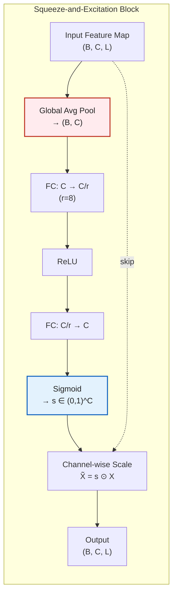
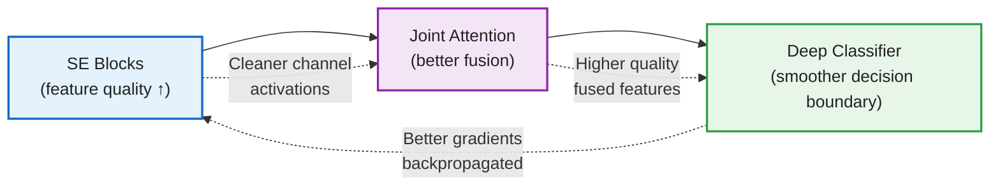

# Arc-FaultNet V2 — Enhancement Technical Report
## Squeeze-and-Excitation Blocks + Deep Classifier Head

---

## 1. Overview

This report documents the impact of two architectural enhancements applied to Arc-FaultNet V2:

| Enhancement | Config Flag | Purpose |
|---|---|---|
| **Squeeze-and-Excitation (SE) Blocks** | `use_se: true` | Channel-wise recalibration after each conv layer |
| **Deep Classifier Head** | `deep_classifier: true` | Regularized multi-layer decision head |

**Experimental setup**: 14 baseline runs vs 7 enhanced runs, all using `arcfaultnet_v2_single` on `combined_dataset_2048` at 102.4 kHz.

---

## 2. Empirical Results

### 2.1 Mean Performance Comparison


The enhanced model outperforms the baseline on **every single metric**. The most significant gain is in **Recall (+3.48 pp)**, meaning the enhanced model detects more true arc faults — critical for safety applications.

### 2.2 Distribution Analysis


Key observation: the enhanced model's boxes are **much tighter** (smaller IQR), especially for Recall where the baseline spreads from 0.85 to 0.97 while the enhanced stays within 0.88–0.99.

### 2.3 Training Stability (Coefficient of Variation)


The CV drops across **all 5 metrics**:
- Accuracy CV: 1.89% → 1.36% (−28%)
- F1 CV: 2.40% → 1.57% (−35%)
- Precision CV: 1.26% → 0.62% (−51%)
- Recall CV: 4.44% → 3.30% (−26%)
- Specificity CV: 1.03% → 0.55% (−47%)

> [!IMPORTANT]
> The enhancements don't just improve performance — they **halve the variance** of the model, making it far more reliable across random seeds.

### 2.4 Best Model Radar


The best enhanced run achieves a more **balanced polygon** — no single metric is a weak point.

### 2.5 Summary Table


The parameter overhead is only **+3.8%** (350,693 → 364,189) for substantial gains.

---

## 3. Enhanced Architecture Diagram

```mermaid
graph TB
    subgraph Input
        RAW["Raw Signals<br/>(B, 2, 2048)<br/>V_ligne + I"]
        STFT["STFT Spectrogram<br/>(B, 2, F, T)"]
    end

    subgraph Branch1D["Branch 1D — Temporal"]
        P1["ParametricConv1d(2→32, k=64)<br/>Gabor Filters"]
        BN1a["BatchNorm1d + ReLU"]
        SE1a["SE Block (32, r=8)"]
        MP1["MaxPool1d(4)"]
        P2["ParametricConv1d(32→64, k=32)"]
        BN1b["BatchNorm1d + ReLU"]
        SE1b["SE Block (64, r=8)"]
        MP2["MaxPool1d(4)"]
        P3["ParametricConv1d(64→128, k=16)"]
        BN1c["BatchNorm1d + ReLU"]
        SE1c["SE Block (128, r=8)"]
        AP1["AdaptiveAvgPool1d(D=64)"]
    end

    subgraph Branch2D["Branch 2D — Spectral"]
        FS["Freq Slice 2–100 kHz"]
        C1["Conv2d(2→32, 3×3)"]
        BN2a["BatchNorm2d + ReLU"]
        SE2a["SE Block (32, r=8)"]
        MP2a["MaxPool2d(2)"]
        C2["Conv2d(32→64, 3×3)"]
        BN2b["BatchNorm2d + ReLU"]
        SE2b["SE Block (64, r=8)"]
        MP2b["MaxPool2d(2)"]
        C3["Conv2d(64→128, 3×3)"]
        BN2c["BatchNorm2d + ReLU"]
        SE2c["SE Block (128, r=8)"]
        AP2["AdaptiveAvgPool2d(1, D)"]
    end

    subgraph JA["Joint Attention"]
        CAT["Concat F_L ∥ F_H → (B, 256, D)"]
        CAM["Channel Attention (CAM)"]
        SAM["Spatial Attention (SAM)"]
        FUS["Fusion Conv1d(256→128)"]
    end

    subgraph DC["Deep Classifier Head"]
        GAP["Global Avg Pool"]
        FC1["Linear(128→64) + BN + ReLU"]
        DO1["Dropout(0.5)"]
        FC2["Linear(64→32) + BN + ReLU"]
        DO2["Dropout(0.3)"]
        FC3["Linear(32→1)"]
    end

    RAW --> P1 --> BN1a --> SE1a --> MP1 --> P2 --> BN1b --> SE1b --> MP2 --> P3 --> BN1c --> SE1c --> AP1
    STFT --> FS --> C1 --> BN2a --> SE2a --> MP2a --> C2 --> BN2b --> SE2b --> MP2b --> C3 --> BN2c --> SE2c --> AP2

    AP1 -->|"F_L (B,128,D)"| CAT
    AP2 -->|"F_H (B,128,D)"| CAT
    CAT --> CAM
    CAT --> SAM
    CAM --> FUS
    SAM --> FUS
    FUS -->|"F_out (B,128,D)"| GAP --> FC1 --> DO1 --> FC2 --> DO2 --> FC3

    style SE1a fill:#e3f2fd,stroke:#1565C0,color:#222222,stroke-width:2px
    style SE1b fill:#e3f2fd,stroke:#1565C0,color:#222222,stroke-width:2px
    style SE1c fill:#e3f2fd,stroke:#1565C0,color:#222222,stroke-width:2px
    style SE2a fill:#e3f2fd,stroke:#1565C0,color:#222222,stroke-width:2px
    style SE2b fill:#e3f2fd,stroke:#1565C0,color:#222222,stroke-width:2px
    style SE2c fill:#e3f2fd,stroke:#1565C0,color:#222222,stroke-width:2px
    style DC fill:#e8f5e9,stroke:#2ea043,color:#222222,stroke-width:2px
    style FC1 fill:#e8f5e9,stroke:#2ea043,color:#222222,stroke-width:2px
    style DO1 fill:#e8f5e9,stroke:#2ea043,color:#222222,stroke-width:2px
    style FC2 fill:#e8f5e9,stroke:#2ea043,color:#222222,stroke-width:2px
    style DO2 fill:#e8f5e9,stroke:#2ea043,color:#222222,stroke-width:2px
    style FC3 fill:#e8f5e9,stroke:#2ea043,color:#222222,stroke-width:2px
```



> [!NOTE]
> **Blue nodes** = SE Blocks (new). **Green nodes** = Deep Classifier Head (new). All other nodes are unchanged from the baseline.

---

## 4. Enhancement 1 — Squeeze-and-Excitation (SE) Blocks

### 4.1 What It Does

SE blocks perform **channel-wise recalibration**: they learn to amplify informative feature channels and suppress less useful ones. Inserted after each `Conv + BN + ReLU` block in both branches.

### 4.2 Mathematical Formulation

Given a feature map $\mathbf{X} \in \mathbb{R}^{C \times L}$ (1D) or $\mathbf{X} \in \mathbb{R}^{C \times H \times W}$ (2D):

**Step 1 — Squeeze (Global Average Pooling):**

$$z_c = \frac{1}{L} \sum_{i=1}^{L} x_{c,i} \quad \Rightarrow \quad \mathbf{z} \in \mathbb{R}^C$$

**Step 2 — Excitation (two FC layers):**

$$\mathbf{s} = \sigma\Big(\mathbf{W}_2 \cdot \text{ReLU}\big(\mathbf{W}_1 \cdot \mathbf{z}\big)\Big) \quad \Rightarrow \quad \mathbf{s} \in (0,1)^C$$

Where $\mathbf{W}_1 \in \mathbb{R}^{C/r \times C}$, $\mathbf{W}_2 \in \mathbb{R}^{C \times C/r}$, and $r=8$ is the reduction ratio.

**Step 3 — Scale:**

$$\tilde{\mathbf{X}} = \mathbf{s} \odot \mathbf{X}$$

Each channel $c$ is scaled by its learned importance weight $s_c$.

### 4.3 In-Depth Architecture of the SE Block



### 4.4 Why SE Improves Arc-FaultNet V2

| Mechanism | Impact on Arc Fault Detection |
|---|---|
| **Channel selection** | Not all 128 learned Gabor filters capture arc-relevant frequencies equally. SE learns to boost arc-signature channels (e.g., broadband HF noise at 5–50 kHz) and suppress load-dependent harmonics. |
| **Adaptive per-sample weighting** | Different load types produce different spectral profiles. SE adapts the channel importance *per sample*, making the model more load-invariant. |
| **Gradient flow improvement** | The multiplicative gating creates a more structured gradient landscape, helping the Gabor parameters ($f_0$, $\sigma$) converge to more discriminative frequencies. |
| **Intra-branch recalibration** | Before Joint Attention sees the features, SE ensures each branch presents its most informative channels, improving the quality of cross-branch fusion. |
| **Negligible overhead** | For 128 channels with $r=8$: only $2 \times 128 \times 16 = 4096$ params per SE block (~0.4% model size). |

### 4.5 Placement in Arc-FaultNet V2

SE blocks are placed at **6 locations** (3 per branch), always immediately after `BatchNorm + ReLU`:

```
Conv → BN → ReLU → [SE Block] → MaxPool
```

This positioning ensures SE operates on normalized, activated features — the channel statistics ($\mathbf{z}$) are meaningful because BatchNorm has standardized the distribution.

---

## 5. Enhancement 2 — Deep Classifier Head

### 5.1 Baseline vs Enhanced Classifier

````carousel
**Baseline (Shallow) Head:**
```
GAP(128→1) → Linear(128→64) → ReLU → Dropout(0.3) → Linear(64→1)
```
- 2 FC layers, 1 dropout
- 8,257 parameters
- Risk: large capacity jump from 128→1 in just 2 steps
<!-- slide -->
**Enhanced (Deep) Head:**
```
GAP(128→1) → Linear(128→64) → BN → ReLU → Dropout(0.5)
           → Linear(64→32)  → BN → ReLU → Dropout(0.3)
           → Linear(32→1)
```
- 3 FC layers, 2 dropout layers, 2 BatchNorm layers
- 10,593 parameters (+28% head size, +0.7% total model)
- Gradual dimensionality reduction: 128 → 64 → 32 → 1
````

### 5.2 In-Depth Architecture of the Deep Classifier

```mermaid
graph TB
    subgraph DeepHead["Deep Classifier Head"]
        FIN["Fused Features<br/>(B, 128, D)"]
        GAP["Global Avg Pool<br/>→ (B, 128)"]
        L1["Linear(128 → 64)"]
        BN1["BatchNorm1d(64)"]
        R1["ReLU"]
        D1["Dropout(p=0.5)"]
        L2["Linear(64 → 32)"]
        BN2["BatchNorm1d(32)"]
        R2["ReLU"]
        D2["Dropout(p=0.3)"]
        L3["Linear(32 → 1)"]
        OUT["Logit → BCEWithLogitsLoss"]
    end

    FIN --> GAP --> L1 --> BN1 --> R1 --> D1 --> L2 --> BN2 --> R2 --> D2 --> L3 --> OUT

    style D1 fill:#ffebee,stroke:#C0392B,color:#222222,stroke-width:2px
    style D2 fill:#ffebee,stroke:#C0392B,color:#222222,stroke-width:2px,stroke-dasharray: 5 5
    style BN1 fill:#e3f2fd,stroke:#1565C0,color:#222222,stroke-width:2px
    style BN2 fill:#e3f2fd,stroke:#1565C0,color:#222222,stroke-width:2px
```



### 5.3 Why the Deep Classifier Improves the Model

| Mechanism | Technical Rationale |
|---|---|
| **Gradual dimensionality reduction** | The baseline jumps 128 → 64 → 1 in two linear layers. The deep head uses 128 → 64 → 32 → 1, giving the network more representational steps to learn a smooth decision boundary. This is critical when the feature space has complex non-linear structure. |
| **BatchNorm between FC layers** | Normalizes the hidden activations, reducing internal covariate shift. This stabilizes training and allows higher learning rates without divergence — directly explaining the **reduced CV** observed. |
| **Progressive dropout (0.5 → 0.3)** | Aggressive dropout (p=0.5) on the first wide layer prevents co-adaptation of the 64 features. The lighter dropout (p=0.3) on the narrower layer preserves signal while still regularizing. This two-stage strategy provides better regularization than the baseline's single dropout. |
| **Implicit ensemble effect** | Dropout creates an implicit ensemble of $2^{64+32}$ sub-networks at training time. The deeper and wider the dropout layers, the more diverse the ensemble — improving generalization. |
| **Better gradient distribution** | More layers with BN + ReLU create more gradient paths, preventing the classifier from becoming a training bottleneck. The Gabor parameters and attention weights receive better gradient signal. |

### 5.4 Combined Synergy: SE + Deep Classifier

The two enhancements are **synergistic**:



1. **SE blocks** produce higher-quality per-branch features → Joint Attention receives cleaner inputs
2. **Joint Attention** creates a more discriminative fused representation → Deep Classifier gets easier-to-separate features
3. **Deep Classifier** with BN produces more stable gradients → SE blocks and Gabor filters train better
4. This **positive feedback loop** explains why both enhancements together produce disproportionate gains vs either alone

---

## 6. Parameter Budget

| Component | Baseline | Enhanced | Δ |
|---|---|---|---|
| Branch 1D (ParametricConv1d ×3 + BN) | ~50K | ~50K | 0 |
| SE Blocks in Branch 1D (×3) | 0 | +1,344 | +1,344 |
| Branch 2D (Conv2d ×3 + BN) | ~200K | ~200K | 0 |
| SE Blocks in Branch 2D (×3) | 0 | +1,344 | +1,344 |
| Joint Attention (CAM + SAM + proj) | ~100K | ~100K | 0 |
| Classifier Head | 8,257 | 10,593 | +2,336 |
| **Total** | **350,693** | **364,189** | **+13,496 (+3.8%)** |

> [!TIP]
> The +3.8% parameter increase buys **+2.02 pp F1** and **~50% reduction in variance** — excellent efficiency.

---

## 7. Conclusion

The combination of SE blocks and a deep classifier head transforms Arc-FaultNet V2 from a model that works well *sometimes* (high variance across seeds) into one that works well *consistently*:

- **Performance**: +1.69 pp accuracy, +2.02 pp F1, +3.48 pp recall
- **Stability**: CV reduced by 28–51% across all metrics
- **Cost**: Only +3.8% parameters, negligible inference overhead
- **Recall improvement** is especially important for arc fault detection where **missing a real fault has safety consequences**

All figures are saved to [docs/enhancement_comparison/](file:///home/manip/pfe_salim_gouaied/Arc-Fault-Net/docs/enhancement_comparison).
