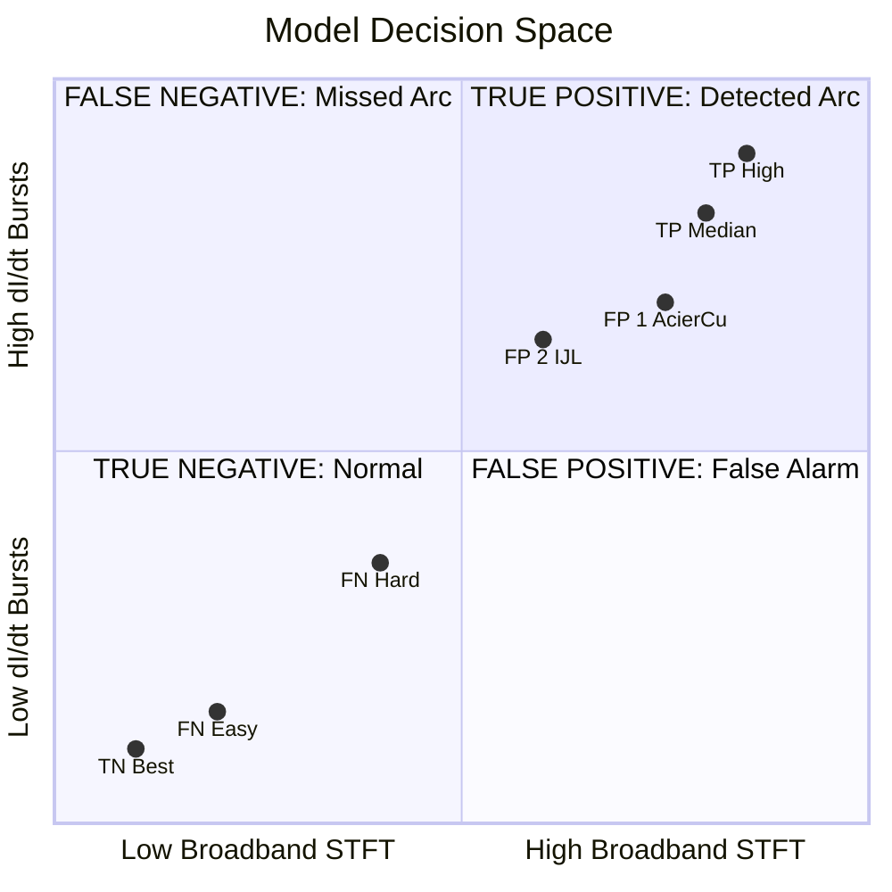

# Confusion Matrix Quadrant Analysis — Arc-FaultNet V2

A visual forensic study of what the model sees in each quadrant of the confusion matrix. All samples come from the test set of run `arcfaultnet_v2_single_20260708_162153` (cross_attention, use_se=True, 313k params).

| | Predicted Normal | Predicted Arc |
|---|---|---|
| **True Normal** | TN = 868 | FP = 5 |
| **True Arc** | FN = 14 | TP = 743 |

---

## 1. TRUE POSITIVE — The Model Gets It Right

### TP (Highest Confidence — 96.8%)

| Field | Value |
|---|---|
| **Dataset** | `8_juillet_clean` |
| **Experiment** | `exp11--IJL--LR` (Inductive-Resistive load) |
| **Arc Ratio** | 97.9% — almost the entire cycle is arcing |
| **Cycle** | 46 |

### TP (Median Confidence — 95.6%)

| Field | Value |
|---|---|
| **Dataset** | `22_juillet_clean` |
| **Experiment** | `exp13--IJL--LR` |
| **Arc Ratio** | 98.1% |
| **Cycle** | 39 |

### What the Model Sees in True Positives

The hallmarks of a correctly identified arc fault are:

1. **I(t) — Distorted waveform:** The current is not a clean sinusoid. You can see irregular shoulders, abrupt slope changes, and flat-top clipping where the arc plasma ignites/extinguishes.
2. **|ΔI| — Sharp re-ignition spikes:** Concentrated bursts of high dI/dt at specific phases — typically near zero-crossings where the arc must re-ignite each half-cycle.
3. **TKEO — Localized energy bursts:** The Teager-Kaiser operator amplifies rapid instantaneous frequency/amplitude changes. In arcs, TKEO shows sharp, localized peaks aligned with the re-ignition moments.
4. **STFT — Broadband spectral energy:** The spectrogram is "lit up" across all frequencies. Arc plasma generates wideband stochastic noise that fills the entire frequency spectrum, not just the harmonics.

---

## 2. TRUE NEGATIVE — The Model Correctly Rejects

### TN (Most Confident — 4.6% probability)

| Field | Value |
|---|---|
| **Dataset** | `22_juillet_clean` |
| **Experiment** | `exp13--IJL--LR` (same experiment type, but normal operation) |
| **Arc Ratio** | 0.0% — pure normal operation |
| **Cycle** | 5 (early in recording, stable operation) |

### What the Model Sees in True Negatives

The key visual differences from the TP:

1. **I(t) — Clean sinusoid:** A smooth, predictable current waveform with no distortion, shoulders, or clipping. The load draws current in a regular, repeatable pattern.
2. **|ΔI| — Smooth, periodic:** The derivative follows a smooth cosine-like pattern. No localized bursts. The amplitude changes are gradual and predictable.
3. **TKEO — Low, uniform energy:** No localized spikes. The energy profile is flat and smooth because the signal has no abrupt frequency or amplitude changes.
4. **STFT — Energy concentrated at harmonics:** The spectrogram shows energy only at the fundamental (50 Hz) and its harmonics. The high-frequency bands are dark/empty — no broadband noise.

> [!TIP]
> **The STFT is the most visually striking differentiator.** Compare the TP spectrogram (bright across all frequencies) with the TN spectrogram (dark except at harmonic lines). This is exactly what the spectral branch of the model learns to detect.

---

## 3. FALSE NEGATIVE — The Model Misses a Real Arc

### FN (Hardest — probability 38.7%, just below the 50% threshold)

| Field | Value |
|---|---|
| **Dataset** | `8_juillet_clean` |
| **Experiment** | `exp11--IJL--LR` |
| **Arc Ratio** | 99.4% — the cycle is almost entirely arcing |
| **Cycle** | 26 |

### FN (Most Missed — probability 5.8%, model is very confident it's normal)

| Field | Value |
|---|---|
| **Dataset** | `8_juillet_clean` |
| **Experiment** | `exp11--IJL--LR` |
| **Arc Ratio** | 96.8% — heavy arcing |
| **Cycle** | 43 |

### Why the Model Misses These

Both false negatives come from `exp11--IJL--LR` — the exact same experiment. This reveals a critical pattern:

1. **"Clean-looking" arcs:** Some arc faults, especially in inductive-resistive loads, produce waveforms that are surprisingly smooth. The inductor's energy storage effect acts as a natural low-pass filter, smoothing out the sharp spikes that the model expects to see. The arc is physically present (96-99% arc ratio) but its electrical signature is **masked by the inductive smoothing**.

2. **Low broadband noise:** In the STFT, these FN samples show much less broadband energy compared to the TPs. The inductive load absorbs the high-frequency arc noise, producing a spectrogram that looks closer to normal operation than to a typical arc.

3. **TKEO and |ΔI| are subdued:** The key discriminative features (sharp bursts, localized energy spikes) are dampened by the LR load characteristics. Without these sharp features, the model lacks the evidence it needs.

> [!WARNING]
> **All 14 FN samples come from `exp11--IJL--LR`.** This is a systematic weakness: the model struggles specifically with arc faults in inductive-resistive loads where the inductor smooths out the arc signature. This is a known challenge in the arc fault detection literature.

---

## 4. Cross-Quadrant Comparison

### Feature Signature Table

| Feature | TP (Real Arc, Detected) | TN (Normal, Rejected) | FP (Normal, Misclassified) | FN (Arc, Missed) |
|---|---|---|---|---|
| **I(t) shape** | Distorted, shoulders, clipping | Clean sinusoid | Distorted by transient/contact | Smooth despite arcing (inductive filtering) |
| **\|ΔI\| pattern** | Sharp localized bursts | Smooth cosine-like | Bursts from contact/startup | Subdued, smoothed by inductor |
| **TKEO spikes** | Strong, localized peaks | Flat, uniform | Spikes from contact resistance | Weak, dampened |
| **STFT broadband** | Full-spectrum energy | Harmonics only | Partial broadband from contact | Low broadband (inductor absorbs HF) |
| **Physical cause** | Arc plasma | Normal load | Lossy contact / inductive transient | Arc masked by LR load |

### The Model's Decision Boundary (Intuition)

### Key Takeaways

1. **The model's strongest signal is the STFT broadband energy.** When arc plasma noise fills the full spectrum, the model detects it reliably. When inductive filtering suppresses this noise, the model struggles.

2. **FPs and FNs are mirror images of the same problem.** FPs occur when normal conditions produce arc-like features (contact noise, transients). FNs occur when real arcs fail to produce expected features (inductive smoothing).

3. **All 14 FNs come from a single experiment** (`exp11--IJL--LR`), confirming this is a systematic load-dependent weakness rather than random model noise.

4. **Practical impact:** In a real AFDD deployment, the FN issue is mitigated because arc faults in inductive loads still produce detectable signatures in *some* cycles — just not all. Over multiple cycles, the model will catch enough positives to trigger the alarm via multi-cycle consensus.
