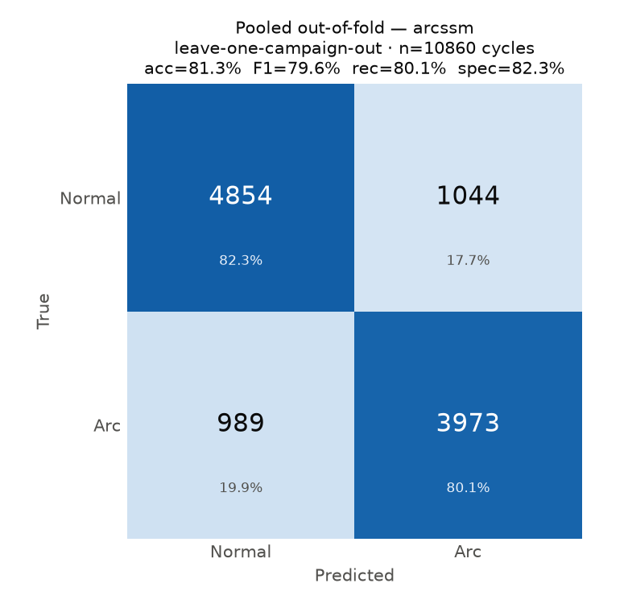
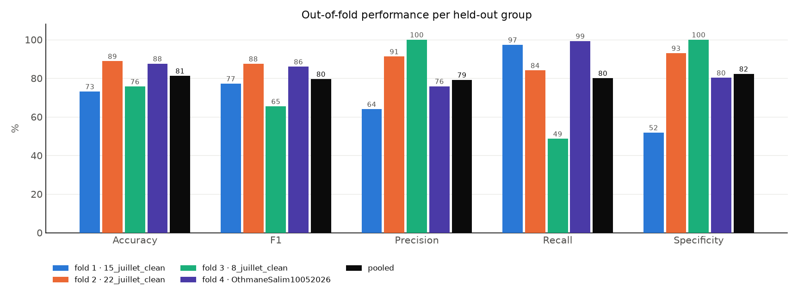
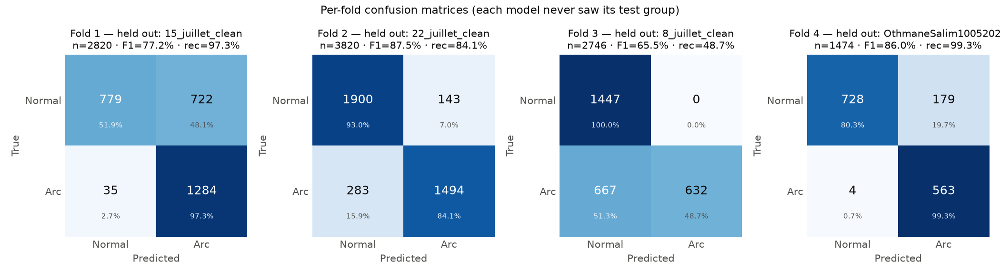
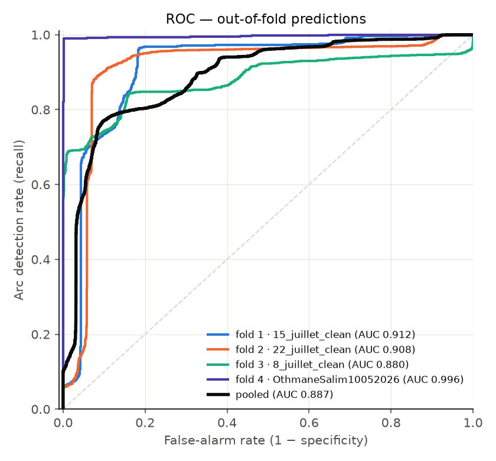
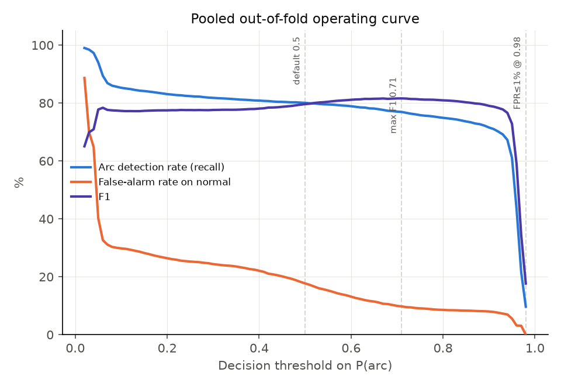

# Group cross-validation report — arcssm

- Run: `runs/arcssm_groupkfold_campaign_20260726_195946`
- Protocol: leave-one-campaign-out, 4 folds (`--mode groupkfold --group-level campaign`)
- Validation split inside the training groups: `alternance`
- Decision threshold: 0.5
- Epochs (max): 60, patience 10, lr 0.0003, batch 32, seed 42

## 1. Headline — pooled out-of-fold

Every one of the 10860 cycles was classified exactly once, by a model trained without its campaign. No cycle is scored by a model that saw its own campaign, so this matrix is the honest performance estimate.

| Metric | Value | 95% CI (Wilson) |
|---|---|---|
| Accuracy | 81.28% | [80.54, 82.00] |
| F1 | 79.63% | — |
| Precision | 79.19% | — |
| Recall (arc detection) | 80.07% | [78.93, 81.16] |
| Specificity | 82.30% | [81.30, 83.25] |
| ROC AUC | 0.8872 | — |

Confusion counts: TP=3973  FP=1044  FN=989  TN=4854

## 2. Per-fold results

| Fold | Held out | n | Acc % | F1 % | Prec % | Rec % | Spec % | AUC |
|---|---|---|---|---|---|---|---|---|
| 1 | 15_juillet_clean | 2820 | 73.16 | 77.23 | 64.01 | 97.35 | 51.90 | 0.9119 |
| 2 | 22_juillet_clean | 3820 | 88.85 | 87.52 | 91.26 | 84.07 | 93.00 | 0.9076 |
| 3 | 8_juillet_clean | 2746 | 75.71 | 65.46 | 100.00 | 48.65 | 100.00 | 0.8804 |
| 4 | OthmaneSalim10052026 | 1474 | 87.58 | 86.02 | 75.88 | 99.29 | 80.26 | 0.9963 |

| Across folds | Accuracy % | F1 % | Precision % | Recall % | Specificity % |
|---|---|---|---|---|---|
| mean ± std | 81.32 ± 6.96 | 79.06 ± 8.78 | 82.79 ± 13.86 | 82.34 ± 20.31 | 81.29 ± 18.39 |

Mean ± std weights each fold equally regardless of size; prefer the pooled numbers in section 1 as the headline and read the spread here as the campaign-to-campaign variability.

## 3. Per-held-out-group breakdown

| Group | n | Acc % | F1 % | Rec % | Spec % | TP | FP | FN | TN |
|---|---|---|---|---|---|---|---|---|---|
| 15_juillet_clean | 2820 | 73.16 | 77.23 | 97.35 | 51.90 | 1284 | 722 | 35 | 779 |
| 22_juillet_clean | 3820 | 88.85 | 87.52 | 84.07 | 93.00 | 1494 | 143 | 283 | 1900 |
| 8_juillet_clean | 2746 | 75.71 | 65.46 | 48.65 | 100.00 | 632 | 0 | 667 | 1447 |
| OthmaneSalim10052026 | 1474 | 87.58 | 86.02 | 99.29 | 80.26 | 563 | 179 | 4 | 728 |

## 4. Operating point

| Threshold | Recall % | False-alarm % | Precision % | F1 % |
|---|---|---|---|---|
| 0.5 (default) | 80.07 | 17.70 | 79.19 | 79.63 |
| 0.71 (max F1) | 76.92 | 9.77 | 86.89 | 81.60 |
| 0.98 (FPR≤1%) | 9.69 | 0.00 | 100.00 | 17.67 |

The thresholds above are picked on the pooled out-of-fold predictions, so treat any non-default choice as a *reported trade-off*, not a tuned model: tuning it on the same predictions you report would leak the test set.

### Errors by campaign

| Campaign | Arc cycles | Normal cycles | Missed arcs (FN) | Miss rate % | False alarms (FP) | False-alarm rate % |
|---|---|---|---|---|---|---|
| 15_juillet_clean | 1319 | 1501 | 35 | 2.65 | 722 | 48.10 |
| 22_juillet_clean | 1777 | 2043 | 283 | 15.93 | 143 | 7.00 |
| 8_juillet_clean | 1299 | 1447 | 667 | 51.35 | 0 | 0.00 |
| OthmaneSalim10052026 | 567 | 907 | 4 | 0.71 | 179 | 19.74 |

Per-cycle forensics are in `false_positives.csv` / `false_negatives.csv` (experiment, alternance index, arc_ratio, predicted probability, fold).

## 5. Random-split comparison (optimism of the in-distribution number)

| Protocol | Acc % | F1 % | Rec % | Spec % |
|---|---|---|---|---|
| Random 70/15/15 split (cycle level) | 98.47 | 98.33 | 96.96 | 99.77 |
| Leave-one-campaign-out (pooled) | 81.28 | 79.63 | 80.07 | 82.30 |

The random split lets cycles of the same arc burst and the same recording sit in train and test at once, so it measures in-distribution fit — the gap between the two rows is the cost of that leakage.

