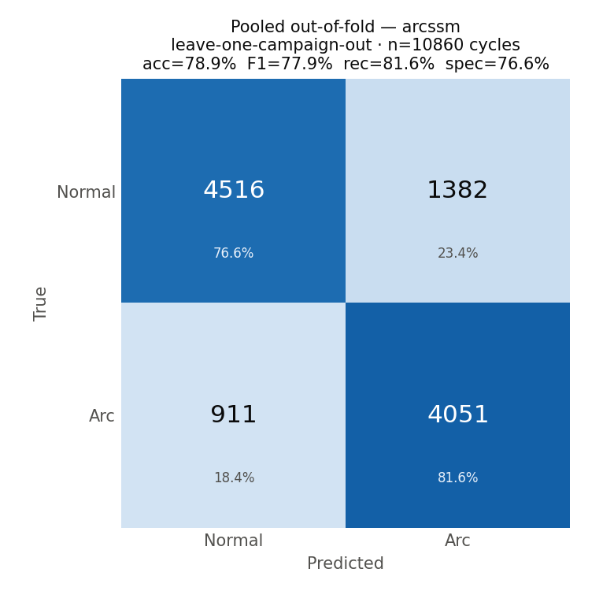
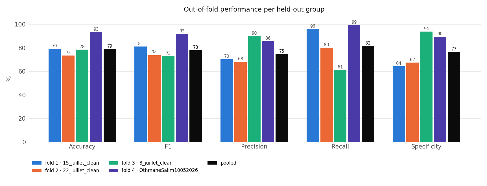
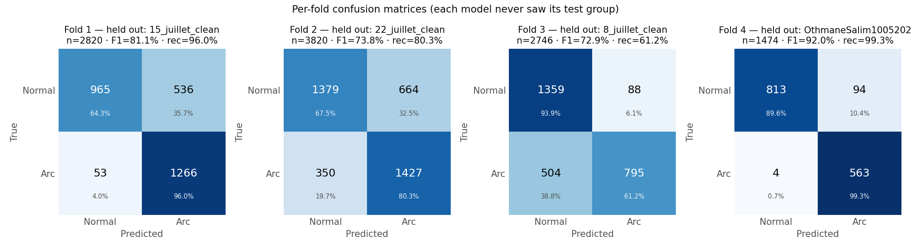
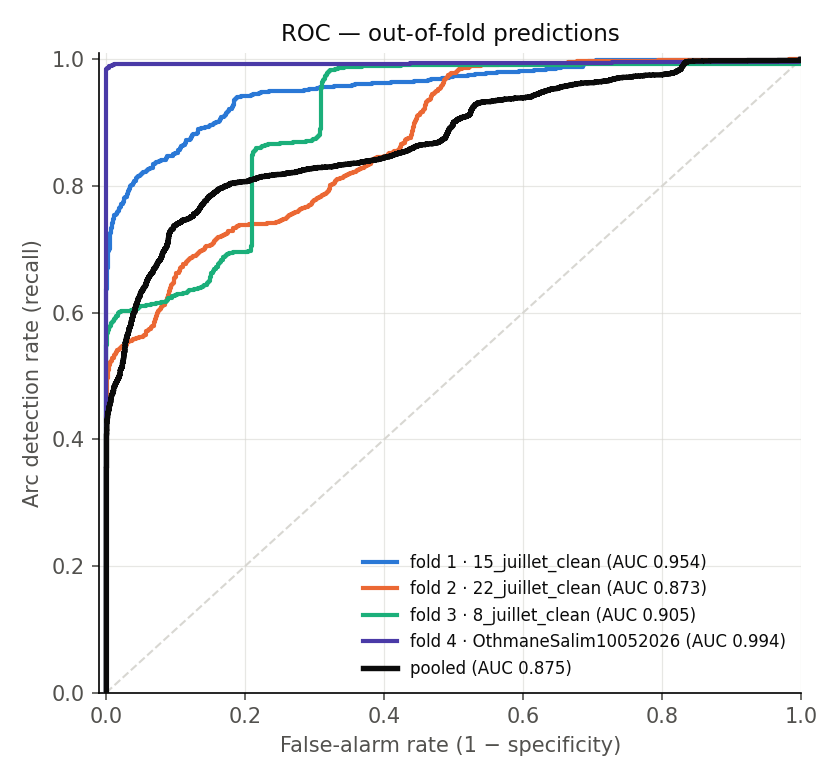
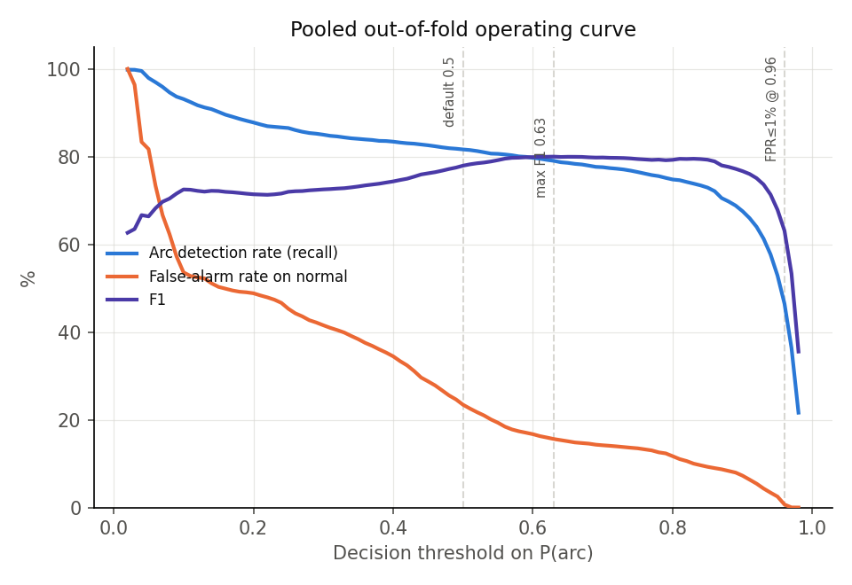

# Group cross-validation report — arcssm

- Run: `runs/arcssm_groupkfold_campaign_20260727_115858`
- Protocol: leave-one-campaign-out, 4 folds (`--mode groupkfold --group-level campaign`)
- Validation split inside the training groups: `alternance`
- Decision threshold: 0.5
- Epochs (max): 60, patience 10, lr 0.0003, batch 64, seed 42

## 1. Headline — pooled out-of-fold

Every one of the 10860 cycles was classified exactly once, by a model trained without its campaign. No cycle is scored by a model that saw its own campaign, so this matrix is the honest performance estimate.

| Metric | Value | 95% CI (Wilson) |
|---|---|---|
| Accuracy | 78.89% | [78.11, 79.64] |
| F1 | 77.94% | — |
| Precision | 74.56% | — |
| Recall (arc detection) | 81.64% | [80.54, 82.69] |
| Specificity | 76.57% | [75.47, 77.63] |
| ROC AUC | 0.8747 | — |

Confusion counts: TP=4051  FP=1382  FN=911  TN=4516

## 2. Per-fold results

| Fold | Held out | n | Acc % | F1 % | Prec % | Rec % | Spec % | AUC |
|---|---|---|---|---|---|---|---|---|
| 1 | 15_juillet_clean | 2820 | 79.11 | 81.13 | 70.26 | 95.98 | 64.29 | 0.9536 |
| 2 | 22_juillet_clean | 3820 | 73.46 | 73.78 | 68.24 | 80.30 | 67.50 | 0.8734 |
| 3 | 8_juillet_clean | 2746 | 78.44 | 72.87 | 90.03 | 61.20 | 93.92 | 0.9046 |
| 4 | OthmaneSalim10052026 | 1474 | 93.35 | 91.99 | 85.69 | 99.29 | 89.64 | 0.9944 |

| Across folds | Accuracy % | F1 % | Precision % | Recall % | Specificity % |
|---|---|---|---|---|---|
| mean ± std | 81.09 ± 7.41 | 79.94 ± 7.66 | 78.56 ± 9.46 | 84.20 ± 15.09 | 78.84 ± 13.08 |

Mean ± std weights each fold equally regardless of size; prefer the pooled numbers in section 1 as the headline and read the spread here as the campaign-to-campaign variability.

## 3. Per-held-out-group breakdown

| Group | n | Acc % | F1 % | Rec % | Spec % | TP | FP | FN | TN |
|---|---|---|---|---|---|---|---|---|---|
| 15_juillet_clean | 2820 | 79.11 | 81.13 | 95.98 | 64.29 | 1266 | 536 | 53 | 965 |
| 22_juillet_clean | 3820 | 73.46 | 73.78 | 80.30 | 67.50 | 1427 | 664 | 350 | 1379 |
| 8_juillet_clean | 2746 | 78.44 | 72.87 | 61.20 | 93.92 | 795 | 88 | 504 | 1359 |
| OthmaneSalim10052026 | 1474 | 93.35 | 91.99 | 99.29 | 89.64 | 563 | 94 | 4 | 813 |

## 4. Operating point

| Threshold | Recall % | False-alarm % | Precision % | F1 % |
|---|---|---|---|---|
| 0.5 (default) | 81.64 | 23.43 | 74.56 | 77.94 |
| 0.63 (max F1) | 79.04 | 15.62 | 80.98 | 80.00 |
| 0.96 (FPR≤1%) | 46.45 | 0.68 | 98.29 | 63.09 |

The thresholds above are picked on the pooled out-of-fold predictions, so treat any non-default choice as a *reported trade-off*, not a tuned model: tuning it on the same predictions you report would leak the test set.

### Errors by campaign

| Campaign | Arc cycles | Normal cycles | Missed arcs (FN) | Miss rate % | False alarms (FP) | False-alarm rate % |
|---|---|---|---|---|---|---|
| 15_juillet_clean | 1319 | 1501 | 53 | 4.02 | 536 | 35.71 |
| 22_juillet_clean | 1777 | 2043 | 350 | 19.70 | 664 | 32.50 |
| 8_juillet_clean | 1299 | 1447 | 504 | 38.80 | 88 | 6.08 |
| OthmaneSalim10052026 | 567 | 907 | 4 | 0.71 | 94 | 10.36 |

Per-cycle forensics are in `false_positives.csv` / `false_negatives.csv` (experiment, alternance index, arc_ratio, predicted probability, fold).

